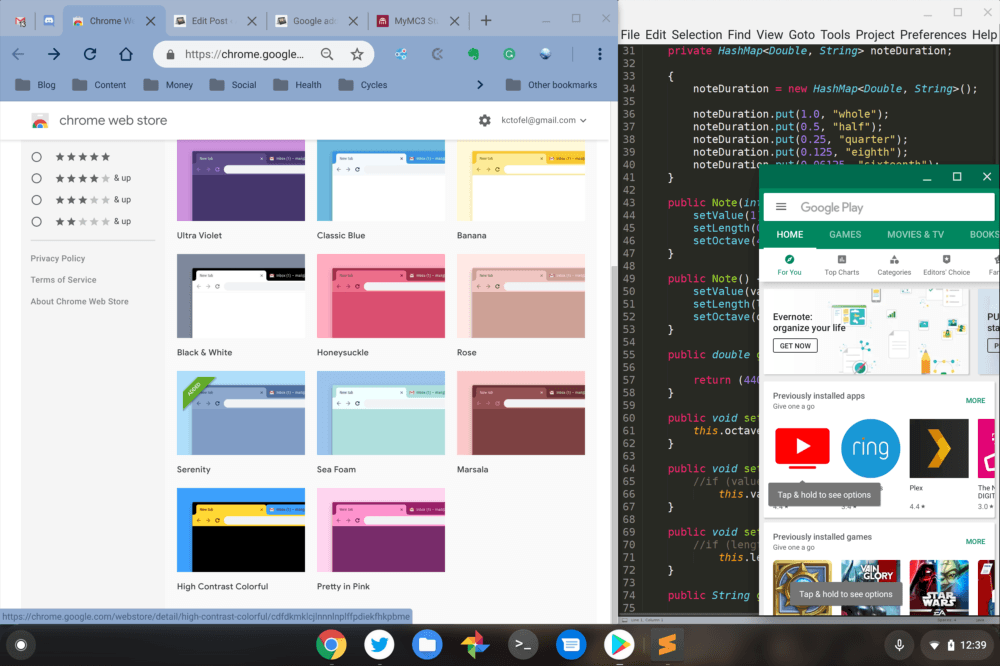

I generally don't use themes on my Chromebooks, but after looking at the newest choices from Google, I might change my mind. The [Google Chrome team published 14 new themes this week](https://chrome.google.com/webstore/category/collection/chrome_themes) and there appears to be something for just about everyone. In fact, I may go with the Slate on my Pixel Slate -- how meta! -- although Serenity (shown below) looks pretty nice.

Granted, most of these are just for the look and feel of Chrome. It's doubtful you'll be any more productive, for example.

But there could be some benefits to choosing a custom theme for your Chromebook. My old eyes are getting overused since I use my Slate for at least 12 hours a day, for this site, for [programming in my CompSci class](https://www.aboutchromebooks.com/news/how-to-code-on-a-chromebook-crostini-pixel-slate/) and for content consumption; YouTube TV and Netflix look great on the Slate. So some themes might help reduce eye strain for both me and others. This [higher contrast set of colors](https://chrome.google.com/webstore/detail/high-contrast-colorful/cdfdkmklcjlnnnlnplffpdiekfhkpbme) could be just what my eye doctor ordered.

Keep in mind that the themes don't apply to Android or Linux apps. That makes the experience look a little disjointed when running multiple apps, but as you'd expect, a Chrome theme only applies to Chrome. Perhaps in the future, these themes extend to more items on a Chromebook.

\[caption id="attachment\_2903" align="aligncenter" width="1000"\] Serenity Chrome theme with Android and Linux\[/caption\]

Thanks for the tip, Ian!
