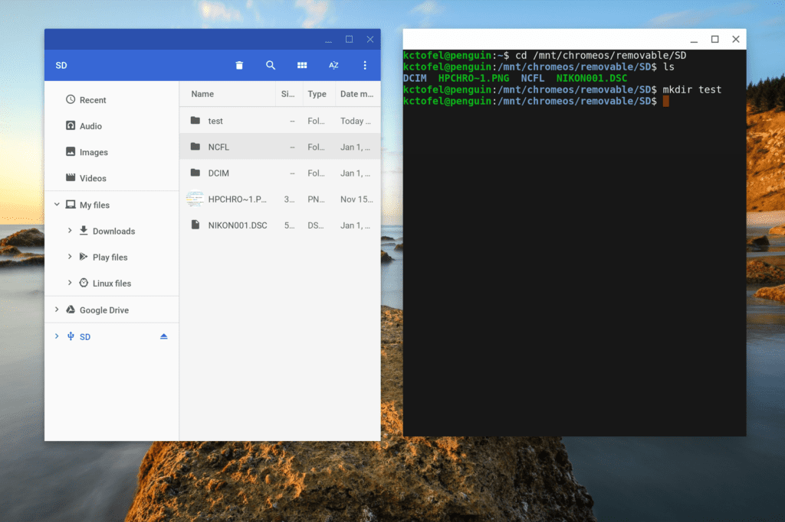
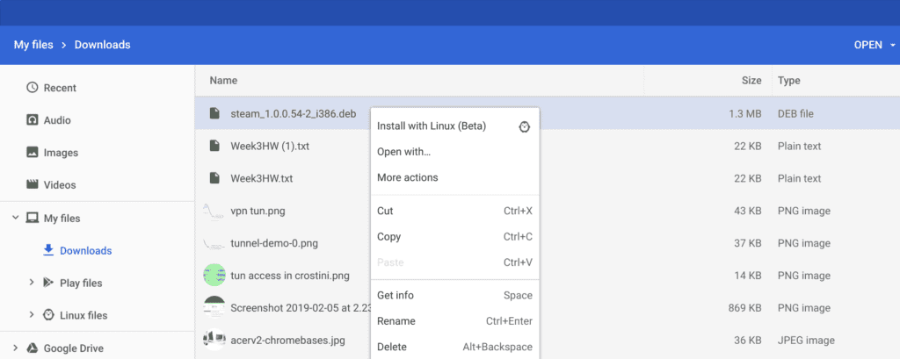
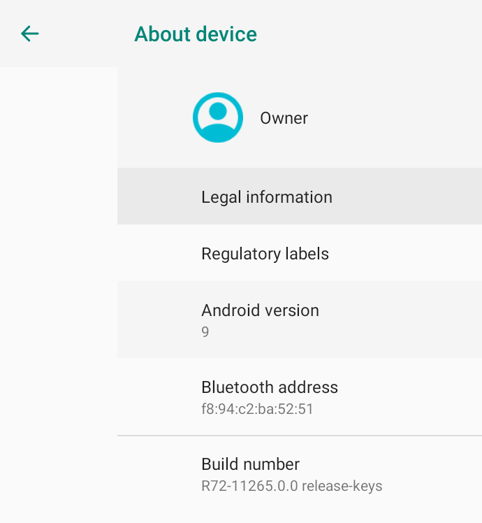
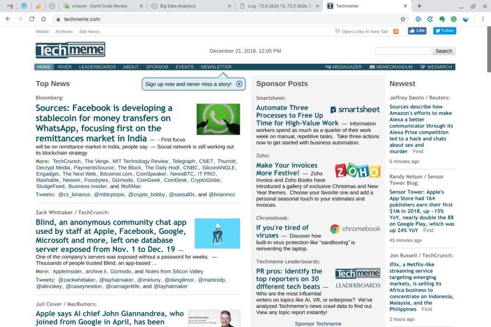
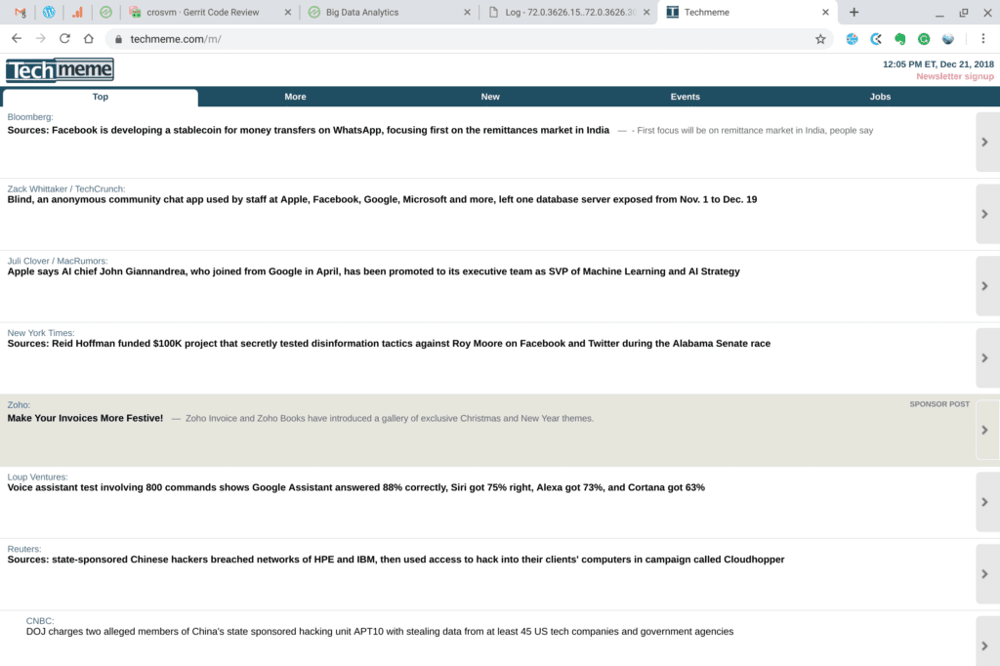
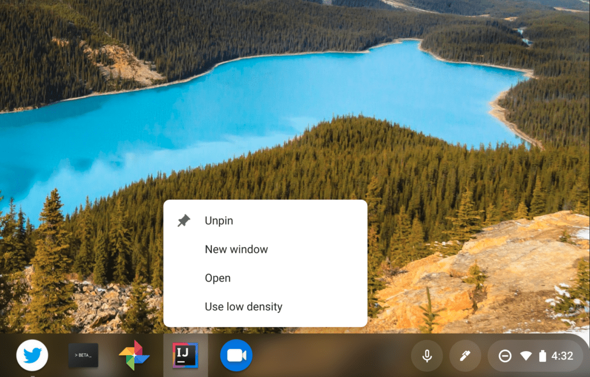
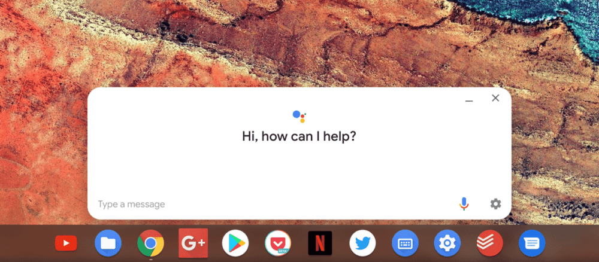
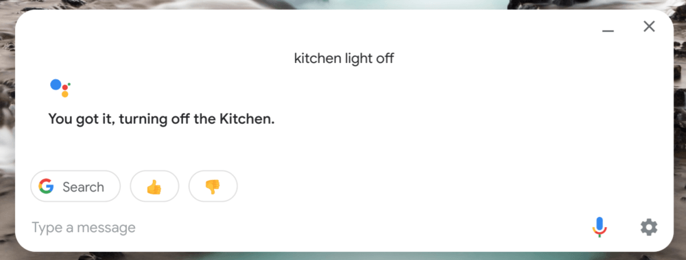

Good news if you've been waiting for some the latest Chrome OS features I've been testing for the past several months: [Chrome OS 72 hit the Stable Channel on Friday](https://chromereleases.googleblog.com/2019/02/stable-channel-update-for-chrome-os.html) and is in the process of rolling out to various Chromebook devices.

Here's the list of what Google says has changed, been added or improved:

- Addition of a page about touch gestures in the built-in ChromeVox screen reader tutorial
- Chrome browser has been optimized for touchscreen devices in tablet mode
- External storage access for Android apps using direct /storage and MediaStore APIs
- App shortcuts for Android apps are now searchable in the launcher. Users can find an app shortcut by long pressing or right-clicking on an Android app.
- Policies added to manage print job attributes for native printing including simple/duplex printing and color/B&W printing
- Picture in Picture (PiP) now available for Chrome sites
- Within the ChromeVox screen reader, added a setting in the ChromeVox options page to read anything under the mouse cursor
- Files saved via Backup and Sync on Drive now available in Files app under My Drive/Computers

All in all, that's a nice list. But here's what **_else_** is in there based on my testing experience since Chrome OS 72 landed in the Dev Channel back in November:

## External storage access in Linux and easier .deb package installs

First up is USB support for Crostini, the containerized instance of a full Linux distro; Debian is the default. This opens up the ability to [mount a USB or SD card drive in Chrome OS and share it with Linux](https://www.aboutchromebooks.com/news/chrome-os-72-dev-channel-usb-sd-card-support-project-crostini-chromebooks-android-9-pie/). To share it, find the external storage in the Chrome OS Files app, right-click it, and choose "Share with Linux". The external storage device will then appear as a file mount available at _/mnt/chromeos/removable/\[name of storage\]_ with the name of the card or USB drive inserted where I have brackets (don’t include the brackets when accessing your mount in Crostini).

Also, there's no longer a need to [move downloaded .deb package files for Linux apps from the Chrome OS filesystem over to the Linux files](https://www.aboutchromebooks.com/news/install-linux-apps-chromebook-share-with-linux-files-for-project-crostini/). That step is gone because the Chrome OS package installation process has been updated to work securely and directly from your Chromebook files, right in the native Files app.

## Android 9 Pie upgrade

Yes, your [Chromebook or Chrome tablet may be upgraded to Android 9](https://www.aboutchromebooks.com/news/chrome-os-72-dev-channel-usb-sd-card-support-project-crostini-chromebooks-android-9-pie/) before your handset. That's because Google doesn't have to deal with carriers or third-party software testing on Android for Chrome OS; it can simply push out the update to Chromebooks. It's quicker because the company has already certified all of the software on Chrome OS, which can't be modified, so there isn't any (or much) device fragmentation to deal with.

## Tablet view option to see the mobile version of web pages

\[caption id="attachment\_2547" align="aligncenter" width="800"\] Desktop view\[/caption\]

There aren't too many Chrome tablets out on the market but folks that own one might appreciate this new option, particularly those that have a small slate, such as the [Acer Chromebook Tab 10](https://www.aboutchromebooks.com/news/acer-chromebook-tab-10-review-unit-is-here-got-questions/) or the [Asus Chromebook Tablet CT100](https://www.asus.com/us/Tablets/ASUS-Chromebook-Tablet-CT100PA/). When surfing on the Chrome desktop browser, there's a new option (in the top right, three-dot menu) to [show the mobile version of a site](https://www.aboutchromebooks.com/news/chrome-os-72-dev-channel-mobile-tablet-view-web-page-setting/). This makes it easier to read and interact with on a touchscreen. This is actually in Google's above feature list, but there's not much of an explanation on what the feature is and how to use it.

Here's the same website shown above when using the tablet view option:

\[caption id="attachment\_2548" align="aligncenter" width="800"\] Tablet view\[/caption\]

## HiDPI toggle for Linux apps in Project Crostini

Folks who have been running Linux apps in Chrome OS may have seen some very tiny text or icons in those apps. That's due to how a Chromebook scales its display. Now there's a new option to open Linux apps in either high- or -low DPI mode for optimal pixel density.

Before this feature arrived, I could barely read some the small text in a few of my Linux apps. Now, they look great. Here's a before and after example of Sublime Text:

\[gallery type="slideshow" size="full" ids="2605,2603"\]

## Google Assistant is baked into your Chromebook

\[caption id="attachment\_2038" align="aligncenter" width="1000"\] Image Credit: Chrome Story\[/caption\]

Prior to Chrome OS 72, you could always use a voice or typed command to get information from Google, although it required you to have the Google Play Store installed. Now you can natively control smart home devices and get more personalized information. Essentially, [your Chromebook is now like a Google Home device](https://www.aboutchromebooks.com/news/chrome-os-72-native-google-assistant-chromebooks/). The Assistant interface has now expanded in size and moved to the center of the display as well. Of course, this functionality is optional so it can be enabled or disabled at any time. And you can still use it without the "always listening" function on if you don't mind typing out your commands.

## USBGuard is enabled by default

This feature is noted in the [enterprise version of the Chrome OS 72 changelog](https://support.google.com/chrome/a/answer/7679408?hl=en) but it affects all Chromebooks. To reduce potential security threats over USB, [Chrome OS won't have access to any USB drives or devices when locked](https://www.zdnet.com/article/chrome-os-to-block-usb-access-while-the-screen-is-locked/).

## Still don't see Chrome OS 72 on your Chromebook?

Remember that Google rolls out Chrome OS updates on a staggered basis, so your device may not have the new software available just yet. An easy way to track which version is available for which device is to hit the [Chrome OS Update Matrix found here](https://cros-updates-serving.appspot.com/).
