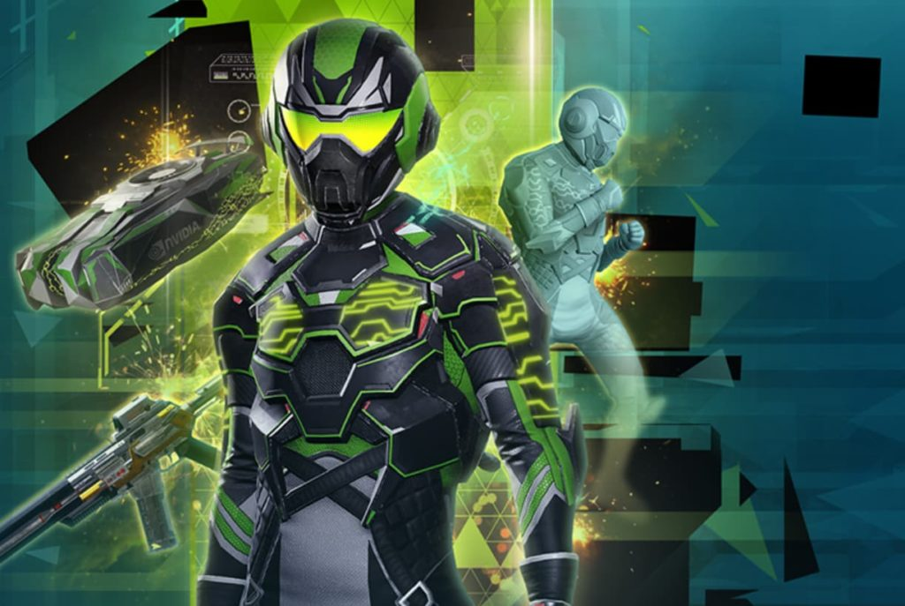
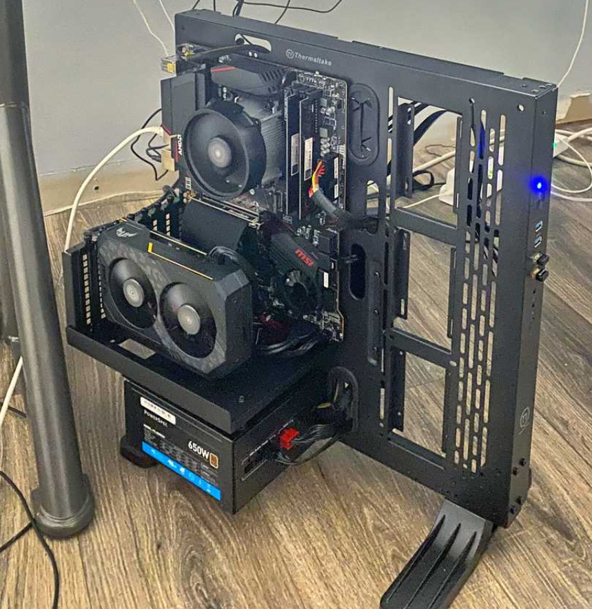

Google made a big splash with its [Stadia gaming service, bringing PC games from the cloud directly to Chromebooks](https://www.aboutchromebooks.com/news/google-stadia-turns-every-chromebook-into-a-pc-gaming-rig/). Today, Nvidia is following suit with news of [Chrome OS support for GeForce NOW gaming on Chromebooks](https://blogs.nvidia.com/blog/2020/08/18/geforce-now-open-a-chromebook/) at [https://play.geforcenow.com/](https://play.geforcenow.com/).

Like Stadia, GeForce NOW streams PC games from the cloud, where they can be played directly in the Chrome browser. Unlike Stadia, although some would say it _should_ have done this, Nvidia says this is a beta offering for Chromebooks.

To celebrate the launch, [Nvidia is offering a six-month Founders Edition subscription package for $24.95](https://www.nvidia.com/en-us/geforce-now/hyper-scape-bundle/). That gets you a half-year of cloud gaming on your Chromebook and includes a Hyper Space Season One Battle Pass and special in-game content for Epic's latest battle royale. Nvidia says the Founders Edition is a $64.94 value based on the standard monthly subscription charge of $4.99 plus the cost of the Hyper Space bundle.

While both services provide online gaming for Chromebook owners, there are some key differences.

For starters, you can play games on either for free. However, with GeForce NOW, you only get one hour per session at the free tier, likely to test or trial gameplay, or play every now and again on your Chromebook. Stadia users with an unpaid account, can play all they like for no monthly fee, with games limited to 1080p resolution.

Ah, but what about those games? Here's where Nvidia comes out ahead in a big way.

Stadia users that don't pay for the service have to pay for each game title directly in Stadia. That means if you bought three games through Stadia as a non-paying subscriber, you only get to play those three games on the service.

GeForce NOW takes a similar approach that's different in one key respect: You don't purchase games through Nvidia. Instead, you buy PC titles through Steam, which also supports games purchased directly from developers such as Epic, Ubisoft and more.

That's a key difference because Steam discounts PC titles on a regular basis. I was able to purchase the latest Tomb Raider game with all DLC, The Witcher 3, Assassin's Creed: Odyssey, and some smaller indie titles for around $60 on a recent sale. Had I paid full price, it would have easily cost me close to $100 more.

On Stadia, game discounts are limited to paying Stadio Pro members who pony up $9.99 a month for higher resolution gaming, a few free titles each month (that you may or may not want to play) and sale pricing on some games.

The gaming rig I built

Oh and if you have a gaming PC like I do, GeForce NOW lets you play from another device, such as a Chromebook or Nvidia Shield TV over your home network. Essentially, you're streaming locally instead of streaming from Nvidia's servers.

Aside from [my recently built gaming PC](https://www.kctofel.com/2020-07-31-I-was-so-wrong-dont-build-your-own-PC/), I do have a Stadia account. And I tested Nvidia's game streaming service way back in the early days on my first-gen Shield TV. So I've used all of those gaming options extensively, in addition to owning several game consoles.

Yes, playing a game that's directly installed on good hardware will give you the best gaming experience but you're limited to playing on that one device.

Stadia opened the doors to gaming anywhere you had a fast enough internet connection and on Chromebooks, which I definitely appreciate. But for gaming on the go with the largest possible amount of game titles, Nvidia's GeForce NOW is the way to go.

Although I can't speak to how well it yet works on Chromebooks or if Nvidia's game servers are up to snuff for a large audience, my previous experience with it has been excellent. And now I can have that same experience on my Chromebook, which is icing on the cake.
