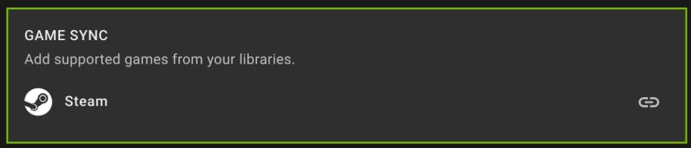
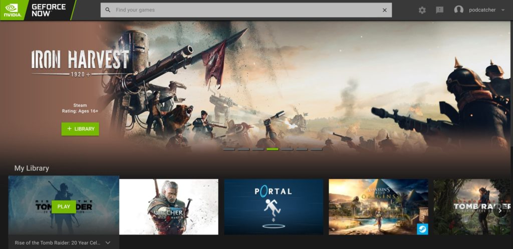
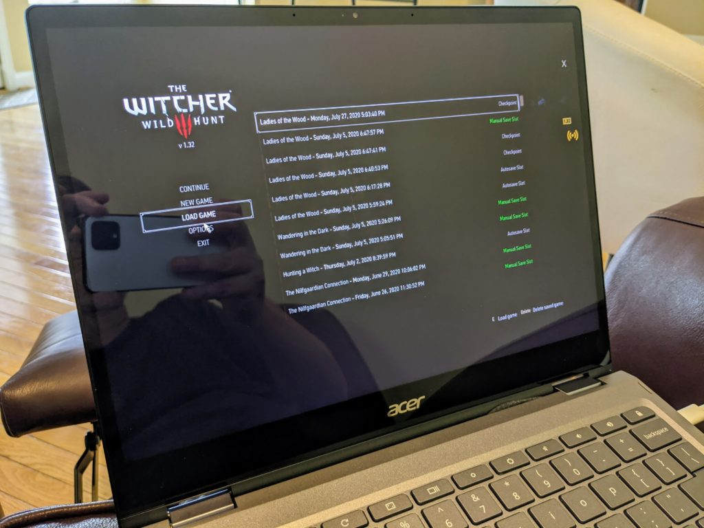

Last month, [Nvidia debuted a special site for Chromebook users to stream and play PC games](https://www.aboutchromebooks.com/news/stadia-vs-geforce-now-chromebook-launch/) at a lower monthly price than paid Stadia Pro accounts. This month, a small tweak to GeForce Now for Chromebooks could make a big difference on which gaming service you might use. If you have a game library with Steam, you'll probably lean towards Nvidia's offering because you can now sync those game titles from Steam to GeForce Now.

[I caught wind of this news on 9to5 Google](https://9to5google.com/2020/09/10/geforce-now-chromebook-steam-sync/) and since I have a Steam account, hit the [GeForce Now site](https://play.geforcenow.com/) on my Chromebook immediately to verify. Yup, the option is there and I gave it a quick test.

All I had to do was click the option for Game Sync and then sign in to my Steam account. Five seconds later, my PC titles appeared on the GeForce Now site under "My Library" and I was able to fire up a streaming session immediately.

Not only can I play my previously purchased titles, my game save data is in the Steam cloud, so I can pick up in any game where I left off on the gaming PC rig I built a few months back.

For me and other Steam users, this is kind of like the best of both worlds: The game streaming service offered by Google Stadia and the broad game title availability of Steam all wrapped into one. Of course, GeForce Now also includes roughly 100 games with the monthly plan, although those titles do rotate from time to time.

Who would have thought than in less than a year, we went from no true PC gaming options on Chromebooks -- sorry, Android games don't quite compare -- to a pair of them, each with different pros and cons? Regardless of which streaming game platform you choose, both of these have added some long awaited entertainment and fun to Chromebooks.
