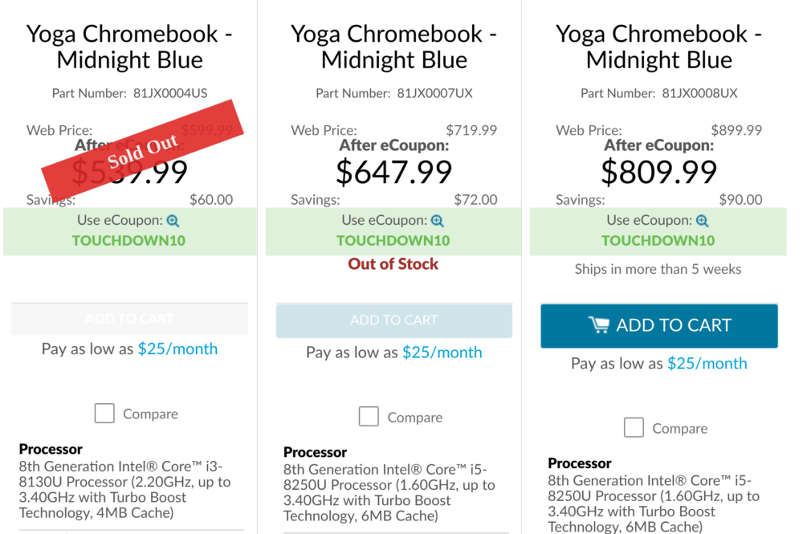

When I say "Super Bowl", do you think Patriots, Rams or... Chromebooks?

No, I don't get it either, but [Lenovo is holding a 10% off sale on all models of the Yoga Chromebook C630](https://www.lenovo.com/us/en/laptops/yoga/yoga-c-series/Yoga-Chromebook/p/88YGCC61096), including the newly available 4K device. In fact, that's the only model you can use the Super Bowl coupon code for since the Core i3 model is currently "sold out" and the Core i5 device with 1080p screen is listed as "out of stock".

By using the coupon code of TOUCHDOWN10, you can order the 4K version of this Chromebook for $809.99, a $90 savings off the $899.99 regular price.

Aside from the 3840 x 2160 display, you're getting high-powered hardware when it comes to Chromebooks:

- 8th-Generation Intel Core i5-8250U processor (which uses a fan for cooling)
- Integrated Intel UHD Graphics 920
- 8 GB of memory
- 128 GB of eMMC storage
- Bluetooth 4.1
- 802.11ac Wi-Fi (2 x 2 MIMO)
- 720p HD camera
- 2 USB Type-C ports, 1 USB Type-A port
- MicroSD card slot
- Backlit keyboard

Of course, with a 15.6-inch display, this isn't a light, small device: You'll be toting 4.2 pounds of hardware on the go with this 2-in-1. The upside is that when you're at a desk, you have a generously sized -- and super sharp -- touchscreen, making it less likely you'd need an external monitor to get work done. Or to watch 4K videos, if that's your thing.
