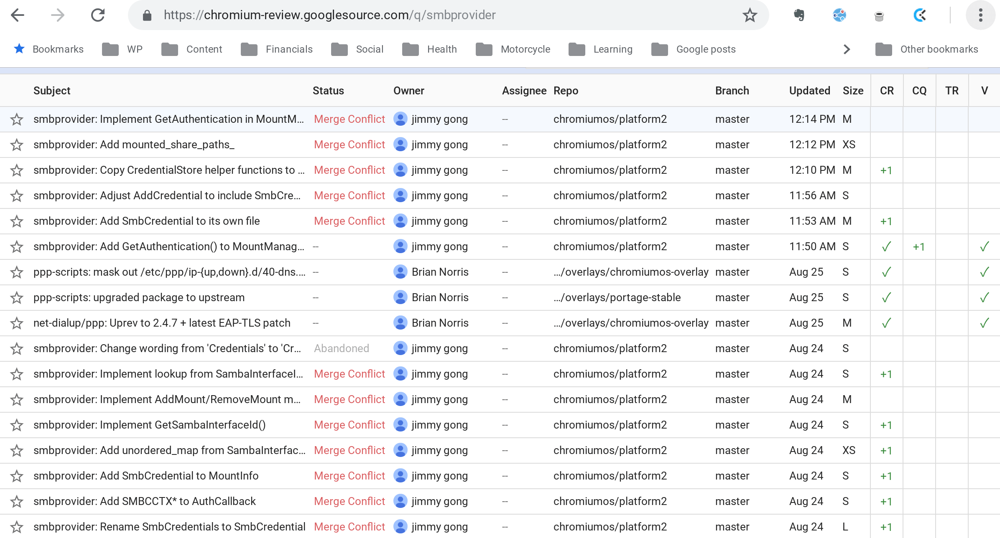
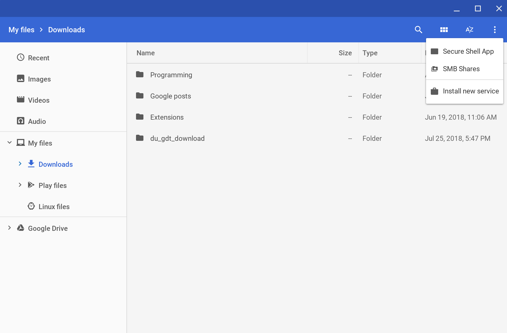
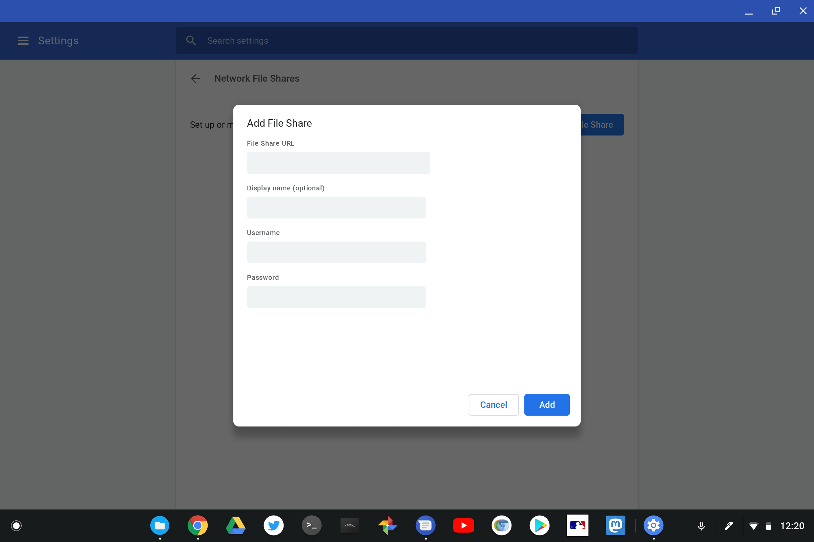

Back in March, [Chrome Story noticed a new flag in the Chrome OS Canary Channel to enable SMB file shares](https://www.chromestory.com/2018/03/native-smb-file-system-support-coming-to-chrome-os/). I see that flag -- it's _chrome://flags/#native-smb_ -- on my Pixelbook running the latest Dev Channel build, so I decided to dig around the latest Chromium code commits to see if there's any movement on this effort. My timing was lucky because I see a slew of progress this month and expect to see native network file shares soon.

These are just the most recent commits relevant to SMB services, for example:

I'm not going to get into details of all these because most of them are small bits of functionality related to the feature. Essentially, instead of using an extension to add network (or even cloud drive) shares to the Chrome OS Files app, this will be built in to the system. You might remember there was an option in Files to add an SMB service in the file tree; don't look for it there if you have the latest Files app though. It's been moved, at least for now.

To see it again, click the three dot menu button at the top right of Files. From here, you can click _**Add new service**_ to see the old **_Install new service_** choice and a new _**SMB Shares**_ option.

Choosing the latter currently shows me setup options for file sharing. I haven't gotten them to work yet, but again, this feature is still in development.

On a related note, [enterprises using Chromebooks or Chromeboxes will have a Chrome policy to enable or disable NetBios SMB share discovery](https://chromium-review.googlesource.com/c/chromium/src/+/1184240). The discovery will be on by default for non-enterprise users according to the code description.

I'll have to dig into the details of all these code changes a little more because it appears to me that Chrome OS could also natively support cloud drive integration from providers other than Google directly in the Files app. Stay tuned.
