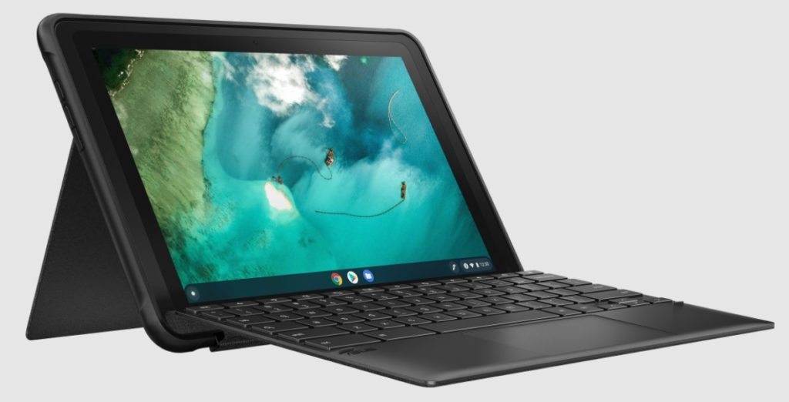
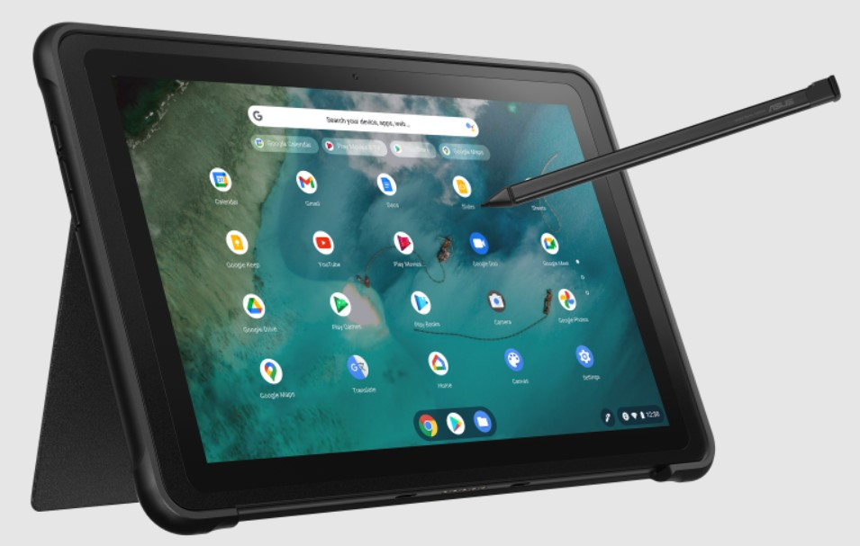

This year is turning out to be one of surprises when it comes to Asus. First, was the [unexpected debut of the fanless Asus Chromebook Flip CX5400](https://www.aboutchromebooks.com/news/asus-chromebook-flip-cx5400-is-a-new-fanless-core-i7-convertible-for-1049-99/) and now there's another one. It's the rugged [Asus Chromebook Detachable CZ1 for classrooms](https://www.asus.com/Laptops/For-Work/Chromebook/ASUS-Chromebook-Detachable-CZ1-CZ1000/). This time it wasn't me who sleuthed it out though. Thanks to an anonymous tipster, we have the early details.

Before you get too excited about a new Chrome OS tablet, the Asus Chromebook Detachable CZ1 is very similar to the [currently available Chromebook](https://www.aboutchromebooks.com/news/asus-chromebook-flip-cm3-tablet-is-official/) Flip CM3 tablet.

That means it has the same 1920 x 1200 touch display, stylus support with a garage for the pen, rear cover with hinge, and detachable keyboard.

The main difference is on the _**outside**_. This model is built to withstand the bumps and bruises of a classroom setting.

Asus describes it better than I can, so here's the copy from the product page to explain:

> Built to military-grade standards, it’s packed with protective features, including a wrap-around rubber trim, shockproof cover and durable 3D-textured finish. It features a free-angle adjustable stand cover and full-size keyboard with 1.5 mm key travel, plus an ErgoLift design

The device has been tested for up to 1.5-meter drops, for example, and withstand endure 15 kg of force without any panel damage.

Overall, this looks like a viable Chrome OS tablet specifically for the classroom. I'd say mostly early classrooms but given the reasonable performance of the MT 8183 (aka Kompanio 500) processor inside and 4 GB of RAM, some high school work is possible as well.

Then again, those students might not need (or want) the ruggedized look. In that case, the CM3 is a reasonable choice.

There's no price or availability information yet, just a product page and specs. So stay tuned for a product announcement at some point from Asus.
