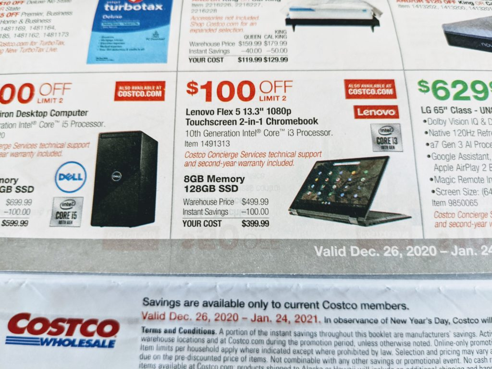
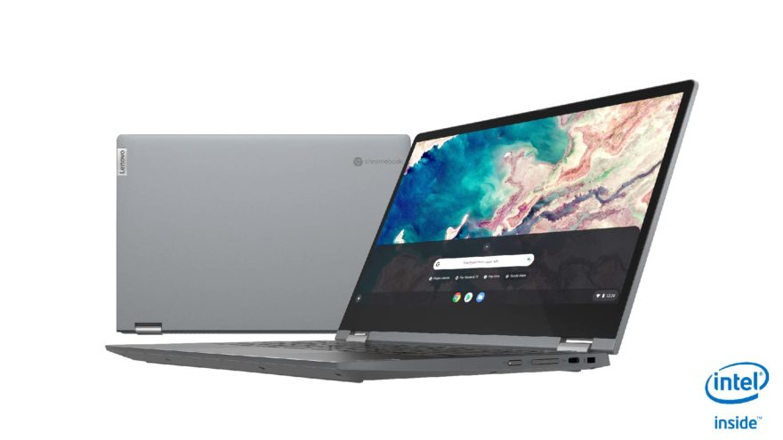

There's a bang-up sale on the top configuration of the [Lenovo Flex 5 Chromebook](https://www.aboutchromebooks.com/news/lenovo-flex-5-chromebook-hands-on-and-first-impressions/) currently going on. And the deal is good all the way through January 24 at Costco.

Between now and then, [the $499 Lenovo Flex 5 Chromebook is discounted by $100](https://www.costco.com/lenovo-flex-5-13.3%22-2-in-1-touchscreen-chromebook---10th-gen-intel-i3-10110u---1080p.product.100692744.html), making the final price $399.99

It was [only a few weeks ago that this model became available in the U.S.](https://www.aboutchromebooks.com/news/theres-finally-an-8-gb-memory-version-of-the-lenovo-flex-5-chromebook-available-in-the-u-s/), doubling up the 4 GB of memory on the original model that's been around for most of this year.

Aside from getting 8 GB of memory, you also get the 128 GB storage configuration. Oh and that's not the slower eMMC storage; it's NVMe, which is much faster for moving data back and forth on the internal drive.

The Lenovo Flex 5 Chromebook has a solid 1080p touchscreen, measuring 13.3-inches, and getting a Core i3 processor is quite a value at this price.

Here's full rundown on the specs:

<table><tbody><tr><td>CPU</td><td>10th-Gen Intel Core i3-10110U</td></tr><tr><td>GPU</td><td>Intel Integrated Graphics</td></tr><tr><td>Display</td><td>13.3-inch 1920 x 1080 IPS touchscreen, 300 nits</td></tr><tr><td>Memory</td><td>8 GB DDR4</td></tr><tr><td>Storage</td><td>128GB NVMe SSD, microSD slot for expansion</td></tr><tr><td>Connectivity</td><td>WiFi 6 (2x2 MIMO), Bluetooth 5.0</td></tr><tr><td>Input</td><td>Water-resistant, backlit keyboard, multitouch trackpad, 720p webcam</td></tr><tr><td>Ports</td><td>Two USB Type-C (3.1), one USB Type-A (3.1), headphone jack</td></tr><tr><td>Battery</td><td>Claimed run-time of up to 10 hours</td></tr><tr><td>Weight</td><td>2.97 pounds</td></tr><tr><td>Software</td><td>Chrome OS automatic software update expiration: Jun 2028</td></tr></tbody></table>

As I said earlier this month, the Lenovo Flex 5 Chromebook should be capable of anything you can throw at it: basic browsing, online productivity apps, and games via streaming services or from the Google Play Store.

I’ve watched many streaming services on this device too: The IPS panel is quite good even though the brightness is average at 250 nits.

You’ll need to be a Costco member to buy at this price, else you pay a small premium. My advice? See if a friend or family member who belongs to Costco will order one if you think this is the Chromebook for you. By the way, Costco provides a second year on your warranty; another nice perk.

One complaint I've heard quite a few times about this device is worth a mention before you pull the trigger though.

Several commenters have noted that the plastic hinges have broken on this device. I haven't experienced that with the Flex 5, nor any other Chromebook that uses plastic hinges. However, it should be noted that this issue has surfaced more than once.
