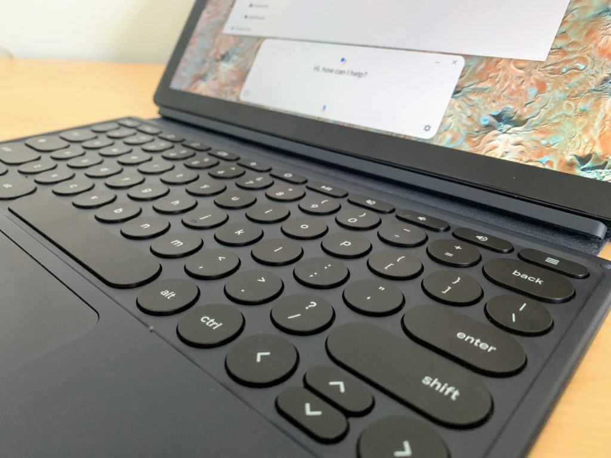

Now that consumers are getting their Pixel Slate devices, it's interesting to hear from people who spent their own money on Google's first Chrome OS tablet. Yes, I was loaned [a Pixel Slate and Pixel Slate Keyboard for my review](https://www.aboutchromebooks.com/reviews/google-pixel-slate-review/), but I also dropped $1,199 of my own cash on the Core i5 model and keyboard attachment.

So too did [Jason Howell](https://twitter.com/jasonhowell), a host on several of the TWiT.TV shows and he hosted the [latest episode of This Week in Google](https://twit.tv/shows/this-week-in-google/episodes/485?autostart=false) where I was a guest. Jason saved $200 over my purchase by going with the [Core m3 option, which I think will be the configuration "sweet spot" for most buyers](https://www.aboutchromebooks.com/opinion/which-google-pixel-slate-to-buy-guide/).

Unlike many of the other Pixel Slate reviewers -- with [Jerry Hildebrand as an exception worth noting](https://www.androidcentral.com/google-pixel-slate-review) -- Jason is a long-time user of Chrome OS who has embraced the platform as a primary one. Another guest on the show, [Jeff Jarvis](https://twitter.com/jeffjarvis), is also a full-time Pixelbook owner; he loves the device and in my opinion, based on his use cases, the Pixel Slate isn't the ideal replacement for his Pixelbook as you'll hear in this episode.

Although we hit a number of Google-related topics, we spent a good amount of time discussing the Pixel Slate. Some interesting observations came from the episode, so if you want to tune in for them, the video is here, queued up to the time we first started the Slate discussion.

\[embed\]https://youtu.be/fWn324E4iX0?t=951\[/embed\]

<iframe style="width: 120px; height: 240px;" src="//ws-na.amazon-adsystem.com/widgets/q?ServiceVersion=20070822&amp;OneJS=1&amp;Operation=GetAdHtml&amp;MarketPlace=US&amp;source=ac&amp;ref=qf_sp_asin_til&amp;ad_type=product_link&amp;tracking_id=aboutchromebo-20&amp;marketplace=amazon&amp;region=US&amp;placement=B07JWB7QB2&amp;asins=B07JWB7QB2&amp;linkId=abc7097ab01201551d4600ea19dca046&amp;show_border=true&amp;link_opens_in_new_window=true&amp;price_color=333333&amp;title_color=0066c0&amp;bg_color=ffffff" frameborder="0" marginwidth="0" marginheight="0" scrolling="no" align="right"></iframe>

Perhaps most interesting to me how Jason was trying to be productive in tablet mode with the Pixel Slate.

I previously used an iPad Pro 12.9 for about 18 months as my full-time device. Yes, it was my laptop and my tablet, just like the Pixel Slate is for me today; I already sold and shipped my Pixelbook, so I'm all in on the Pixel Slate.

Jason is now finding out what I learned during my time with the iPad Pro: For the majority of people to be effectively productive with the Pixel -- or any other tablet, for that matter -- I think you really need some type of hardware keyboard. Even if it's a Bluetooth keyboard with your tablet on a stand, you'll be able to use Google Docs, Evernote, Any.do, etc... much more quickly with a keyboard.

Sure, if you're just tapping out a relatively short email or adding a task to you to-list, you can certainly use a tablet and its software keyboard. But for large amounts of text-based content creation? You'll want a keyboard as I suggested to Jason with a bit of cheekiness, saying "You're using it wrong." ;)

That led to an additional discussion on how the Pixel Slate is positioned. Is it a tablet first and desktop second?

If so, how did that affect the perception of reviewers (which I strongly believe it did, and not in a good way) and how will it influence consumer's purchase decisions? I definitely look at the Pixel Slate a bit differently, but rather than spoil it here, watch the video for how I framed it, which heavily influenced my own purchase decision as you'll see. Maybe this will help you decide [if the Pixel Slate is for you](https://www.aboutchromebooks.com/opinion/google-pixel-slate-vs-chromebook-should-i-buy-chromeos-tablet/) as a result.
