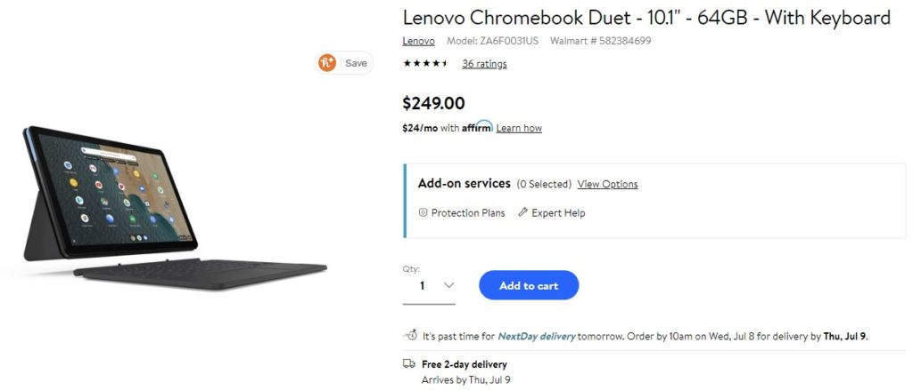

A few weeks ago, I noted that [Walmart was selling the $279 model of the Lenovo Chromebook Duet tablet for $249](https://www.aboutchromebooks.com/news/walmart-sale-drops-64gb-lenovo-duet-chromebook-tablet-to-249/). They sold out quickly and the listing changed to third-party sellers charging over $300. It looks like Walmart has new inventory: You can again [buy the Lenovo Duet Chromebook for under $250](https://www.walmart.com/ip/Lenovo-Chromebook-Duet-10-1-64GB-With-Keyboard/639904019?irgwc=1&sourceid=imp_xJf0OeQaTxyOWpmwUx0Mo38LUkiWwBVFI2h3VI0&veh=aff&wmlspartner=imp_10078&clickid=xJf0OeQaTxyOWpmwUx0Mo38LUkiWwBVFI2h3VI0&sharedid=aboutchromebooks.com).

[Get the 64 GB Lenovo Duet Chromebook](https://www.walmart.com/ip/Lenovo-Chromebook-Duet-10-1-64GB-With-Keyboard/639904019 "Get the 64 GB Lenovo Duet Chromebook")

Like I did the last time Walmart had this Chrome OS tablet in stock, I want to be this: which is the same hardware as the $299 model, save for half the local storage capacity. Even at this price, if you know you can fill up that 64 GB rather quickly with Android apps, media content, or other files, you’re still likely better off with the 128 GB version. Remember, there’s no memory card slot for storage expansion on the Lenovo Duet Chromebook.

Otherwise, this is a great deal at more than 10 percent off the typical $279 price you find this bundle of 10.1-inch tablet, removable kickstand backplate and detachable keyboard.

I still think this is more of a secondary device for most people, as noted in my [review of the Lenovo Chromebook Duet](https://www.aboutchromebooks.com/news/lenovo-ideapad-duet-chromebook-review-2020/):

> I’d **_never_** say you can’t use the Lenovo Duet Chromebook as your sole Chrome OS device but I don’t think it best fits that need. That is unless you’re a grade-school or middle-school student or you just need a basic tablet for browsing that just happens to come with a keyboard and kickstand.

My take is that while the portability is exceptional, a full-time, sit down device for around $300 would better suit your needs. Of course, you can use an external monitor with the Duet, which mitigates the small screen all day problem. You can do the same with a Bluetooth keyboard to give your hands a little more space too.

[Get the 64 GB Lenovo Duet Chromebook](https://www.walmart.com/ip/Lenovo-Chromebook-Duet-10-1-64GB-With-Keyboard/639904019 "Get the 64 GB Lenovo Duet Chromebook")
