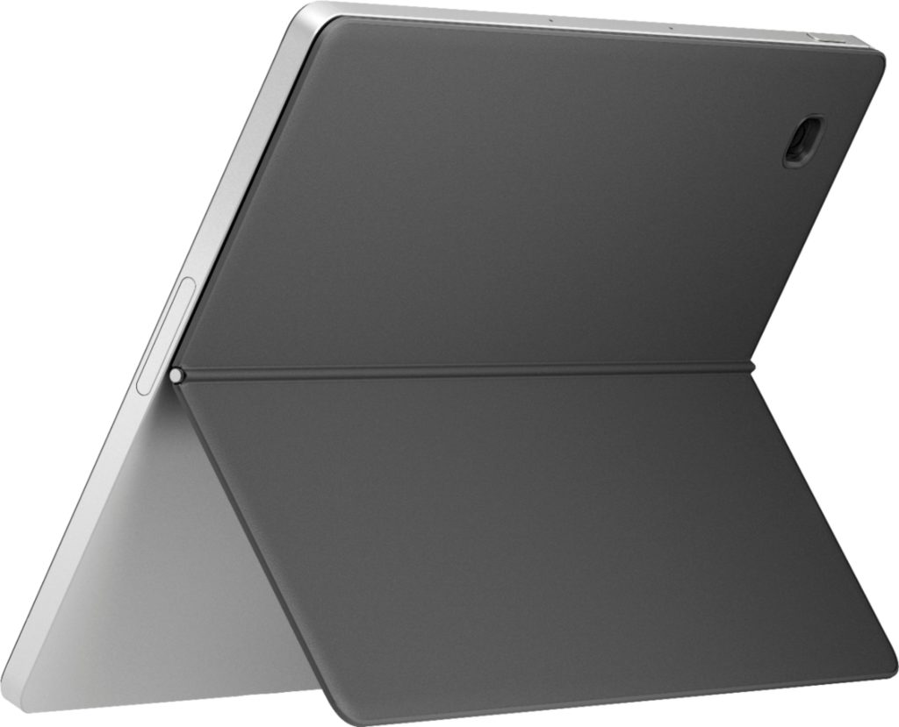

Well, that was quick. If you weren't happy with the $599 price tag of the [HP Chromebook x2 11 that debuted last month](https://www.aboutchromebooks.com/news/hp-chromebook-x2-11-detachable-lte-chrome-os-tablet-and-hp-chromebase-21-5-debut/), you can pic[k up the detachable Chrome OS tablet on sale for $399. Best Buy has dropped the price and it's good all this week.](https://www.bestbuy.com/site/hp-11-touch-screen-chromebook-qualcomm-snapdragon-8gb-memory-64gb-emmc-natural-silver-shade-gray/6471017.p?skuId=6471017)

This price is a bit more realistic for the HP Chromebook x2 11, which includes a digital pen, detachable keyboard, and removable back cover with a kickstand.

_(**Update**: Read my [full review of the HP Chromebook X2 11 here](https://www.aboutchromebooks.com/news/hp-chromebook-x2-11-review-a-good-value-when-on-sale/) and be sure to compare it to the [Lenovo Duet 5 Chromebook](https://www.aboutchromebooks.com/news/lenovo-duet-5-chromebook-review-a-better-laptop-than-tablet-but-great-for-the-money/) that I also recently reviewed.)_

I say that because nearly the same internals can be had for $399 in the Acer Chromebook Spin 513. Both the Acer and the HP are powered by a first-generation Qualcomm Snapdragon 7c processor. If you're curious about the performance experience on such a device, I [just reviewed the LTE version of the Acer Chromebook Spin 513](https://www.aboutchromebooks.com/news/acer-chromebook-spin-513-lte-review-a-lot-to-pay-for-that-mobile-broadband/).

Like the HP that's on sale, it comes with 8 GB of memory but has double the storage capacity of 128 GB. However, that extra eMMC storage isn't likely to impact the overall device performance if you're comparing.

For $399, you're getting a really nice display. The HP Chromebook x2 11 has an 11-inch IPS touch panel with 2160 x 1440 resolution. So you pixel-peepers out there shouldn't easily see individual pixels. It also has a fingerprint sensor for simple login and authentication, which is handy.

Unlike the LTE-enabled Spin 513, I just reviewed, I believe this configuration of the HP is WiFi-only. And because the Qualcomm chipset is two years old, you're only getting WiFi 5. If you don't have a newer WiFi 6 router, you shouldn't care. Although if you do upgrade your router in the future, you won't see a huge uplift on the HP.

