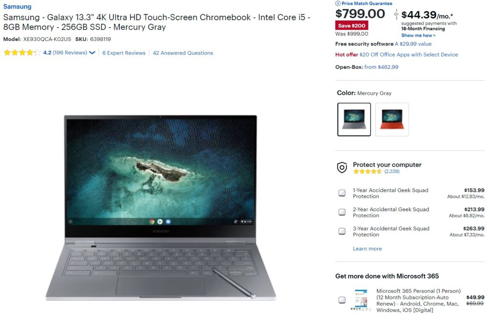

With more competition from [Acer](https://www.aboutchromebooks.com/news/acer-chromebook-spin-713-is-a-project-athena-refresh-of-my-daily-driver-the-chromebook-spin-13/), [Asus](https://www.aboutchromebooks.com/news/asus-chromebook-flip-c436-specifications-release-date-price-ces-2020/), and [HP at the high end of the market](https://www.aboutchromebooks.com/news/hp-pro-c640-chromebook-enterprise-release-date-specifications-now-available/), I'm not surprised to see that [you can get a Samsung Galaxy Chromebook for $799 right now](https://www.bestbuy.com/site/samsung-galaxy-13-3-4k-ultra-hd-touch-screen-chromebook-intel-core-i5-8gb-memory-256gb-ssd-fiesta-red/6398115.p?skuId=6398115). That's a $200 discount from the typical MSRP and more than double the last time this powerful Chromebook with OLED display had a sale price.

The Best Buy sale price is for either color: Mineral Gray or Fiesta Red.

[Get the Samsung Galaxy Chromebook](https://www.bestbuy.com/site/samsung-galaxy-13-3-4k-ultra-hd-touch-screen-chromebook-intel-core-i5-8gb-memory-256gb-ssd-fiesta-red/6398115.p?skuId=63981159 "Get the Samsung Galaxy Chromebook")

When the Samsung Galaxy Chromebook was announced in January, I thought the $999 price was justified for what you were getting: That 13.3-inch 4K OLED display, an integrated stylus, fingerprint sensor, 10th-gen Intel Core i5 U-Series processor, 8 GB of RAM and 256 GB of speedy NVMe local storage. But that power comes at a price and I don't just mean to your wallet.

In review after review, I've seen reports of mediocre battery life, far short of the 9 to 10 hours Samsung told me to expect. Testing has ranged from around 4.5 to 6 hours on a charge, indicating that expectations haven't been met. That could be resolved with some firmware upgrades and [software updates such as this one that could bring up to 28% more run time when browsing](https://www.aboutchromebooks.com/news/how-this-one-chrome-os-change-could-boost-chromebook-browsing-battery-life-up-to-28/), but it's still something to consider if you're interested in buying.

Of course, these days most of us are at home where outlets aren't in short supply. So maybe it's worth taking a chance on the first Project Athena 2-in-1 Chromebook and the first with that gorgeous OLED panel.

[Get the Samsung Galaxy Chromebook](https://www.bestbuy.com/site/samsung-galaxy-13-3-4k-ultra-hd-touch-screen-chromebook-intel-core-i5-8gb-memory-256gb-ssd-fiesta-red/6398115.p?skuId=63981159 "Get the Samsung Galaxy Chromebook")
