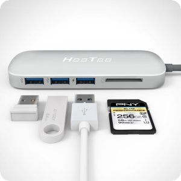

After nearly a week in Las Vegas for the Consumer Electronics Show, I'm back home and thinking about the trip. I've gone to CES nearly every year since 2005 and it's amazing to think of what I used to carry around the show -- often walking up to 50 miles during the event -- compared to what I had in my backpack this year.

Gone are the DSLR cameras and lenses, to be replaced by a smartphone and some add-on lenses from Moment. Instead of lugging a five-pound laptop and large external battery, the lighter [Pixel Slate and Keyboard](https://www.aboutchromebooks.com/reviews/google-pixel-slate-review/) easily lasted each and every day on a single charge. And instead of packing numerous power bricks to charge my smartwatch, phone, Amazon Kindle Oasis (hey, it never hurts to read while resting your feet at the end of the day!), I only took a few USB cords and the Pixel Slate charger because of one accessory: A USB Type-C hub.

Before I even bought my Pixel Slate, I ordered [this hub from Amazon](https://www.amazon.com/gp/product/B072268Q68/ref=as_li_tl?ie=UTF8&camp=1789&creative=9325&creativeASIN=B072268Q68&linkCode=as2&tag=aboutchromebo-20&linkId=f07790307e696b1f9799e0f3b1a5dd8e) (_affiliate link_) to use with my Pixelbook at the time. I'm not saying this is the best hub for your use case, so shop around if you want other features or a lower price. I like this one though because it has everything I need for home and travel.

With it, I have three USB 3.0 Type-A ports, for example. Using them, I can insert USB drives, connect my phone to transfer photos or charge my other devices. Technically, only one of those ports works with USB PD, or power delivery, but I've used all three to charge different things. Note that the power output on the non PD ports is low, so you can't use them to charge something like a tablet; phones and other small devices that draw less power can be charged though.

There's also an SD 3.0 card slot that I've used a number of times for file transfer both with full-sized SD cards and microSD cards with an SD adapter. HDMI output is supported as well, which I've used with my Pixelbook and a 4k monitor. It's not ideal with 4K displays because this port only supports up to 30fps at 4k, but you can drop to half resolution at 60fps and still have a sharp screen. I haven't yet tried HDMI output with the Pixel Slate yet.

<iframe style="width: 120px; height: 240px;" src="//ws-na.amazon-adsystem.com/widgets/q?ServiceVersion=20070822&amp;OneJS=1&amp;Operation=GetAdHtml&amp;MarketPlace=US&amp;source=ac&amp;ref=qf_sp_asin_til&amp;ad_type=product_link&amp;tracking_id=aboutchromebo-20&amp;marketplace=amazon&amp;region=US&amp;placement=B072268Q68&amp;asins=B072268Q68&amp;linkId=f5b8e75cef2f6dd4ef5bd8aec9f8d14c&amp;show_border=true&amp;link_opens_in_new_window=true&amp;price_color=333333&amp;title_color=0066c0&amp;bg_color=ffffff" frameborder="0" marginwidth="0" marginheight="0" scrolling="no" align="right"> </iframe>

Lastly is the ability to supply power to your USB-C laptop or slate since this has pass-through power of up to 100W. In my hotel room in Vegas, for example, I plugged my Pixel Slate charger into a wall outlet and connected the other end to this hub. The hub then connects to my Pixel Slate through USB-C to supply power from the wall, as well as the power to the other ports as needed. Note that even with this hub, I'm not supplying more than 45W to the Pixel Slate because the charger itself only provides 45W. I am considering upgrading to another USB-C charger in the future with higher power output if only to supply more power to the USB ports on the hub, but it's not necessary.

Considering all of the power bricks I used to take with me on the road  -- many of which I've lost over the years --and also the number of outlets these bricks use in my home office, this hub is well worth every penny I've spent on it. I use it daily, have more outlets freed up for other things in my office, gain the addition of an SD card reader and, if I want, external monitor usage for my Pixel Slate.
