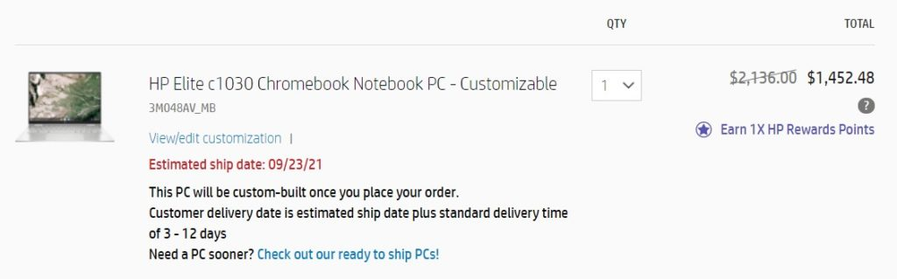
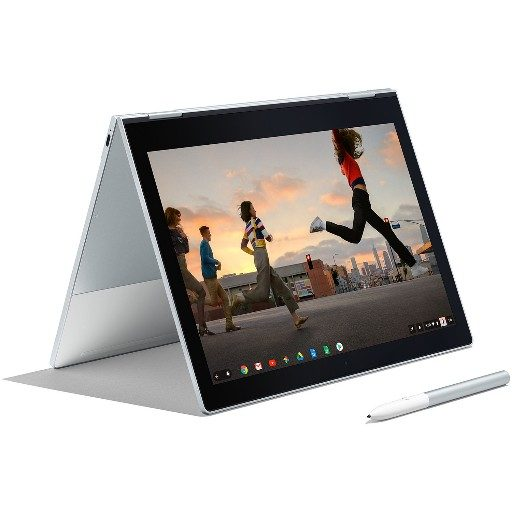
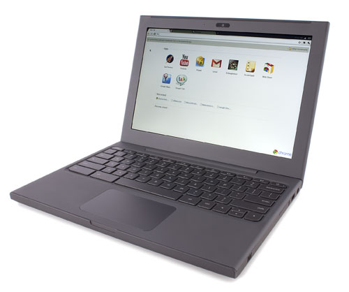
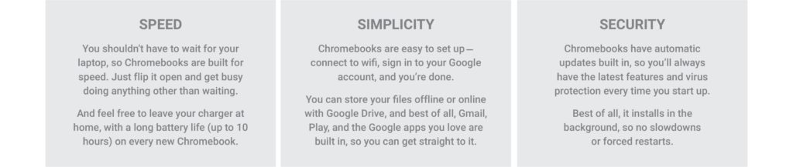
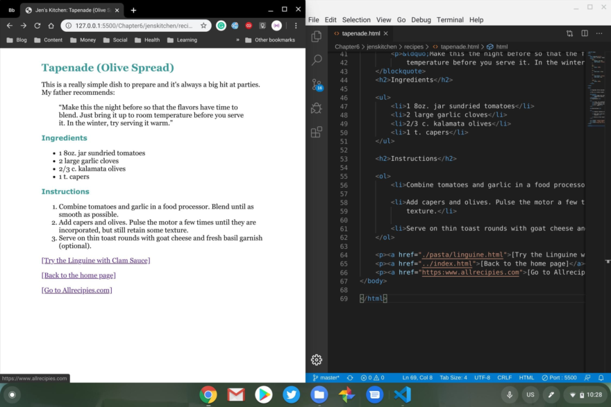

Yesterday I noted that the [2020 Samsung Galaxy Chromebook was available for $699, a $300 discount](https://www.aboutchromebooks.com/news/samsung-galaxy-chromebook-with-4k-display-on-sale-for-699/ "Samsung Galaxy Chromebook with 4K display on sale for $699"). I suggested that there's one key question you should as before deciding between it and the current model, the [Galaxy Chromebook 2](https://www.aboutchromebooks.com/news/ces-2021-samsung-galaxy-chromebook-2-price-release-date-specifications/ "CES 2021: Samsung Galaxy Chromebook 2 debuts as a cut-down convertible from $549"), which has a $699 configuration.

As I often do when talking about Chromebooks that cost this much, I get comments pushing back on the high price.

## The arguments against expensive Chromebooks

Yesterday was no exception, but I'm not trying to highlight the one comment about expensive Chromebooks. There are always people who think that $699, maybe even $599, is just too much to pay for one. **And that's fine**. I respect their opinions. I don't know their particular use cases or computing needs.

But there's often a consensus that Chromebooks in this price range and beyond is simply too much.

Why? Many reasons are provided, with the most often ones cited below:

- I can get the same hardware or better at that price with a Windows laptop.
- Chromebooks are supposed to be cheap.
- You can do so much more with a Windows or macOS laptop

Let me tackle these general viewpoints separately.

## Hardware for the price between Chromebooks and Windows

Yup, if you look around you can easily find a comparably priced Windows laptop with some better specs than a Chromebook. They're out there; I don't dispute that. But you may give up some hardware capabilities to get better ones in other areas.

More importantly are these two questions: Do you need a faster processor more memory and more storage for what you do? And do you rely on Windows apps? If so, then go for it! But my observation would be that you weren't in the market for a Chromebook anyway.

The criticism is akin to telling someone shopping for a 4x4 that they can get so much more car for the same price.

The point is specs shouldn't be the driving factor for buying a laptop. What you need to get done and how you plan to use it should be. Put another way: If you're buying a Windows laptop with better specs as a similarly priced Chromebook but you're going to live in the browser all day, _what are you actually gaining_?

You might get improved performance although that's not guaranteed. Chrome OS may not be the fastest operating system by comparison but it generally performs well on lesser hardware.

And if you are in the Chromebook market and a larger investment gets you a better experience based on a lighter device, better build quality or materials and maybe a better display, why is that a bad thing?

I've personally purchased at least three [Chromebooks that cost over $1,000](https://www.aboutchromebooks.com/news/acer-chromebook-spin-13-with-16-gb-ram-should-you-buy-one/ "I bought a new Chromebook with 16 GB of RAM. Should you?"). They were worth every penny because while they "do" all of the things a less expensive Chromebook can, it's a better experience.

Whether its faster performance, a higher resolution display, more storage, whatever the case may be, it's worth the extra money to me. If it wasn't I would have bought a less expensive model and been done with it.

You could say the same about macOS and Windows machines too. Across all price ranges, they all generally "do" the same things limited only by system resources and software requirements.

If they didn't, you'd have to shop for an "Office compatible" laptop instead of choosing any Windows machine to run Office, for example.

Yes, there are exceptions to this; gaming comes to mind, for example. By and large though, devices that support a software ecosystem generally support the whole ecosystem.

Another example: What can a MacBook Pro do that a less-expensive MacBook can't? There are a few things. It could be the number of external monitors support, for example. But the apps and use cases? Pretty much the same.

So why do people pay more for a Pro model? Because they want a better experience whether it's faster video rendering or overall general snappiness. Maybe it's a specific port that the non-Pro model has. In most typical use cases though? These do the same thing.

The same goes for choosing between a $499 Chromebook and one that costs closer to a grand.

Maybe you're a business user that has a few Windows apps keeping you from using a Chromebook. [You could use Parallels Desktop for Chrome Enterprise](https://www.aboutchromebooks.com/news/windows-10-on-a-chromebook-a-look-at-parallels-desktop-for-chromebook-enterprise/ "Windows 10 on a Chromebook: A look at Parallels Desktop for Chromebook Enterprise") in that case. _But you're going to need to spend more money on that Chromebook_. The system requirements of a $499 Chromebook won't cut it.

## "Chromebooks are supposed to be cheap"

In a word: **No**.

In more words: The reason the first Chromebooks 10 years ago were cheap was because as a proof of concept, they were built on existing netbook hardware. Netbooks **_were_** cheap. But [Chromebooks have evolved since then, even if some haven't seen that evolution](https://www.aboutchromebooks.com/news/10-years-of-chromebooks-and-people-still-dont-know-what-theyre-capable-of/ "10 years of Chromebooks and people still don’t know what they’re capable of").

Could a cheap netbook of today run Android apps? Not well. Could they handle a full Linux distro in a virtual machine within a container? Heck no. Unfortunately, some have glommed on to the equation that "Chromebooks = Netbooks" when it comes to price. It's simply not true.

Neither is the "Google said they were supposed to be cheap," mantra that needs to die already. I've explained that this wasn't the case when the [first Chrome OS demo took place more than 10 years ago](https://www.aboutchromebooks.com/news/chrome-os-is-10-years-old-heres-the-first-demo-from-2009/ "Chrome OS is 10 years old! Here’s the first demo from 2009").

You can hear it in Sundar Pichai's own words in that demo as he describes the "three S's" of Chrome OS: Speed, simplicity and security. Those three S's are still the pillars of Chrome OS and Chromebooks internally at Google. At least they were when I worked there back in 2017. I haven't heard any other new or replaced pillars.

## For the same price, you can do more with macOS or Windows

I won't dispute that. If you would rather use or need to use specific desktop apps, you shouldn't buy a Chromebook.

Here's the thing though: If that's the case, you weren't going to buy a Chromebook anyway. Or at least you shouldn't be unless you want to set yourself up for disappointment. Don't blame the tool because you bought the wrong one.

Just remember that Chrome OS and Chromebooks continue to gain new features that could meet your needs. I know I keep beating a dead horse by saying I'm [getting through a college Computer Science program with a Chromebook](https://www.aboutchromebooks.com/news/can-you-learn-to-code-in-a-college-computer-science-program-with-a-chromebook/ "Can you learn to code in a college Computer Science program with a Chromebook?"). But it's the best example I can come up with for what I do.

The addition of Linux support has made this possible. If I were a full time YouTuber or a CAD user, I'd surely be looking at an alternate platform that works better for my needs.

Given that I rely on Linux, I could just use a Linux laptop for my classes and the browser of my choice for typical Chromebook use. But Linux doesn't meet those three S's, which I've come to value.

Speed on Linux is pretty good. Security is great. Simplicity? Yeah, not so much. I could do it for sure; I have a Linux laptop for testing certain things. However, I value the simplicity of my Chromebook which handles the same tasks.

And if I was a full-time developer I'd have no issue paying $999 or more for a Chromebook that meets my needs. I know that some developers read this site. When I highlight a new Chromebook, even a high-end model, they want more. "Give me 32 GB of RAM so I can get my work done faster," they tell me.

This is a specific niche, of course, and doesn't represent the large majority of Chromebook users. However, they show demand for devices that are the best tools for their craft. And they know they'll be spending a good amount of money on them.

## Choose the platform meeting your own needs and move on

Look, I get it. Not everyone sees the value in a Chromebook that costs $699 or more. For what I do, I didn't see the need to spend several thousand dollars on a Mac Pro. Some people do see that value and there's nothing wrong with that.

Yet for some reason -- mostly misperceptions and a lack of priorities when making purchase decisions -- pricing logic applied to Chromebooks seems to be askew.

Again, you should get the right tools for your tasks. If you need bells or whistles with that tool and you can afford it, go for it. But enough already with the generalizations that expensive Chromebooks shouldn't exist. They do for good reasons that apply to the people who buy them. And I don't expect that to change.
