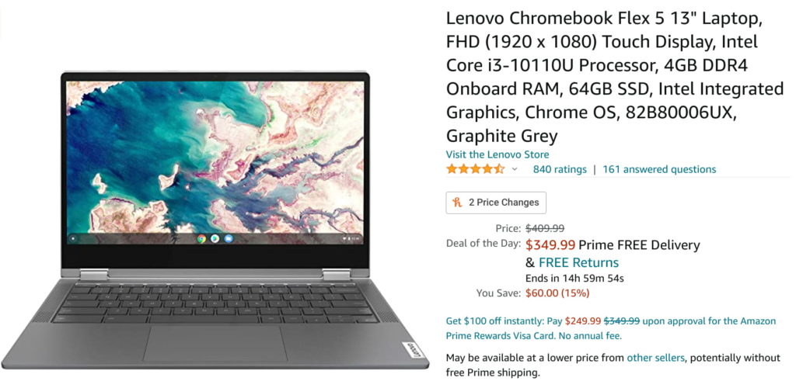

It seems like few retailers are actually waiting for Black Friday to share their best deals. Yesterday it was the [Acer Chromebook Spin 713 discounted to $549](https://www.aboutchromebooks.com/news/acer-chromebook-spin-713-early-good-friday-deal-sale/) and today it's the [Lenovo Chromebook Flex 5 on sale for $350](https://amzn.to/32Pa4TB), down from its typical $409 price tag. This is a fantastic mid-range Chromebook with a 10th-gen Intel Core i3 even at its _full_ price, making Amazon's daily deal even better.

For the money, I don't think you can spend $400 and get a better Chromebook right now. Well, unless that Chromebook is deeply discounted.

Why? Because you can easily configure an entry-level Chromebook for up to $400 and it _still_ won't come close to what the Lenovo Flex 5 Chromebook offers.

Instead of that entry-level model that might have a 1080p display and Intel Pentium Chromebook lacking features such as a backlit keyboard and support for faster, newer WiFi 6 routers, which adds some future-proofing. You can also purchase and use an optional USI stylus with this device.

Oh, and those [entry-level Chromebooks might be older models](https://www.aboutchromebooks.com/opinion/opinion-amazon-needs-to-stop-listing-chromebooks-with-misleading-information/), meaning they won't get Chrome OS software and security updates for as long as the Lenovo Chromebook Flex 5. It has support from Google until June 2028.

Here's a rundown on what you get for $350 with this discount:

<table><tbody><tr><td>CPU</td><td>Dual-core Intel Core i3-10110U Processor (2.1 GHz / 4.1GHz)</td></tr><tr><td>GPU</td><td>Intel Integrated UHD Graphics</td></tr><tr><td>Display</td><td>13.3-inch IPS 1920 x 1080 touchscreen, 16:9 aspect ratio, 250 nits brightness</td></tr><tr><td>Memory</td><td>4 GB DDR4-2600MHz memory</td></tr><tr><td>Storage</td><td>64 GB eMMC 5.1, microSD card slot for expansion</td></tr><tr><td>Connectivity</td><td>WiFi6 (802.11ax, 2x2 MIMO), Bluetooth 5.0</td></tr><tr><td>Input</td><td>Spill-resistant backlit keyboard, USI stylus (optional) support, 720p webcam with physical privacy shutter</td></tr><tr><td>Ports</td><td>1 USB Type-A, 2 USB Type-C, headphone/microphone combo jack</td></tr><tr><td>Battery</td><td>51 WHr, expected run-time up to 10 hours</td></tr><tr><td>Weight</td><td>2.97 pounds</td></tr><tr><td>Software</td><td>Chrome OS automatic updates through: TBD</td></tr></tbody></table>

<iframe style="width:120px;height:240px;" marginwidth="0" marginheight="0" scrolling="no" align="right" frameborder="0" src="//ws-na.amazon-adsystem.com/widgets/q?ServiceVersion=20070822&amp;OneJS=1&amp;Operation=GetAdHtml&amp;MarketPlace=US&amp;source=ss&amp;ref=as_ss_li_til&amp;ad_type=product_link&amp;tracking_id=aboutchromebo-20&amp;language=en_US&amp;marketplace=amazon&amp;region=US&amp;placement=B086383HC7&amp;asins=B086383HC7&amp;linkId=40e941943edbab90fc3b522e8f0a49e7&amp;show_border=true&amp;link_opens_in_new_window=true"></iframe>

Short of doing hard-core app development, even with 4 GB of memory, the Lenovo Chromebook Flex 5 should easily meet the needs of most students and consumers looking for an everyday, fast web browsing machine.  
The occasional Android app usage and maybe even a little light Linux could even be done on this convertible Chromebook.

I'd strongly consider it even at the full price of $409; [yup, it's that good for the money](https://www.aboutchromebooks.com/news/lenovo-flex-5-chromebook-hands-on-and-first-impressions/).

**_Note that Amazon may show you a higher price for the Flex 5. Look for the other new and used offers to see the $350 daily deal._**
