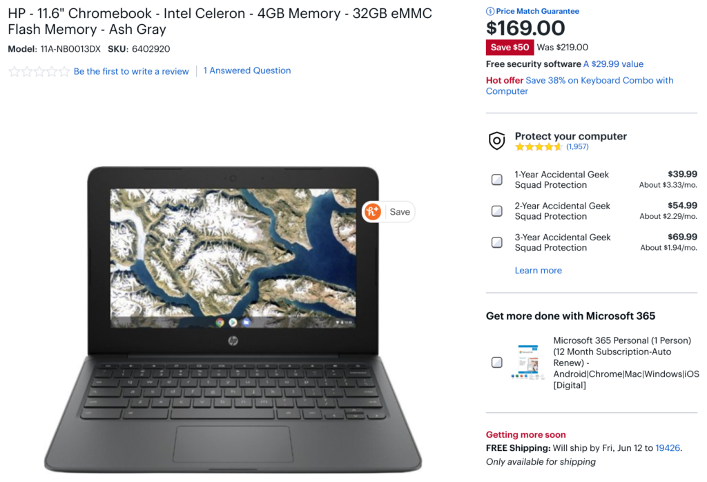
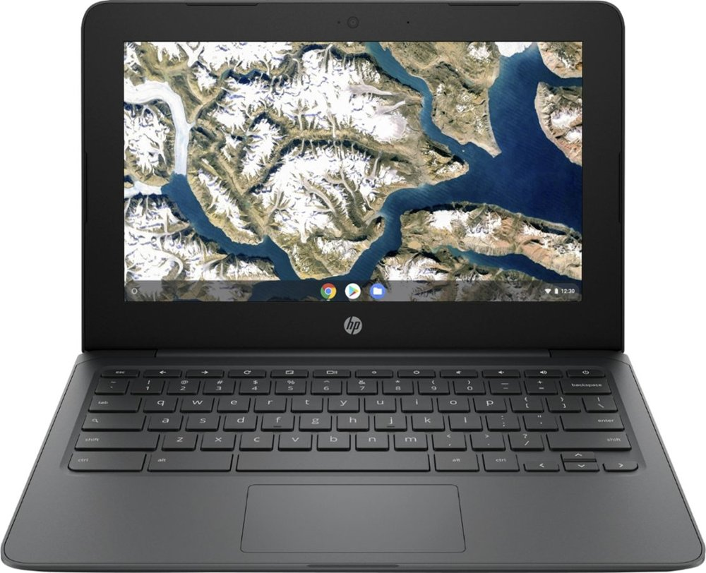
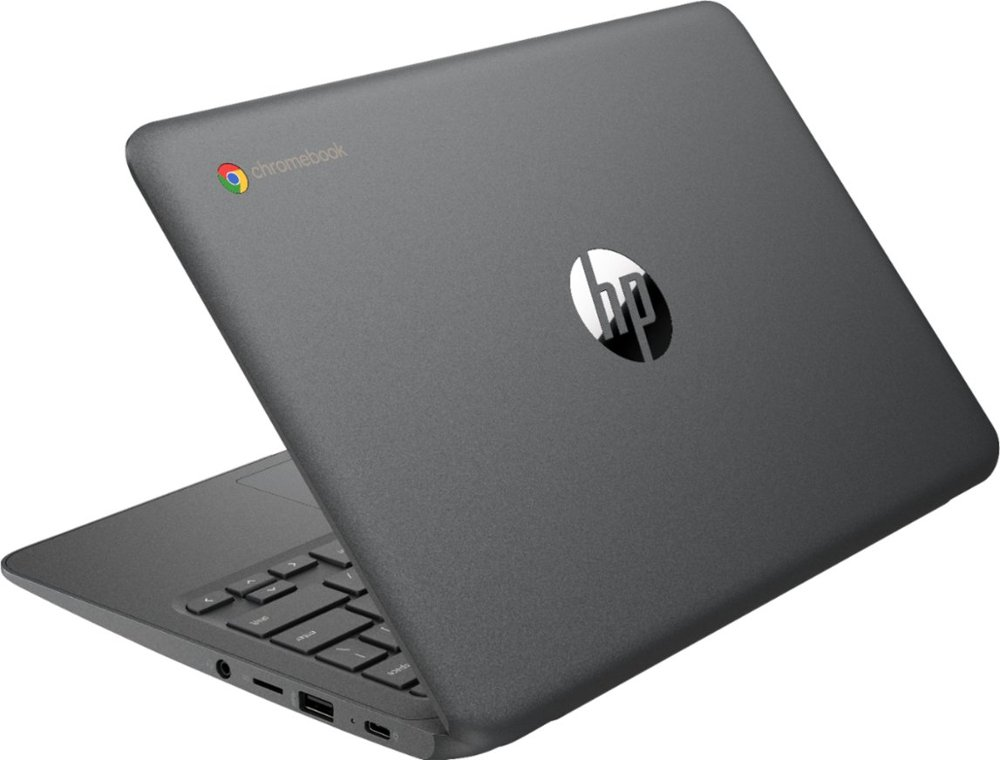

The typical entry-level Chromebooks I recommend cost around $300, although they sometimes see a $50 or so discount on sale. The new HP Chromebook 11a has an MSRP of $219, however, and it's [currently on sale at Best Buy for $169](https://www.bestbuy.com/site/hp-11-6-chromebook-intel-celeron-4gb-memory-32gb-emmc-flash-memory-ash-gray/6402920.p?loc=HP_6402920_PR&skuId=6402920), which is mind-boggling.

Again, this is "entry-level" so consider it as a basic browsing device for the couch, kitchen or comfy chair.

And the specs illustrate that expectation since this three pound clamshell Chromebook uses an older Intel Celeron N3350 processor. I guess Intel still has a bunch of those chips on hand or it has a fabrication line still churning them out for now. You'll also get 4 GB of memory and a meager 32 GB of local storage, but again, even at the full price of $219, the HP Chromebook 11a will get around the web for social media, email or Google Docs.

Yes, there are those big ol' bezels around the 220 nit brightness 11.6-inch 720p display. No they're not the prettiest to look at. There is an upside though: Larger bezels all around make the chassis a little wider for the keyboard so it shouldn't feel too cramped for a device with this screen size.

You're getting the typical Chromebook features on the cheap here: WiFi 5 and Bluetooth 4.2 support, a microSD card slot for storage expansion, a multi-gesture trackpad, a pair of SuperSpeed USB Type-C ports (5 Gbps transfer speeds), a pair of SuperSpeed USB Type-A ports, a 720p webcam, and of course, Android app support.

I checked on the Chrome OS automatic expiration date for software updates but don't yet see when it expires. And I don't see how long the 42 WHr battery is expected to last on a charge either. I do like that this Chromebook comes with a USB-C power adapter though.

Is this the nicest looking and sleekest 11.6-inch Chromebook on the market? Nope. Does this use an older Intel Celron processor? Yup. Is it worth the price? At $219, I'd say it probably is for a secondary device to have around the house. For $169, I'd say yes, for sure.

