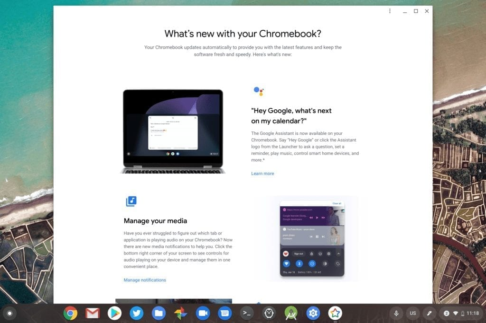
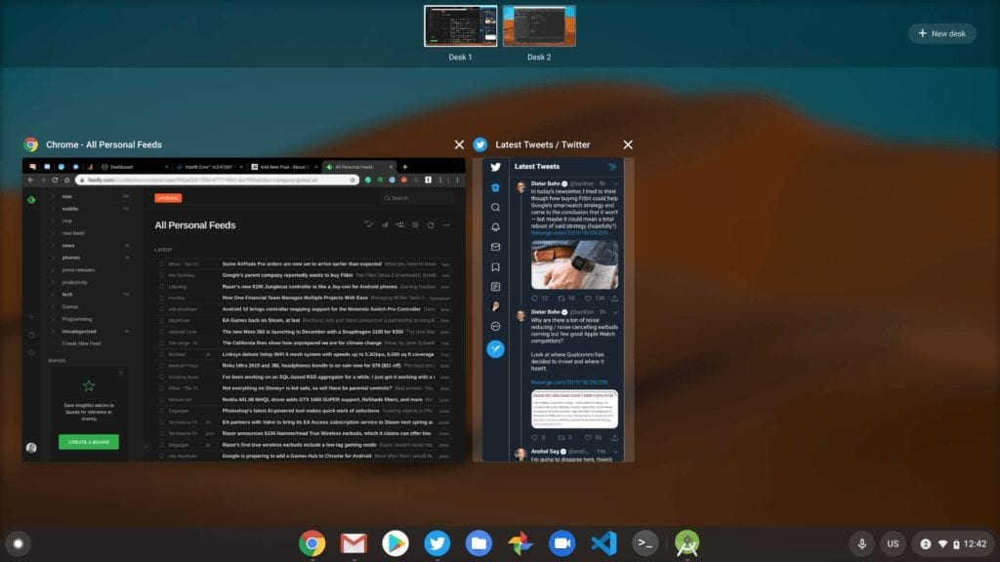

Some weeks back, Google added [a dedicated set of release notes that are easily seen on any Chromebook](https://www.aboutchromebooks.com/news/chromebooks-get-a-dedicated-chrome-os-release-notes-web-page/) after the latest software update. I've been asking for this feature for over two years, back when I worked with the Chrome team at Google, so I was thrilled to see this. You just click the "See what's new" option in the About Chrome OS settings menu. Or you can [view the dedicated webpage](https://www.google.com/chromebook/whatsnew/embedded/?version=78), which shows the same info.

Now that [Chrome OS 78 landed last week](https://www.aboutchromebooks.com/news/chrome-os-78-stable-channel-arrives-heres-what-you-need-to-know/), I went to see the release notes just to verify that I didn't miss any big, new features.

Here's what I saw on both a Pixelbook Go and Acer Chromebook Spin 13 after the Chrome OS 78 update:

The problem I see may not be obvious to you since I track Chrome OS functionality on a daily basis, so I'll explain: These are the [same features that arrived with Chrome OS 77](https://www.aboutchromebooks.com/news/chrome-os-77-stable-channel-arrives-heres-what-you-need-to-know/), a full six-weeks ago.

I double-checked the dedicated, on-board release notes with the linked notes and sure enough, they too still show the features added in last release, not the most current version.

Where is the news about [Virtual Desks being generally available](https://www.aboutchromebooks.com/tag/virtual-desks/), making it easier to group tabs and apps for improved multitasking productivity? What about the ability to tap a hyperlinked phone-number on your Chromebook and have the call placed on your connected Android phone? These are just two examples, but you get the point.

Using Virtual Desks to switch between Android Studio in Linux and general browsing activities

Frankly, for Google to want the public to see Chrome OS as a "first-class citizen" platform as compared to macOS and Windows, it has to see Chrome OS that way too. And something as simple but useful as the new release notes should be part of that perspective.

Sure, [Google outlined a few key features in the blog post about Chrome OS 78](https://blog.google/products/chromebooks/whats-new-november2019/), but outside of full-time Chromebook users like myself and some of the About Chromebook readers, what mainstream Chromebook user is following Google's blog posts?

I'd wager those people are few and far between, which means there's a failed messaging strategy here. And even worse, it fell apart right after trying to improve that messaging strategy.

There's simply no excuse for this.

It's not as if Google doesn't know what's changing in the platform since it's the entity actually building, testing and implementing the changes. My hope is that this is a one-off occurrence because publishing outdated Chrome OS release notes is about as useful as not publishing release notes at all.
