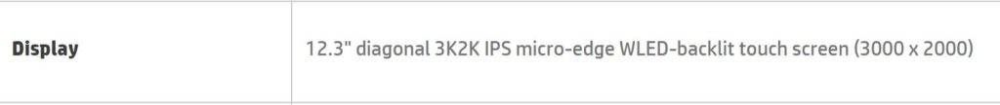

I was wowed by the 3000 x 2000 resolution Pixel Slate display when using a demo unit earlier this week. Turns out, it isn't the only Chrome tablet to have a screen with 293 dots per inch. There's a support page that reader, Rob, found, listing for [an HP Chromebook X2 variant with the same resolution](https://support.hp.com/us-en/document/c06160697?jumpid=reg_r1002_usen_c-001_title_r0004).

The product number is 5ET19EA and based on the final two characters, I _believe_ this is specifically for EU markets. I'm not 100% sure on that, however. I am sure that this is a top-of-the-line model due to the other hardware specifications: An Intel Core i5-7Y54 processor, 8GB of memory, 64GB of local storage and a backlit keyboard.

Unfortunately, here in the U.S., we're still waiting to see any configuration other than the base $599 model, so no 3K display for us yet. We're also still stuck with a Core m3 processor, 4GB of memory and 32GB of storage. We don't get a backlit keyboard either, although a few consumers someone got a unit with one.

While I loved the HP Chromebook X2 for the two weeks I had one -- I returned it to Best Buy -- the timing of its release combined with the upcoming Pixel Slate and other devices with more current chipsets wasn't ideal.

It's a great machine and validated my five-year desire for a Chrome tablet with detachable keyboard. But I'm thinking perhaps HP should have waited to release it with 8th-gen Intel chips and a thinner keyboard option using those pogo pins for those that want a lighter overall package.

Although you might not see a difference between it and the Pixelbook from this image, here's a few shots of the Pixel Slate's higher-resolution screen, which should be comparable to the one on this HP Chromebook X2 model.

\[gallery size="full" columns="1" type="slideshow" ids="1946,1947,1948"\]
