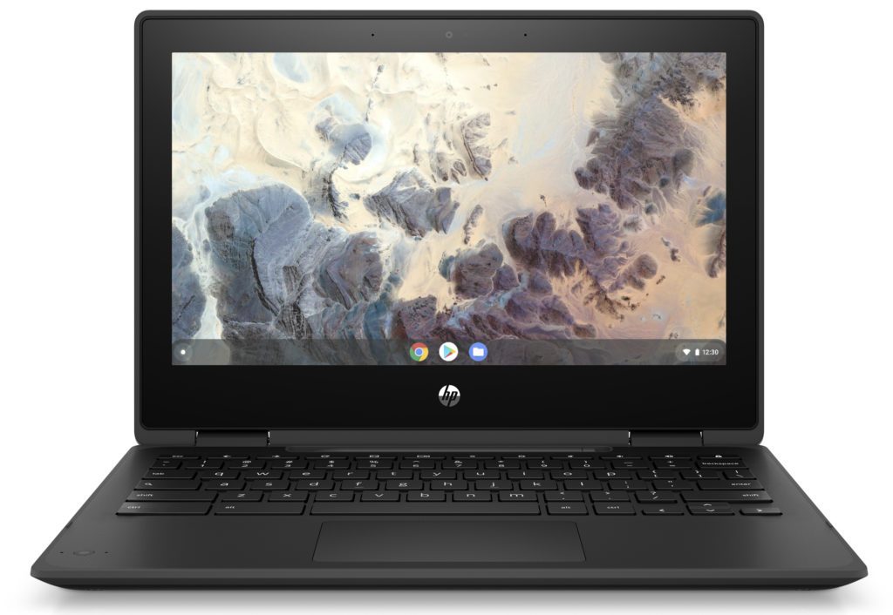
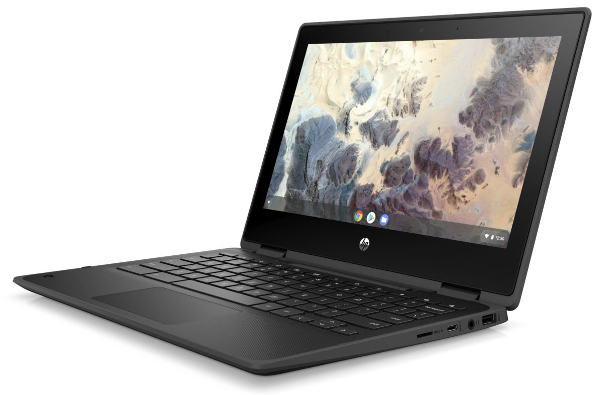
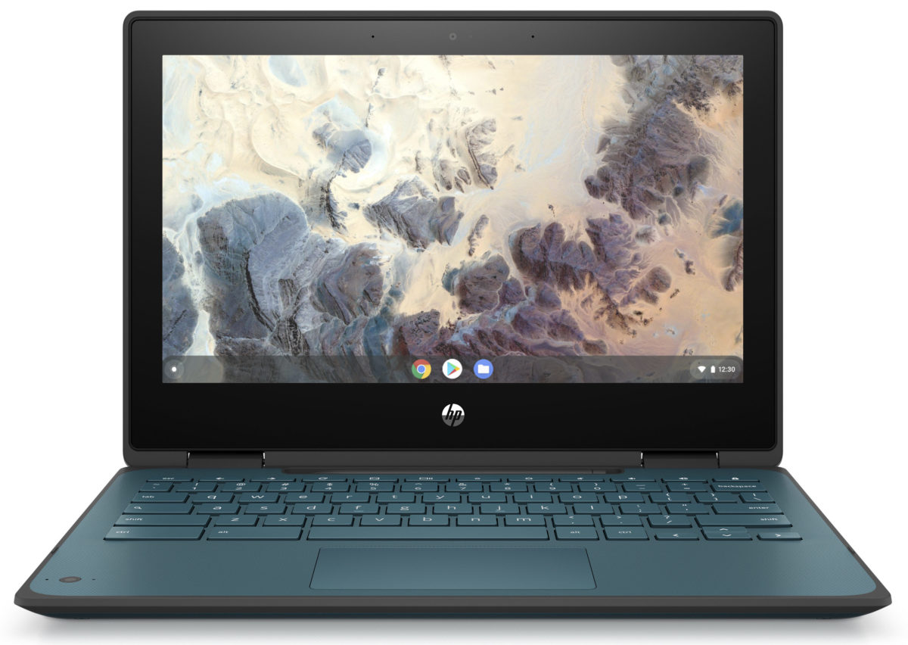
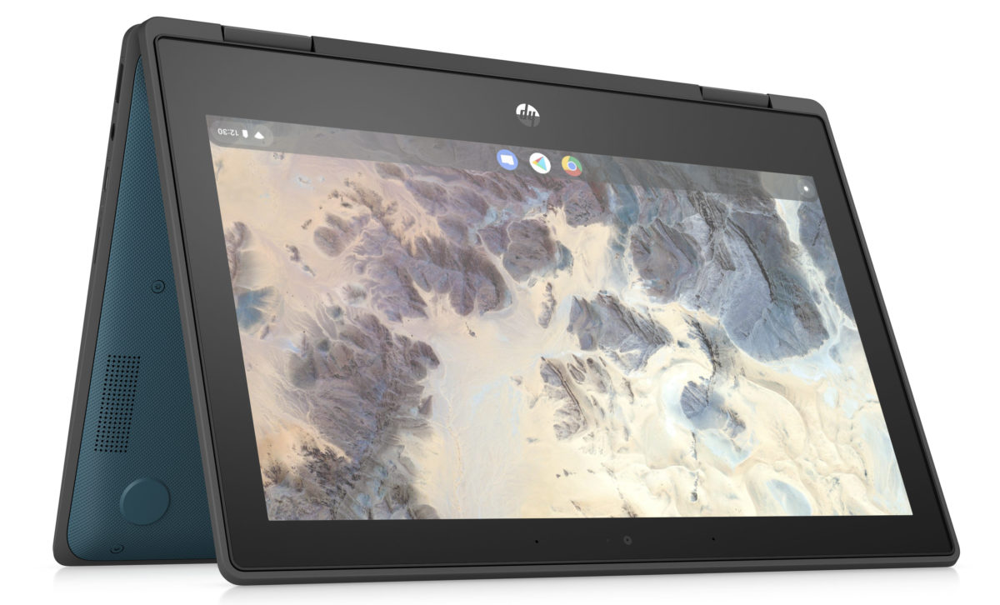
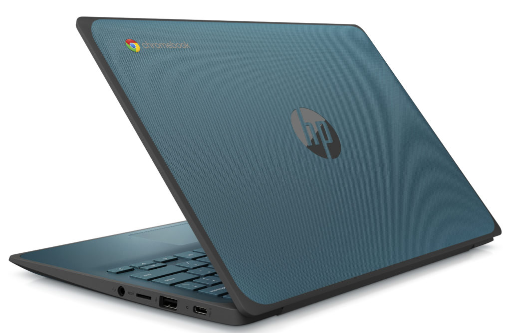
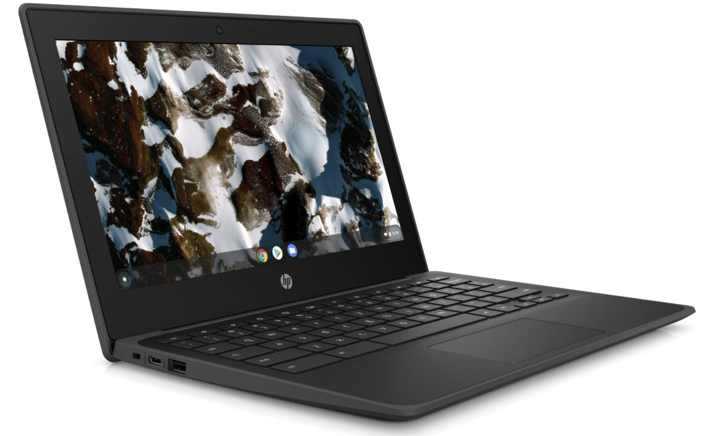
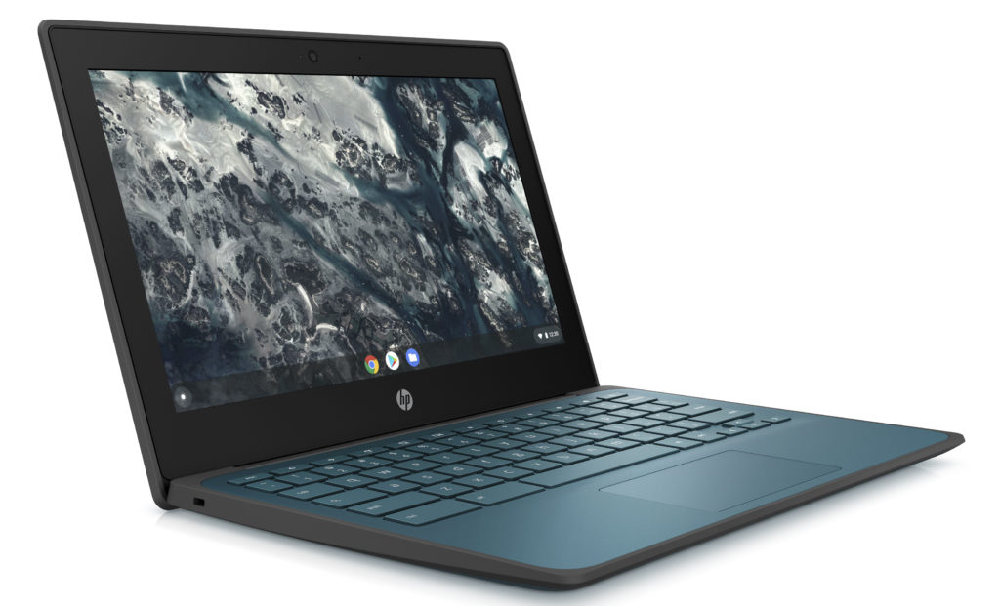
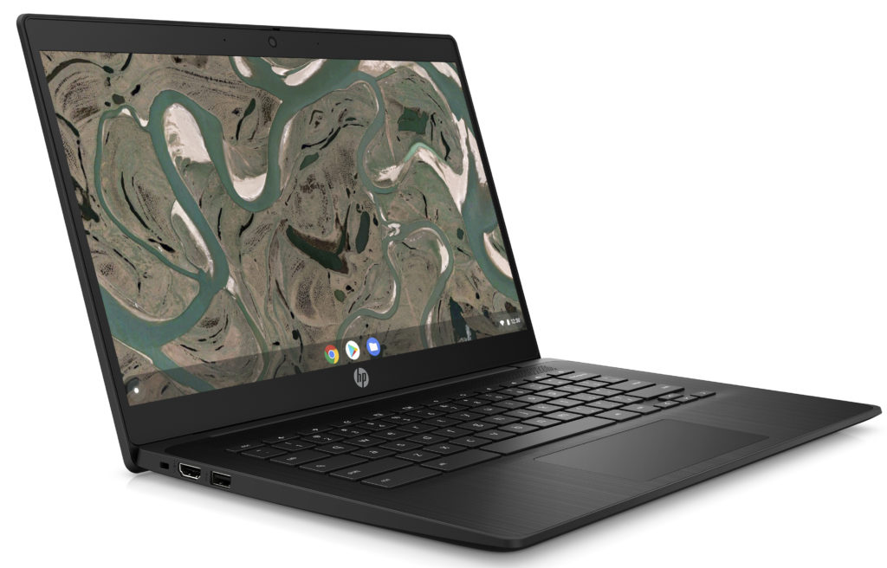
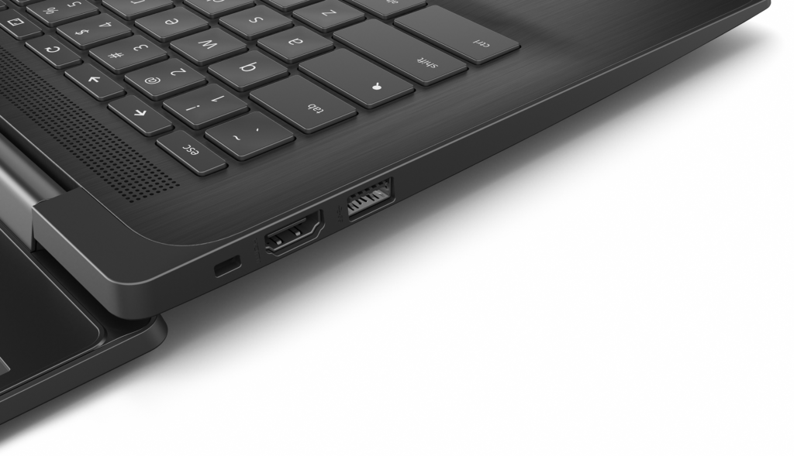

Earlier this week, at the BETT show, [Acer introduced four ruggedized Chromebooks for education](https://www.aboutchromebooks.com/news/acer-education-chromebooks-311-511-512-spin-price-specifications/). HP also joined the party with a number of Chromebooks for students and teachers, some with an included stylus, some with newer Intel chips, and yet some more with MediaTek processors. Best of all, for planning purposes, school districts and students can begin to purchase some of these Chromebooks as early as next month.

Here's a rundown of the [latest HP Chromebooks for education](https://press.hp.com/us/en/press-releases/2020/chromebooks-to-accelerate-teaching-learning-anywhere.html):

## HP Chromebook x360 11 G4 EE

This convertible Chromebook has an 11.6-inch 1366x768 IPS display, available both with and without a touchscreen, depending on needs and budget. The touch option uses Corning Gorilla Glass 3 and both displays top out at 220 nits of brightness.

Configurations are powered by an Intel Celeron N4500 or Celeron N5100 processor paired with either 4 or 8 GB of LDDR4x-2933 memory. Base storage is 32 GB of eMMC but can be configured with 64 GB. Additionally, all models have a microSD card.

Ports include 2 SuperSpeed USB 3.1 Type-C Gen. 1 (supporting Power Delivery, data, and DisplayPort 1.4), 2 SuperSpeed USB 3.1 Type-A, and a combination microphone/headphone jack.

The keyboard is spill-resistant and the Chromebook meets the MIL-STD 810H7 ruggedized tests to help protect against drops. Models include WiFi 6 and Bluetooth 5.0 connectivity. A ruggedized stylus (available with the touchscreen configurations) that slots in the chassis and an 8 MP "world view" camera to complement the built-in 720p webcam are also available options. HP says the 2-cell, 47 WHr battery is targeted for 12 hours of runtime on a charge; the 45W USB-C fast charge adapter can replenish 90% of the battery within 90 minutes when the HP Chromebook x360 11 G4 EE is powered off.

The new HP Chromebook x360 G4 11 EE will be available in a choice of black or teal some time in March, with pricing to be determined. Automatic software updates will be supported through June 2028.

## **HP Chromebook x360 11MK G3 EE** 

Arriving on sale later this month, this Chromebook is very similar to the Intel-powered option above but powered by a MediaTek MT8183 processor. That should extend the battery life as HP is targeting 16 hours of runtime on a single charge with the same power pack and fast-charging capabilities as the Intel version.

Memory, storage, and display options are identical as well. However, you do lose a few ports on the MK model: It only has one USB Type-A and one USB Type-C, for example, which are both on the right side. Connectivity drops down to WiFi5 and Bluetooth 4.0 as well. And there's no way to add a stylus or the additional "world cam" option. HP says Chrome OS software support runs through June 2028. That makes sense, since the processor in this Chromebook is the same as in last year's Lenovo Duet Chromebook, which has software support through the same month and year.

Look for this education Chromebook to go on sale later this month with pricing yet to be announced.

## HP Chromebook 11 G9 EE

This is the clamshell version of the Intel-powered convertible previously noted. Configuration options are the same as the HP Chromebook X360 11 G4 EE: Intel Celeron chips, choice of displays, memory, and storage, etc... Short of a 360-degree hinge, there's essentially no difference between this and that model. I'm sure the price will be lower than the convertible model too, but not yet sure by how much.

Since this a clamshell device, HP chose not to offer the stylus and secondary camera options. This model will be available in February, one month sooner than the convertible edition. The software will be updated through June 2028.

## HP Chromebook 11MK G4 EE

If you're catching on to the trend, you've probably guessed that this is a MediaTek-powered version of the above clamshell. Again, you lose two USB ports and WiFi 6 networking, but you do get that extra battery life of up to 16 hours. Otherwise, all configuration options are the same as above. Note that because of the fewer USB ports, they're on the right side of the chassis. There aren't any ports on the left side of this clamshell.

Watch for the HP Chromebook 11MK 4 EE to arrive later in January.

## HP Chromebook 14 G7

Finally we have a 14-inch clamshell with 180-degree hinge targeted for teachers.

This 14-inch Chromebook can be configured with either a 1366 x 768 (don't choose that one if you can help it) or a 1920 x 1080 IPS panel with touch available as an option. The same Intel Celeron N4500 and N5100 processors power this model, depending on the configuration. Memory choices are the same 4 or 8 GB while there's an additional storage choice compared to the smaller Chromebooks. You can pick between 32, 64, or 128 GB of eMMC storage capacity.

WiFi 6 and Bluetooth 5.0 are standard as is the same 2-cell 47 WHr battery and fast charging on the other Chromebooks. While the HP Chromebook 14 G7 has the same pair of SuperSpeed USB Type-A ports as the other Intel devices in this lineup, it only has a single USB Type-C, which I find an odd choice. Otherwise, you'll see the familiar selection of ports and inputs but with the addition of HDMI out.

If you guessed that Chrome OS software updates would arrive through June 2028, you'd be right, of course. HP expects this 14-inch Chromebook to go on sale later this month but has not specified the price.

Overall, I like the refreshed design of these ruggedized classroom Chromebooks. For too long, devices such as these have been blocky-looking laptops. Yes, the display bezels are a bit large for my taste but that's not a huge issue for the classroom.

By offering all of the student models in both Intel and MediaTek flavors, HP is giving schools a broader choice to meet their student's needs while also managing their budgets. And I really appreciate the option of up to 8 GB of memory across the board. Elementary school students can easily get by with the base configuration of 4 GB but as students get older and use more applications or browser tabs, that extra RAM will be appreciated.
