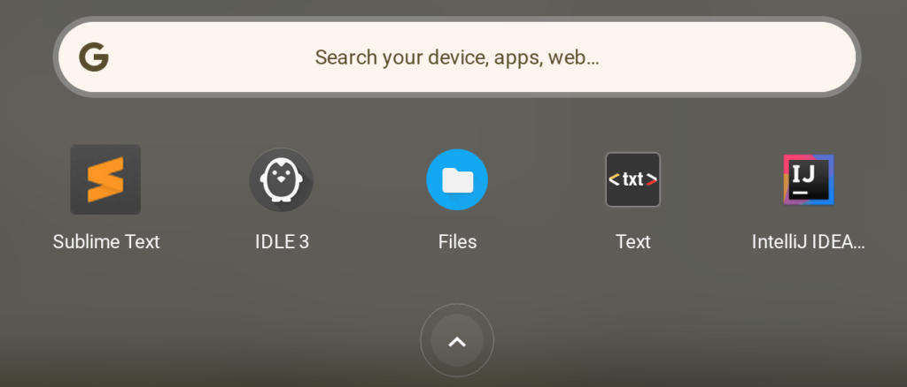

After years of waiting, it appears that an upcoming version of Chrome OS will allow you to sort apps on Chromebooks. [9to5 Google spotted a code commit](https://9to5google.com/2021/07/09/chrome-os-sort-apps-launcher/) for this still in the works feature. The bug is listed as private, so only the Chromium development team can see what version of Chrome OS will add this feature.

One thing we do know from the code is that there will be [an experimental flag to introduce the feature](https://chromium-review.googlesource.com/c/chromium/src/+/3016905/5/chrome/browser/about_flags.cc). Early birds will want to watch the Canary channel for: `chrome://flags#launcher-apps-sort`. Once enabled, you can presumably sort apps alphabetically or by some other logical means.

It was almost a year ago that I finally got aggravated by the lack of sortable Launcher apps to speak out about it. I noted that [after a decade of Chrome OS, it was inexcusable to offer such basic, but important, functionality](https://www.aboutchromebooks.com/news/after-a-decade-of-chromebooks-its-time-for-chrome-os-to-sort-apps-in-the-launcher/).

I also shared some insight from my time working at Google on _why_ the ability to sort apps on Chromebooks wasn't likely a priority:

> "[Chromebooks have been commercially available since 2011,](https://www.aboutchromebooks.com/news/chrome-os-is-10-years-old-heres-the-first-demo-from-2009/) although the CR-41 arrived in 2010, and they still don’t have what I consider to be a basic, “must-have” feature for an operating system. In a way, I understand why. Everything at Google revolves around searching. And when I worked at Google, I _rarely_ saw my peers scrolling through an app launcher on any device, whether it was a phone or a laptop (typically MacBooks and Chromebooks). Instead, they searched for an app with just a few keystrokes, tapped the search result, and moved on."

Simply put, Googlers search for just about everything possible. So what end-users might consider a key feature, such as sortable apps, isn't foremost in the minds of engineers. It's a bit of a disconnect, in my opinion.

Regardless of the reasons why you can't sort apps on Chromebooks, I'm thrilled to see signs of progress on this.

I know not everyone wants or cares about various ways to sort their Launcher apps. But my Launcher? It's a mess. There are pages of apps, some of which only have an app or two on them. And of course, the Launcher layout syncs to my other devices, so I see the mess on nearly a half-dozen Chromebooks. Eew!
