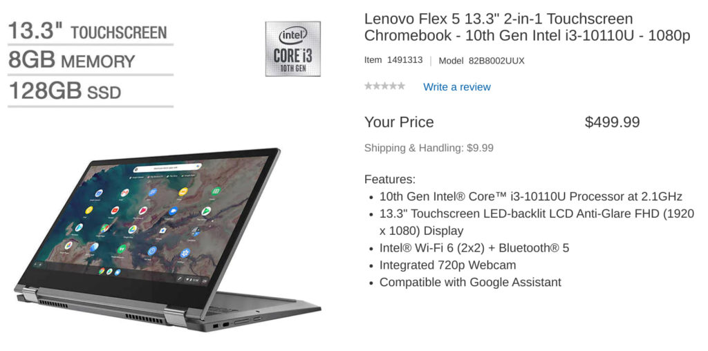

It only took 11 months since the [launch announcement of the Lenovo Flex 5 Chromebook](https://www.aboutchromebooks.com/news/did-you-miss-the-new-lenovo-chromebook-flex-5-at-ces-2020/), but here in the U.S., we can now purchase a configuration with 8 GB of memory. An About Chromebooks reader pinged me with the news yesterday afternoon, providing [a link to Costco, where the upgraded configuration is available for $499](https://www.costco.com/lenovo-flex-5-13.3%22-2-in-1-touchscreen-chromebook---10th-gen-intel-i3-10110u---1080p.product.100692744.html).

That's a $90 premium over the base $409 model, [which is a fantastic convertible Chromebook](https://www.aboutchromebooks.com/news/lenovo-flex-5-chromebook-hands-on-and-first-impressions/) considering what you get: a dual-core Intel Core i3-10110U CPU, 13.3-inch 1080p touchscreen, and WiFi 6 support. But you only get 4 GB of RAM with that model. And it has 64 GB of eMMC storage. That's why I said I'd [pay $479 for the upgraded 128 GB model](https://www.aboutchromebooks.com/news/upgraded-lenovo-ideapad-flex-5-chromebook-emmc-vs-nvme-ssd/): It gets you faster NVME storage, as well as doubling local storage capacity.

This new configuration at Costco also includes 128 GB of NVME storage but doubles up on the memory, which gives you some overhead for opening more tabs, using Linux, or running Android apps. I'd say it's worth the $90 price bump. And at only $20 over the standard 128 GB configuration, it's a no-brainer if you were keen on that model.

Short of doing full-time app development, which I know most people reading this aren't doing, I'd position the $499 model as a great all around Chromebook.

It should be capable of anything you can throw at it: basic browsing, online productivity apps, and games via streaming services or from the Google Play Store. I've watched many streaming services on this device too: The IPS panel is quite good even though the brightness is average at 250 nits.

You'll need to be a Costco member to buy at this price, else you pay a small premium.

My advice? See if a friend or family member who belongs to Costco will order one if you think this is the Chromebook for you. By the way, Costco provides a second year on your warranty; another nice perk.

