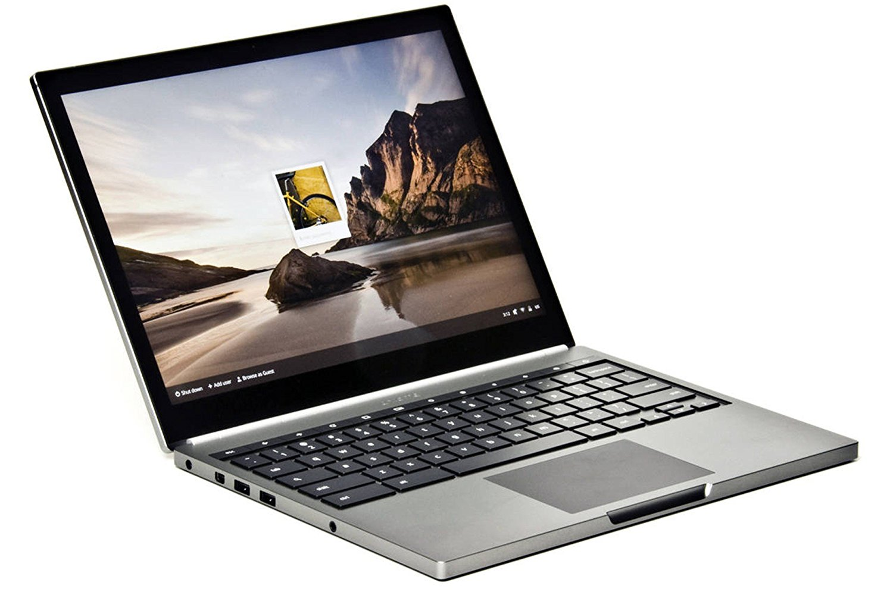

Earlier this month, Google's official announcement of Linux app support on Chromebooks suggested that the feature [required Linux kernel version 4.4](https://www.aboutchromebooks.com/news/these-are-the-chromebooks-and-chromeboxes-that-can-support-linux-apps/). But Project Crostini, the container approach Google is using for this feature, began last year with lower versions of the Linux kernel. Now, there's evidence that Google is trying to get Linux containers on those lower versions.

XDA Developers noted on Tuesday that [the Chromium team is trying to backport certain Linux modules](https://www.xda-developers.com/linux-app-support-older-chrome-os-devices/) so that Chromebooks on an older Linux kernel can run desktop apps. Instead of pushing an entire kernel upgrade to older devices, it may make sense to make certain required components compatible for Project Crostini.

In terms of devices, only Samus -- the code name of the Chromebook Pixel 2015 -- is being tested for this approach but if it passes, other Chromebooks could follow.

There's no guarantee this will all come to pass; we'll have to see how the testing goes, as well as any future development on other specifically required Linux modules. This is basically a workaround to the more time-consuming effort to upgrade the full kernel on older devices.

Still, it provides hope to Chromebook users that are currently running on an older Linux kernel but still want the [full desktop experience Project Crostini brings](https://www.aboutchromebooks.com/news/first-look-running-full-linux-apps-on-a-chromebook-with-project-crostini/).
