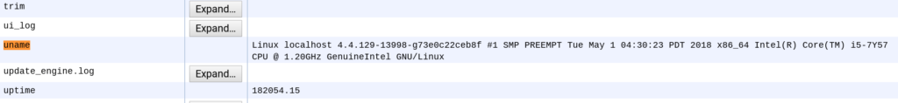

With the cat out of the bag and [Google announcing Linux apps on Chrome OS devices](https://www.aboutchromebooks.com/news/google-officially-unveils-project-crostini-linux-apps-on-chrome-os/), I'm starting to see many questions like this one:

https://twitter.com/sholden/status/994403736725340160

It's a great question since the Linux app support, also known as Project Crostini, has only officially announced for the Pixelbook, [which is where I've been running such apps](https://www.aboutchromebooks.com/news/first-look-running-full-linux-apps-on-a-chromebook-with-project-crostini/). But Google gave us a clue as to what other Chromebooks and Chromeboxes may get Linux containers and it isn't which processor architecture. Linux support is being worked on for both x86 and ARM chips, so don't think if you bought an ARM-powered Chromebook that you'll be on the outside looking in.

Instead, it all depends on which Linux kernel version your Chrome OS device runs on. You'll need version 4.4 at this point for your Chromebook or Chromebox to use the Linux KVM, or [Kernel-based Virtual Machine](https://www.linux-kvm.org/page/Main_Page).

To find the kernel version on your particular device, type _chrome://system_ in the browser and then _cntrl+F_ to open the Find function. Search for _uname_ to see the results. Here are mine from the Pixelbook, showing Linux kernel version 4.4.x:

If you'd rather see a list of all current Chrome OS devices running on Linux kernel 4.4, you can hit [this link which has sortable results](https://www.chromium.org/chromium-os/developer-information-for-chrome-os-devices) for each column. Sort the Kernel column by descending and the devices with 4.4 will rise to the top.

As of today, here are the Chrome OS devices running on Linux kernel 4.4 and could support [Project Crostini](https://www.aboutchromebooks.com/tag/crostini/); note that this isn't a _guarantee_ of future support, but it should give some of you without a Pixelbook hope:

- Acer Chromebook 11
- Lenovo ThinkPad 11e / Yoga 11e
- Acer Chromebook 15
- AOpen Chromebox Commercial
- Samsung Chromebook 2
- HP Chromebook 11 G3
- Acer Chromebook 15.6"
- Acer Chromebook Spin 11
- Toshiba Chromebook 2
- Lenovo N20 Chromebook
- AOpen Chromebase Commercial
- Asus Chromebook C300
- Samsung Chromebook Plus
- Asus Chromebook Flip
- HP Chromebook X360 11 G1
- Asus Chromebook C200

Keep in mind that while in the past Google wasn't updating the Linux kernel on older Chrome OS devices, it has been recently testing updates for some devices. So even if your device doesn't appear on the list today, it may in the future.

Again, this doesn't guarantee that you'll be able to run Linux apps on your non-Pixelbook, but it's a start; without Linux Kernel 4.4, it's a no go.
