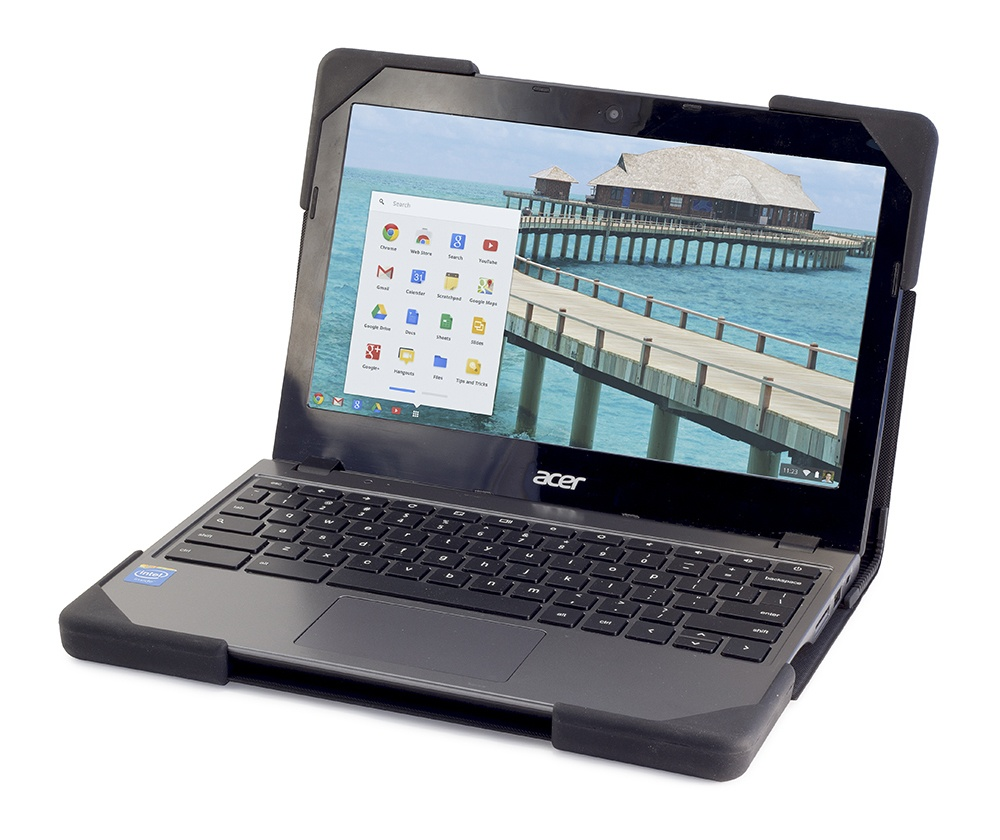

While more and more school districts are buying Chromebooks for their students, not all of those purchases are for ruggedized laptops. That makes them easy to drop and break or get nicked up. What's a district to do in order to protect their investment?

Enter DeviceWear, a company that makes what it calls ["Book Covers" for Chromebooks](http://www.devicewear.com/book-covers/). These add-ons cost $45 each and reinforce the corners and edges of the laptops, and help add impact resistance with a stiff inner liner and soft molded padding.

The nice thing is, they don't get in the way of actually using the Chromebook since all of the material is around the back and edges. DeviceWear says it can also add a custom school logo to the covers although I suspect that would cost a bit extra.

Ideally, I'd hope more schools choose Chromebook models that were actually built to withstand the everyday challenges of drops, spills and bumps. But for those that haven't, a little extra spending per device could add another year or two of service, making it with the investment of a book cover or other protective case.
