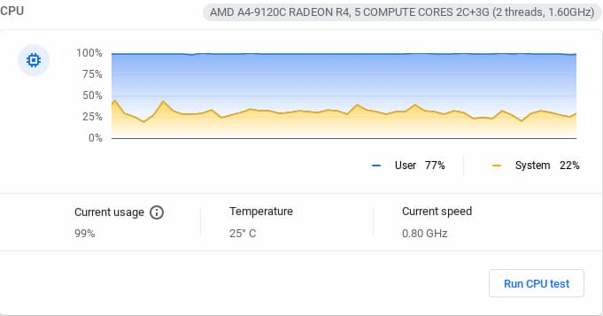
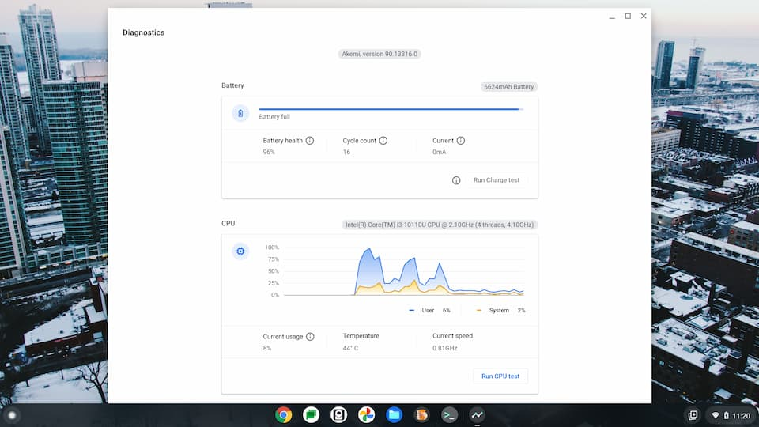
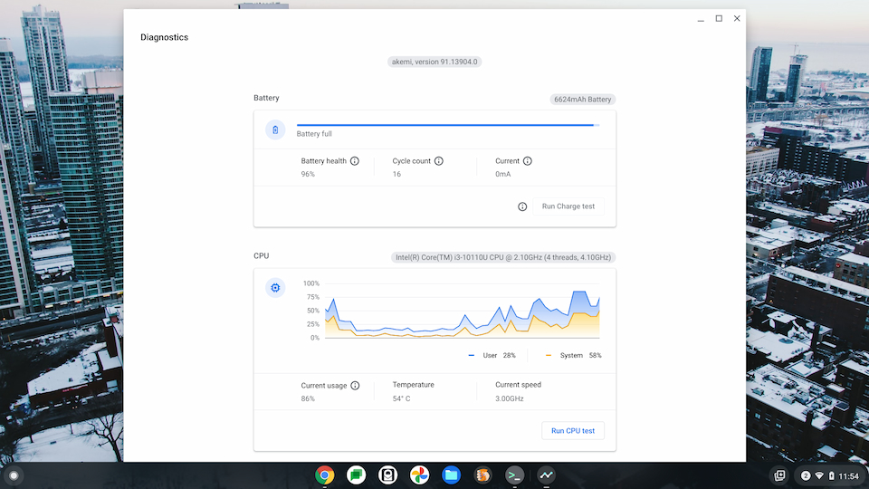

Last week, I mentioned a [small Chrome OS 91 update to the Stable Channel arrived](https://www.aboutchromebooks.com/news/updated-chrome-os-91-stable-channel-fixes-broken-clipboard-in-linux-on-chromebooks/). I was happy because it fixed a clipboard issue between Chrome OS and Linux. Now I see that some people are reporting a high-impact performance issue after receiving the latest Chrome OS 91 update. On certain Chromebooks, users are seeing the CPU pegged at 100% usage or a CPU clocked at a very low-frequency speed.

[Android Police spotted the issue](https://www.androidpolice.com/2021/07/05/you-might-not-want-to-update-your-chromebook-to-the-latest-chrome-os-release-just-yet/) and even [highlighted the bug for people to star and follow](https://bugs.chromium.org/p/chromium/issues/detail?id=1226037), or to provide additional information. It appears that the problem is manifesting itself on the Grunt and Hatch Chromebooks at the moment.

Of course, your Chromebook doesn't say Grunt or Hatch on it. These are the internal Google names for the certified boards inside your Chromebook. So to help identify which Chromebooks **_may_** be affected, here's a list, in no particular order:

## Grunt-based Chromebooks:

- HP Chromebook 14
- Acer Chromebook 315
- HP Chromebook 11a G6 EE
- Lenovo 14e Chromebook
- Acer Chromebook 311
- Acer Chromebook Spin 311
- Lenovo 100e 2nd-gen AMD
- Lenovo 300e 2nd-gen AMD

## Hatch-based Chromebooks:

- Acer Chromebook 712
- Lenovo Ideapad Flex 5
- Samsung Galaxy Chromebook and Chromebook 2
- Asus Chromebook Flip C435

To be clear: Just because you have one of these devices does not mean that you will any performance issues caused by the latest Chrome OS 91 Stable Channel update.

I'm basing that on my own testing of a Hatch device, which didn't have the update installed. I checked the CPU performance in the Diagnostics app prior to the update and aside from some high utilization at startup, the CPU settled down into normal range after some typical usage. And the clock frequency is bouncing around as it should, based on my activities.

I then updated the Chromebook to the latest Chrome OS 91 Stable Channel update and rechecked the Diagnostics. The initial CPU usage stayed higher for a bit longer after startup but again settled down after I repeated the exact same usage. And again, the CPU frequency clock is adjusting normally.

This leads me to believe the issue isn't widespread and affecting every single Chromebook I've listed above. Perhaps there are some experimental flags set on these particular devices for example. And if it is, resetting all of the flags to their default settings would address the issue, at least temporarily.

Unfortunately, I don't know the current state of those Chromebooks seeing the CPU process speaking to 100% for what appears to be no good reason.

If you can replicate the issue on your Chromebook, my advice is to [visit the reported bug](https://bugs.chromium.org/p/chromium/issues/detail?id=1226037). Star it to follow along for updates and provide whatever details you can to help the Chromium developers figure out any issues.
