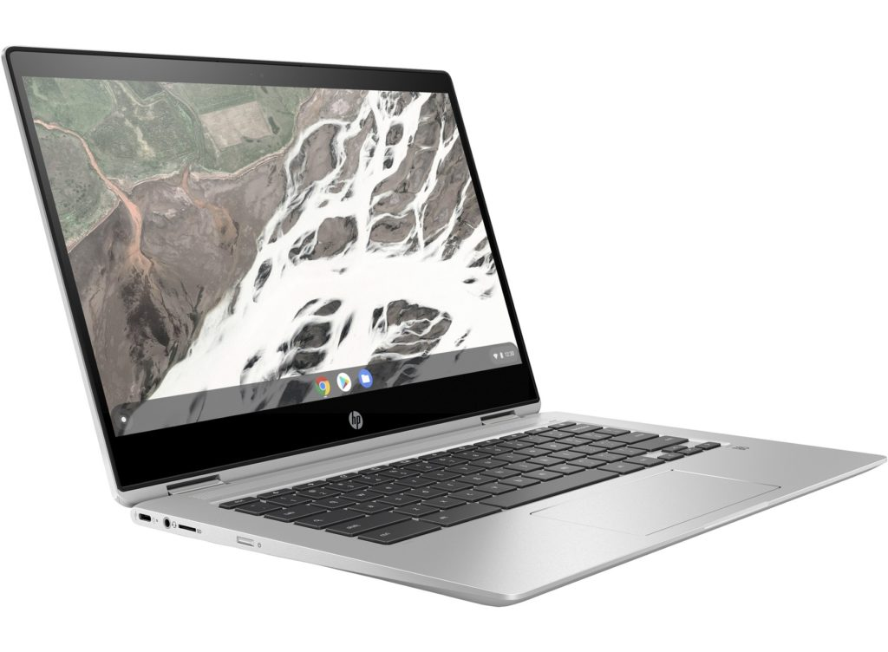

A few days ago a reader reached out to me for a budget Chromebook purchase recommendation. The main requirements were a cost between $250 and $400, 11- to 14-inch display, HD if possible, and both a touchscreen and backlit keyboard would be nice.

There are plenty of Chromebooks to choose from in this category, with most in the $250 to $350 range. They'll likely have a 720p display in the desired size range, may not have either a touchscreen or backlit keyboard (or both) and are probably performance constrained by 4 GB of memory and, at best, a Pentium processor.

So I didn't recommend any of those. [The Best Buy sale of the very capable mid-range HP Chromebook X360 is back at $399.99](https://www.bestbuy.com/site/hp-2-in-1-14-touch-screen-chromebook-intel-core-i3-8gb-memory-64gb-emmc-flash-memory-white-gold/6365772.p?skuId=6365772), fitting in just one penny under the budget.

Yes, a buyer could save $100 to $150 and go for a true entry-level Chromebook. But I think the extra value by spending the additional money is well worth it, mainly because there are no compromises in the requirements at all and in many cases, this 2-in-1 exceeds them.

The only "downside", if you will, is that the white & slate model isn't on sale; this deal is on the white & gold option.

That aside, _at this moment_, I think the best "entry-level" priced Chromebook is a mid-range device based on this configuration at $399.99, which is $200 off of the MSRP:

<table class=""><tbody><tr><td>CPU</td><td>Dual-core Intel Core i3-8130U clocked at 2.2 GHz with 3.4 GHz boost</td></tr><tr><td>GPU</td><td>Intel UHD 620 Graphics</td></tr><tr><td>Memory</td><td>8 GB DDR4, 2133 MHz</td></tr><tr><td>Storage</td><td>64 GB eMMC, microSD card expansion</td></tr><tr><td>Display</td><td>14-inch, 1920 x 1080 IPS touchscreen</td></tr><tr><td>Connectivity</td><td>Intel Wireless-AC 7265 802.11ac (2x2) Wi-Fi and Bluetooth 4.2 Combo</td></tr><tr><td>Ports</td><td>Two USB Type-C (3.1), one USB Type-A (3.1), headphone/microphone</td></tr><tr><td>Input</td><td>Backlit keyboard, multi-touch trackpad</td></tr><tr><td>Audio</td><td>B&amp;O stereo speakers</td></tr><tr><td>Battery</td><td>60 WHr, up to 14 hours claimed run time</td></tr><tr><td>Software support</td><td>Automatic Chrome OS updates through June 2025</td></tr></tbody></table>

It is a valid point that the HP Chromebook X360 isn't included in the [new Chrome OS software update policy of 8 years, announced earlier this week](https://www.aboutchromebooks.com/news/google-announces-8-years-of-chrome-os-software-updates-aue-for-new-chromebooks/). However, this device did get a bit of a [support extension late last year](https://www.aboutchromebooks.com/news/chrome-os-software-support-dates-extended-for-more-than-130-chromebooks/), so there's still 5.5 years of updates to be had.

This sale has been on all week so I anticipate it will disappear by this weekend. And if it does, I'd definitely recommend another option that's more in line with the entry-level Chromebook experience. Right now though? I'd take [this deal](https://www.bestbuy.com/site/hp-2-in-1-14-touch-screen-chromebook-intel-core-i3-8gb-memory-64gb-emmc-flash-memory-white-gold/6365772.p?skuId=6365772) over any of those options in a heartbeat.
