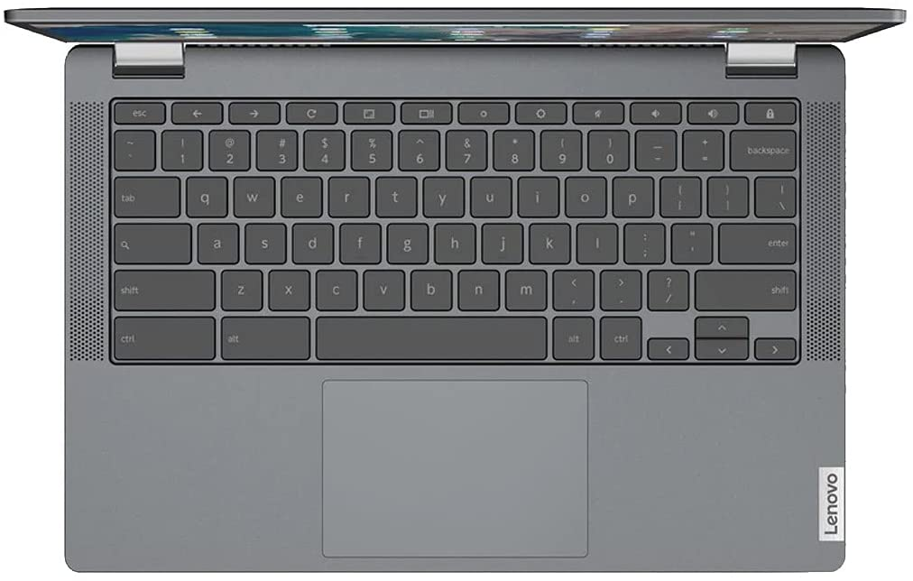

Did you miss out on buying a discounted Chromebook on Amazon Prime Day? It turns out that there's a [Lenovo Chromebook Flex 5 sale currently available](https://amzn.to/2Ues9ZR) that's almost as good as the Amazon Prime Day Deal. You can grab the very capable mid-range [Lenovo Chromebook Flex 5 for $355.99 today](https://amzn.to/2Ues9ZR).

I **_almost_** picked this device as my [2020 Chromebook of the year](https://www.aboutchromebooks.com/news/my-pick-for-2020-chromebook-of-the-year/) based on the value you get for the price. And that was at the full $409.99 MSRP. The [Lenovo Chromebook Flex 5 gets you a mid-range experience](https://www.aboutchromebooks.com/news/lenovo-flex-5-chromebook-hands-on-and-first-impressions/) with a closer to an entry-level price.

[Get this Lenovo Flex 5 Chromebook deal](https://amzn.to/2Ues9ZR "Get this Lenovo Flex 5 Chromebook deal")

I've said prior that instead of an entry-level model that might have a 1366 x 768 non-touch display and Intel Pentium this device may be the better buy.

You're getting a 10th-generation Intel Core i3 processor and full HD, or 1920 x 1080 resolution, touch screen. That comes along with a backlit keyboard and support for faster, newer WiFi 6 routers, which adds some future-proofing. You can also purchase and use an optional USI stylus with this device.

Here are the full specs of this Lenovo Chromebook Flex 5, to illustrate the value of what you're getting for a penny under $356.

<table><tbody><tr><td>CPU</td><td>Dual-core Intel Core i3-10110U Processor (2.1 GHz / 4.1GHz)</td></tr><tr><td>GPU</td><td>Intel Integrated UHD Graphics</td></tr><tr><td>Display</td><td>13.3-inch IPS 1920 x 1080 touchscreen, 16:9 aspect ratio, 250 nits brightness</td></tr><tr><td>Memory</td><td>4 GB DDR4-2600MHz memory</td></tr><tr><td>Storage</td><td>64 GB eMMC 5.1, microSD card slot for expansion</td></tr><tr><td>Connectivity</td><td>WiFi6 (802.11ax, 2x2 MIMO), Bluetooth 5.0</td></tr><tr><td>Input</td><td>Spill-resistant backlit keyboard, USI stylus (optional) support, 720p webcam with physical privacy shutter</td></tr><tr><td>Ports</td><td>1 USB Type-A, 2 USB Type-C, headphone/microphone combo jack</td></tr><tr><td>Battery</td><td>51 WHr, expected run-time up to 10 hours</td></tr><tr><td>Weight</td><td>2.97 pounds</td></tr><tr><td>Software</td><td>Chrome OS automatic updates through: June 2028</td></tr></tbody></table>

Is the "perfect" Chromebook? No, of course not. You might want more than 4 GB of memory or 64 GB of local storage capacity.

But at this price, you're not likely to find those attributes on any relatively new Chromebook.

And to be honest, for everyday use as a home computer or schoolwork, the Lenovo Chromebook Flex 5 will surely be up the task for most people. Sure, you could wait for the [just-announced Lenovo Chromebook Flex 5i, but it starts at $439.99](https://www.aboutchromebooks.com/news/mwc-2021-lenovo-chromebook-5i-and-flex-5i-debut-look-great-on-paper/). Are a newer processor and extra year of software updates worth $100? That's a personal decision based on your budget, although I would say probably not. At least not for me.

[On Amazon Prime Day, this model was discounted down to $309](https://www.aboutchromebooks.com/news/amazon-prime-day-chromebook-deals-to-consider-buying-and-or-passing-on/), which was a spectacular deal. For $45 more today you can still get a very capable convertible Chromebook with seven years of software and security updates in the Flex 5.

[Get this Lenovo Flex 5 Chromebook deal](https://amzn.to/2Ues9ZR "Get this Lenovo Flex 5 Chromebook deal")

_Update: This deal at a slightly lower price was available on June 29, 2021. It’s back at a slightly higher price but still at a deep discount today._
