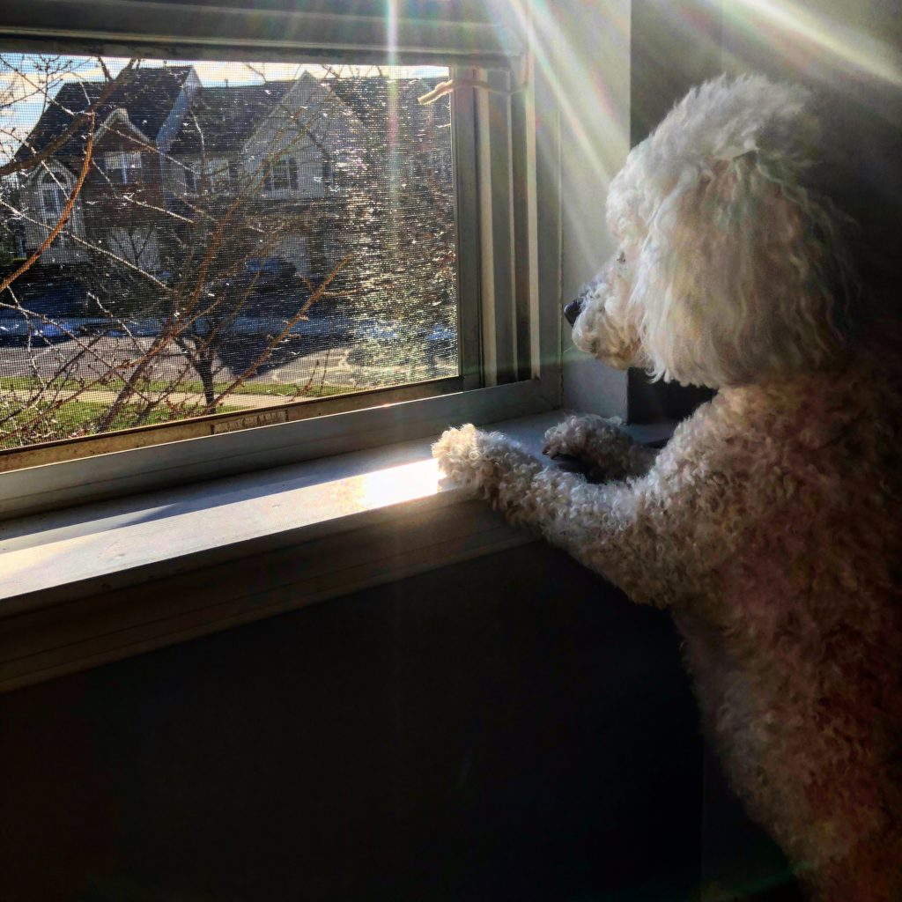

Like most, if not all of you, I'm hunkered down with my family as the world fends itself off from the Covid-19 pandemic. I've actually been in a self-lockdown mode since early last week, having not written a Chromebook post since Tuesday.

Honestly, I sat down many times since then to share some Chromebook news but I obviously never did. I'd start a post, sometimes even finish one, but not publish it.

I'm not in a depressed state due to the situation, although I _**do**_ take anti-depressants. I have since 2011 when I was diagnosed with clinical depression not long after I lost my father unexpectedly. But I'm no more depressed today because of current world events.

I didn't publish any posts mainly because, in the grand scheme of things, **the latest news about Chromebooks or Chrome OS didn't really matter at the time**. Instead, I had to ensure we were as prepared as possible before national, state and local emergencies.

Where I live, in [Montgomery County, PA](https://www.montcopa.org/), we're essentially getting close to a lockdown: All schools and non-essential businesses are closed, we have 45 confirmed or presumptive positive Covid-19 cases -- the most in our state -- and store shelves are barren.

What does matter, to me anyway, is making sure I'm here for my family, friends, and neighbors. I believe we all have to work together in every way possible; now more than ever.

As it stands now, my daughter is home from an extended college spring break and she's going stir crazy. And that is sort of making me crazy.

My wife is home from work and I've found her crying a few times this past week. Stress and the unknown are not things that work well for her.

Additionally, we have concerns because her immune system isn't 100% due to various medical factors and challenges. Back in 2008, for example, she contracted viral meningitis a few months before our wedding. That week in isolation at the hospital was scary enough for her and for me.

And I've had a cough, on and off, for the past week or so, along with some chest discomfort. It's been completely manageable and I check my temperature several times a day. No fever as of yet, but if I do experience one, I'll, of course, seek the appropriate medical attention.

I'm not sharing these personal tidbits for pity or concern.

We'll do what we always do and make the best of things. Instead, I'm simply airing out some thoughts, cleaning out my mind and hoping all of you are doing what you need to in this time of worldwide crisis.

Please, think of others around you, even those you don't know, and strongly consider these simple actions:

- Take care of your family, pets and loved ones
- Wash your hands excessively
- Respect the calls for social distancing
- Don't spread bad or misinformation
- Do share supplies with others
- Don't panic
- Do good things, even when nobody is watching

I sincerely wish all of you and yours well in this challenging time. Humanity is inherently good when we realize that each of us can make the world a much better place simply by being human and respecting all others.

With that said, my hope is to ensure that my household and my neighborhood is in the best state it can be in by tomorrow. And if it is, I'll be back to covering Chromebooks at that time.

Thanks for reading.

Peace!

P.S.: In the spirit of positivity, here's a pic of our canine cuteness, Norm, looking forward to better days. Smile!

