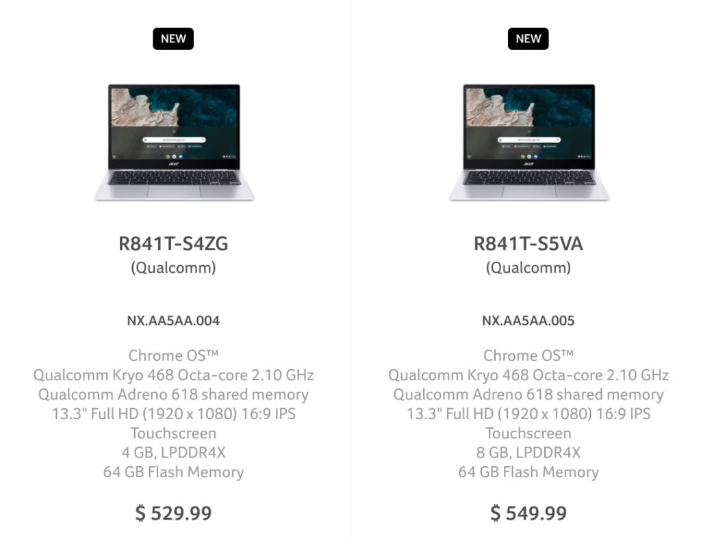
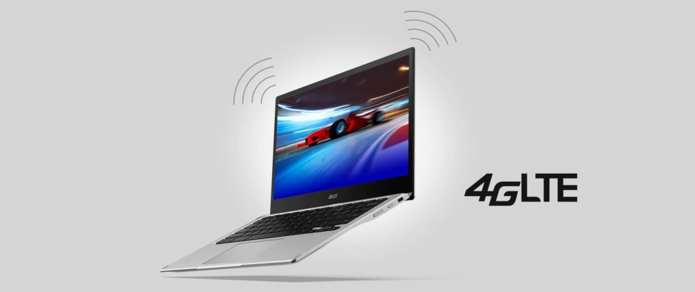

Last week, I spied the [first official direct listings for the Acer Chromebook Spin 513 with Qualcomm Snapdragon 7c chipset](https://www.aboutchromebooks.com/news/acer-chromebook-spin-513-starts-at-479-with-snapdragon-7c/). I said at the time that the pricing looked odd since the price difference between the two models was only $20. The only differentiation between those two configurations was memory: One had 4 GB and one had 8 GB. The pricing still looks odd but now for different reasons. [Both Acer Chromebook Spin 513 prices are now $50 higher](https://www.acer.com/ac/en/US/content/models/laptops/acerchromebookspin513).

Here's the new pricing on Acer's Store site, showing a cost of $529.00 or $549.99 for the Acer Chromebook Spin 513.

And here's what the Acer Store showed last week for the exact same configurations and model numbers:

Note that you still can't buy these; hitting the Buy Now button simply returns a "No sellers available" message.

To be honest, I feared this might happen.

Earlier in the week, I noticed that Promevo had listings for the Acer Chromebook Spin 513. The model number Promevo is offering is different from the above two, [but the price shown is $799.99](https://shop.promevo.com/index.php/acer-chromebook-enterprise-spin-513-r841lt-s7uu-nx-aa6aa-003-8-gb-128-gb.html). That includes a boost of local storage to 128 GB and a Chrome Enterprise Upgrade license. Even if you back out the license cost that's still higher than I expect for this Chromebook.

I also noticed just today that [Promevo is showing the same 8 GB configuration as the Acer Store with the $549.99 price tag](https://shop.promevo.com/index.php/acer-chromebook-spin-513-r841t-nx-aa5aa-005-8gb-64gb.html). That doesn't mean this is officially final pricing, but it strongly suggests it to be that.

What worries me even more? I haven't seen a single model on any site say that the LTE radio is enabled. Will that add even more of a premium? If so, how much?

I don't have answers to those questions, of course. But based on the information we have now, I think the Acer Chromebook Spin 513 is going to be a tougher sell than I thought it would be.

It's not using the latest Snapdragon Compute platform right off the bat, which could shy some folks away. We don't yet have hands-on testing data for performance and battery life claims.

Yet even if those come in as expected: Buying a small convertible Chromebook [that's "roughly equivalent to the Pentium Silver N5030](https://www.aboutchromebooks.com/news/snapdragon-7c-chromebook-test-roughly-equivalent-to-the-pentium-silver-n5030/)" with a $529.99 starting price isn't as compelling a story.
