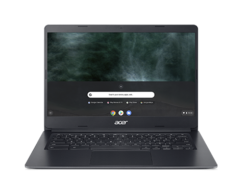
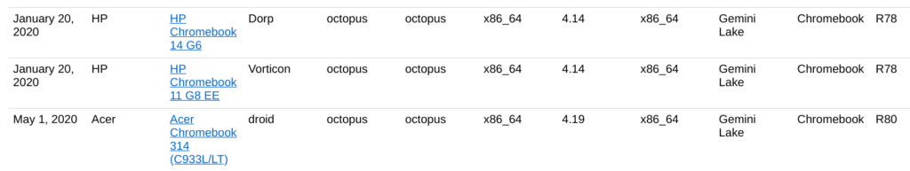
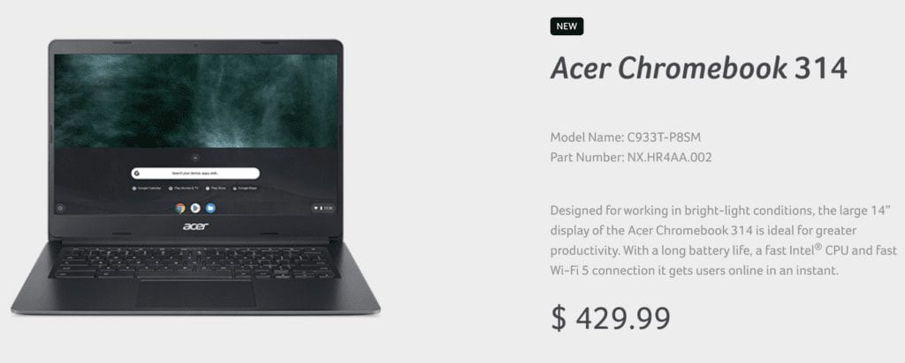
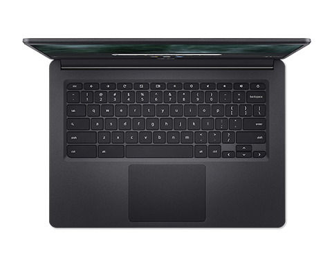

I was checking something on the [Chromium Developer Information page this morning when I noticed a new Acer Chromebook in the list](https://www.chromium.org/chromium-os/developer-information-for-chrome-os-devices). Well, it's a newly updated model, to be more precise.

The page shows that another Acer Chromebook 314 is arriving on May 1; that's not an official announcement, of course, so the date could be a moving target.

If you recall, [Acer announced several Chromebooks at the IFA event last September](https://www.aboutchromebooks.com/news/ifa-2019-acer-chromebook-spin-311-314-315-price-specifications-availability/). At the time, the Chromebook 314 was one of them but has only been available in a Celeron version as Acer said these would be configured "...with the latest dual-core Intel Celeron N4000 or quad-core Intel Celeron N4100 processors."

The company also said the Chromebook 314 could be ordered with a 1920 x 1080 display, 8 GB of memory and 64 GB of storage, but I haven't seen that model.

It turns out that Intel launched its [Pentium Silver N5030 chip](https://ark.intel.com/content/www/us/en/ark/products/197308/intel-pentium-silver-n5030-processor-4m-cache-up-to-3-10-ghz.html) in the final quarter of 2019 and that's what's powering this [updated Acer Chromebook 314](https://www.acer.com/ac/en/US/content/model/NX.HR4AA.002) per the link on the Chromium Developer Information page.

This model also has the 14-inch 1080p touchscreen, the 8 GB of RAM and 64 GB of storage, per the Acer store. I've clicked the "buy now" button but Acer says there are no sellers yet. The MSRP is $429.99.

However, this clamshell is appearing at retailers such as [Colamco ($395.08)](https://www.colamco.com/product/acer-chromebook-314-c933t-c933t-p8sm-chromebook-nx-hr4aa-002-1903610), [ShopBLT ($413.79)](https://www.shopblt.com/item/acer-nx.hr4aa.002-c933t-p8sm-14in-chrome/acer_nxhr4aa002.html), and [NextWarehouse ($416.33)](http://www.nextwarehouse.com/item/?3602985_g10e), so there could be some discounts available at launch. None of these online retailers have any stock yet.

Here are the full specs, per Acer:

<table><tbody><tr><td>CPU</td><td>Quad-core, Intel Pentium Silver N5030 1.1 GHz base rate, 3.1 GHz turbo rate</td></tr><tr><td>GPU</td><td>Intel UHD Graphics 605</td></tr><tr><td>Display</td><td>14-inch, IPS, 1920 x 1080 resolution touchscreen</td></tr><tr><td>Memory</td><td>8 GB LPDDR4 RAM</td></tr><tr><td>Storage</td><td>64 GB eMMC storage, microSD expansion slot</td></tr><tr><td>Connectivity</td><td>WiFi 5, Bluetooth (no version specified</td></tr><tr><td>Input</td><td>Keyboard, multi-touch trackpad</td></tr><tr><td>Ports</td><td>2 USB Type-C, 2 USB Type-A, front-facing webcam</td></tr><tr><td>Battery</td><td>Up to 12.5 hours claimed run-time</td></tr><tr><td>Weight</td><td>3.31 pounds</td></tr><tr><td>Software</td><td>Chrome OS automatic update software support through: TBD (should be around 8 years)</td></tr></tbody></table>

I don't believe the Acer Chromebook 314 will have a backlit keyboard but aside from that nit, a quad-core Pentium Silver with double the memory and storage of most devices in this class isn't a bad deal at around $400. The 14-inch IPS 1080p display is another compelling factor.

Stay tuned for what I expect will be an official announcement from Acer in the coming few weeks: If you've been holding off on a Chromebook purchase and have $400 or so to spend, this might be worth the wait.

