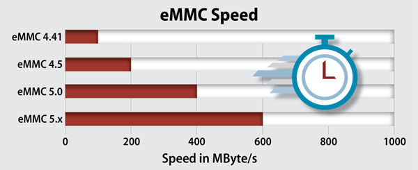

The eagle-eyed folks at Chrome Unboxed spotted [a new U.S. variant of the Lenovo Flex 5 Chromebook at Costco today](https://chromeunboxed.com/new-lenovo-flex-5-chromebook-configurations-on-sale-costco/). This model is nearly identical to the $409 model that's been available for a few weeks (see my [first impressions of the Lenovo Flex 5 Chromebook here](https://www.aboutchromebooks.com/news/lenovo-flex-5-chromebook-hands-on-and-first-impressions/)) but is [priced at $479.99 at Costco](https://www.costco.com/lenovo-13.3%22-touchscreen-2-in-1-chromebook-flex-5---10th-gen-intel-i3-10110u---1080p.product.100579368.html). You only get one hardware difference for that $80 premium: And I think it's worth it.

What's the difference?

Instead of [64 GB of eMMC 5.1 storage, per the official specs](https://psref.lenovo.com/Detail/IdeaPad/IdeaPad_Flex_5_CB_13IML05?M=82B8000BUS), the higher priced model bumps that up to 128 GB of M.2 NVMe local storage.

Normally, I say only get the upgraded model if you just need more space.

However, just two days ago [I ran an interesting experiment on a gaming PC I built](https://www.kctofel.com/post/2020-07-17-this-68-storage-upgrade-was-well-worth-it-even-if-it-was-twice-the-cost-of-an-ssd/)  [last month](https://www.kctofel.com/post/2020-07-17-this-68-storage-upgrade-was-well-worth-it-even-if-it-was-twice-the-cost-of-an-ssd/).

[I added an M.2 NVMe drive to the game rig which originally had a SATA-interface SSD drive](https://www.kctofel.com/post/2020-07-17-this-68-storage-upgrade-was-well-worth-it-even-if-it-was-twice-the-cost-of-an-ssd/).

And I did some disk benchmarking.

I mention this because eMMC 5.1 storage, according to the Enterprise Storage Forum, [reads and writes data at roughly the same speeds as that SSD drive](https://www.enterprisestorageforum.com/storage-hardware/emmc-flash-memory-storage.html) I was using:

> The 5.1 eMMC storage standard delivers transfer speeds up to 400MB/s. That's roughly equivalent to SATA SSD highest transfer speeds – and clearly fast enough for enterprise applications

Are they correct?

Well, here are the benchmarks I ran on the old SATA-based SSD drive I was using for the Windows 10 PC. They look in line with eMMC 5.1 speeds:

SATA-interface SSD benchmarks

After installing the M.2 NVMe drive, I tested it for speeds.

Here are the results:

M.2 NVMe benchmarks

The speed difference is obvious, roughly 60 to 80 percent in disk read and write speeds. I knew M.2 NVMe storage over a PCI 3 interface was fast but I didn't realize that I could literally read 3.1 GB of data from a drive in one second.

But wait: Most of the data Chromebooks "move" around is probably to and from the cloud. So do the disk transfer speeds really matter?

I used to be in the "probably not" camp, but the continuation of my experiment moved me over to the "maybe so" group.

It turns out that the benchmark speeds were so fast that I ended up swapping the operating system installation from the slower SSD and moving it over the faster drive. And now everything in Windows happens faster.

Boot up to sign-in is about 6 seconds, for example, when it used to be more like 15 to 20. Accessing and opening apps is faster. Hopping deep into the Windows Settings is faster.

**Everything. Is. Faster.**

Granted, this isn't a Windows 10 blog: This is about Chromebooks.

The thing is, I'm willing to bet anyone the $68 I spent on my M.2 NVMe drive last week that the $479.99 Lenovo Flex 5 Chromebook is recognizably faster than its $409 counterpart with eMMC storage. That speed is worth a premium as is the extra 64 GB of storage to me.

So if you're thinking of getting the $409 model and you think it might be worth it too, you might want to check out the upgraded version at Costco. I know I would.
