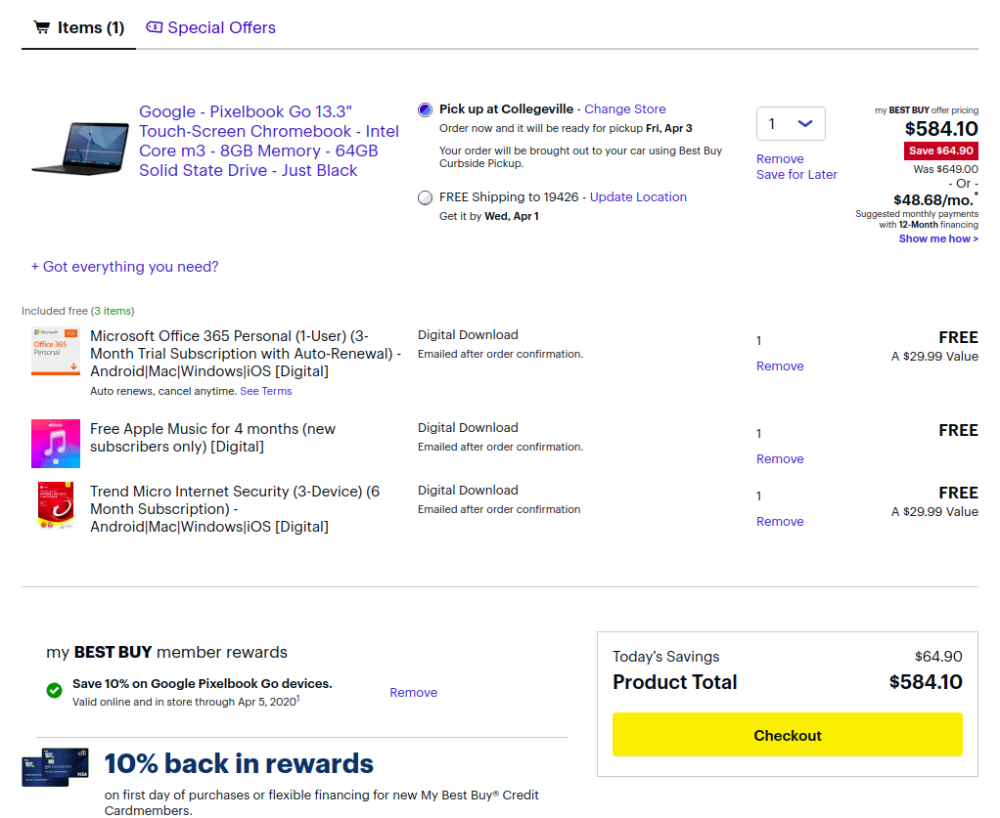

After [dubbing the Pixelbook Go my pick for Chromebook of the year in 2019](https://www.aboutchromebooks.com/news/my-pick-for-2019-chromebook-of-the-year/), I recently [re-reviewed it and still feel the same](https://www.aboutchromebooks.com/news/pixelbook-go-review-2020/). Sure it's not a 2-in-1 device but if you don't need to convert your laptop into tablet mode, it's a fantastic clamshell for Chrome OS.

The starting price of $649 may be too steep for some buyers, but I think it's worth every penny based on performance, build quality, outstanding keyboard, battery life and of course, automatic Chrome OS updates directly from Google until June 2026.

Would a price of $584.10 change your mind about the base model?

If so, there's an easy way to get a 10% discount that brings the Core m3 down to that price: [Sign up for a free myBestBuy account](https://www.bestbuy.com/identity/newAccount?token=tid%3A617d7324-7113-11ea-b07d-005056ae87ac).

It takes just a few minutes to do so and it's not a payment account so you don't need to provide any credit card information. Think of it as a loyalty program.

Once you have your account and [visit the Pixelbook Go product page on Best Buy](https://www.bestbuy.com/site/google-pixelbook-go-13-3-touch-screen-chromebook-intel-core-m3-8gb-memory-64gb-solid-state-drive-just-black/6382912.p?skuId=6382912), you'll see a myBestBuy price with the 10% discount through April 5.

Pixelbook Go

Keep in mind that I reviewed the next model up, which costs $849. That extra cost bumps the processor up from a Core m3 to a Core i5, has the same 8 GB of memory and doubles storage from 64 to 128 GB. Here's the full list of specs on the base model if you need more details:

<table class="wp-block-table"><tbody><tr><td>CPU</td><td>Dual-core, four-thread Intel Core m3 (fanless) at 1.1 GHz, 3.4GHz in boost mode</td></tr><tr><td>GPU</td><td>Intel UHD Graphics 615</td></tr><tr><td>Display</td><td>13.3-inch glossy 1920 x 1080 LCD touchscreen, 16:9 aspect ratio, 72% NTSC</td></tr><tr><td>Memory</td><td>8 GB, LPDDR3-1866</td></tr><tr><td>Storage</td><td>64 GB, eMMC 5.1</td></tr><tr><td>Connectivity</td><td>802.11ac Wi-Fi 2×2 MIMO, Bluetooth 4.2</td></tr><tr><td>Ports</td><td>Two USB Type-C ports, 3.5mm headphone jack</td></tr><tr><td>Audio</td><td>Dual speakers, 2 microphones for echo cancellation</td></tr><tr><td>Webcam</td><td>2 megapixel, ƒ/2.0 aperture, 1080p 60fps video</td></tr><tr><td>Keyboard</td><td>Backlit, island hush-keys, 19mm pitch, dedicated Google Assistant key</td></tr><tr><td>Trackpad</td><td>Etched glass, multi-gesture support</td></tr><tr><td>Battery</td><td>47 WHr with claimed 12-hour run-time, quick-charge of 2 added hours in 20 minutes</td></tr></tbody></table>

For everyday, typical use the Core m3 paired with 8 GB of memory should be more than capable. I'd only opt for a higher performance processor if you planned to do heavy computational tasks such as coding full time using Linux on the Go.

Put another way, this model isn't for me as [my needs require a more expensive, higher-end device](https://www.aboutchromebooks.com/news/acer-chromebook-spin-13-with-16-gb-ram-should-you-buy-one/), but for around 80 percent of Chromebook users, it's more than sufficient and you can save yourself nearly $65 on this excellent Chromebook.
