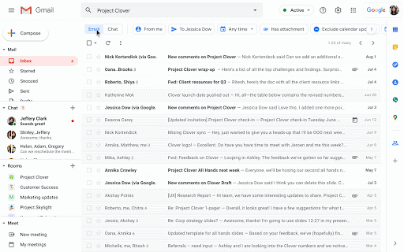

I suspect most readers use free Gmail accounts on their Chromebooks. If you're one of them, like me, this news doesn't apply to you, at least not yet. For those who are paying GSuite customers though, the Gmail interface on your Chromebook is about to look a whole lot different. Google today announced a preview of [upcoming client changes that unify Mail, Tasks, Meet and Chat like never before](https://cloud.google.com/blog/products/g-suite/introducing-your-new-home-for-work-in-gsuite).

Here's a quick overview video to show you what to expect:

https://youtu.be/4Cslvqi38eI

Chat will become more integrated into Gmail with these changes, along with a nifty new collaboration feature in Chat rooms:

> ... we’ve infused them with real-time collaboration by adding the ability to open and co-edit a document with your team without leaving Gmail. This makes it easier for you to collaborate directly within the context of where you’re doing your work in the moment—so, for example, you can chat about the changes you’re making to a document in real time, or assign a new task (or mark one complete!), without switching between screens.

Fewer screens to manage? Count me in although I don't do much collaboration in documents these days.

Oh and you'll be able to use Gmail's search tool, one of my all-time favorite features that I can't live without, to quickly find what you want in Chat as well:

Google says it will begin rolling out this new integrated GSuite and Gmail experience to interested customers who sign up here, and a wider rollout will follow.

Will us freeloaders using Gmail on Chromebooks with unpaid plans get the same, or a similar, upgrade in the future?

That's tricky to say as Google has been trying to keep "extra" features within paid plans, especially when those plans are targeted at businesses that pay a per-seat license. Even so, I wouldn't be surprised to see at least some of these changes trickle down to us in the future. It took COVID-19 to get us all Google Meet access and I suspect that's getting a bunch of usage on Chromebooks, even from those who don't pay for GSuite.

Is this something as a non-GSuite Chromebook user you'd like to see?
