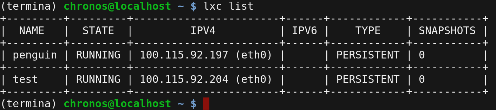

The New York Linux User Group recently had a pair of special guests: Googlers David Reveman and Zach Reizner. Reveman and Reizner presented all of the nuts and bolts put together for [Project Crostini](https://www.aboutchromebooks.com/tag/project-crostini), which is the containerized method Google is using to [support Linux apps on Chrome OS](https://www.aboutchromebooks.com/news/google-officially-unveils-project-crostini-linux-apps-on-chrome-os/). Reddit user [apsted pointed out the video](https://www.reddit.com/r/Crostini/comments/91mh9m/httpswwwyoutubecomwatchvwwrxqderfm8/), which I watched in its entirety this afternoon.

I'll warn you in advance, the first half of this 85 minute video is _very_ much down in the weeds from a technical perspective, but if you want to understand Google's approach for supporting Linux apps on Chrome OS, it's worth it.

And if you'd rather just see a demo of Linux apps running on a Chromebook, you can skip to 49 minutes in.

\[embed\]https://youtu.be/WwrXqDERFm8\[/embed\]

Some of the key takeaways I heard and saw include:

- There are 13 steps behind the scenes if you double-click a Linux app icon in your Chrome OS launcher to get to the actually running of that app in a terminal; assuming that you don't already have a terminal running. This is why it takes about 6 seconds (at least on my Pixelbook) before you see the app.
- Many of those steps required Google to engineer custom solutions or services to manage the entire process and still reduce "attack vectors" from a security standpoint. After viewing this presentation, I'm confident that Crostini's security is on par with that of Chrome OS.
- All of the services Google created are named after French hospitality roles, such as concierge and maitre d. That I knew. But how Googlers pronounce them -- intentionally wrong -- is new to me and quite comical!
- You can have multiple containers running at the same time; something else I knew but haven't tried until this I watched the video.

- During the Q&A period, a NYLUG member asked if this was meant to compete against Windows since Microsoft recently added a Linux subsystem option. That wouldn't surprise me but being an engineers, Reizner joyously says, "We're Linux hackers; we just want to code on our devices!"
- While the default environment for Crostini is Debian Stretch, you can use it various other distros (think Ubuntu or Arch Linux) or containers.
- Yes, the team is working to bring [GPU hardware acceleration support to Crostini](https://www.aboutchromebooks.com/news/project-crostini-progressing-towards-gpu-acceleration-for-chromebooks-running-linux-apps/); Reizner himself is involved. Gamers, rejoice!
- Project Crostini was first envisioned when ARC++ -- the mechanism used to run Android apps on Chromebooks -- was introduced in 2016.
- Like everyone else (including me) who has Project Crostini running, the audience enjoyed seeing the Chrome browsing running in Linux within Chrome OS. It's a geek thing.

There's plenty more that I learned, but rather than spoil _all_ of the fun stuff, tune in to the video when you have time.
