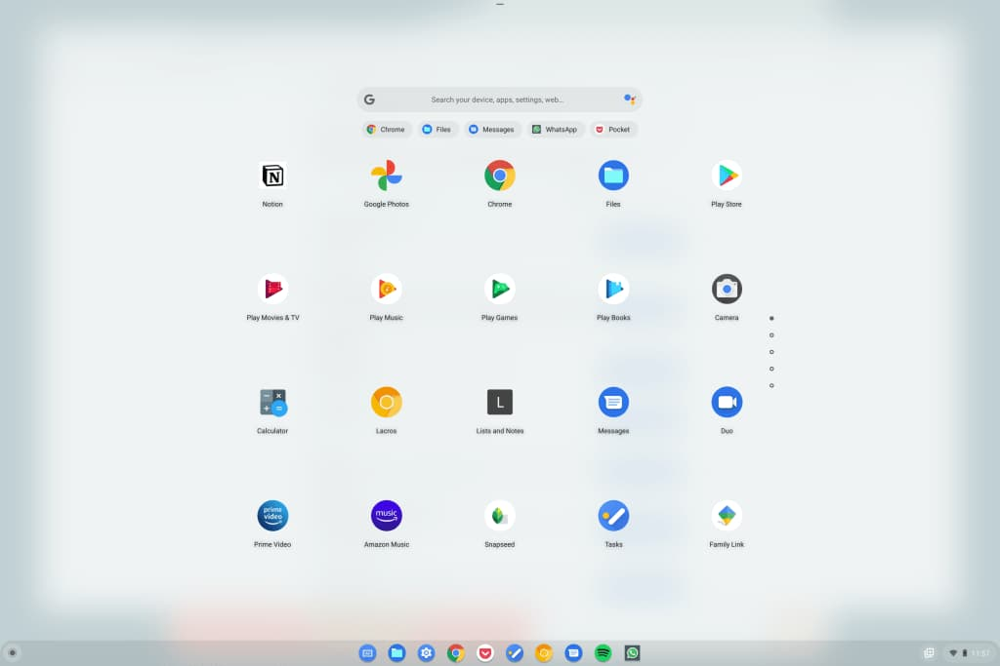

There have been reports over the past few months that Google is bringing a dark theme or dark mode to Chromebooks. The reports are true, but to me, it's more that Google is bringing a _light_ theme and the option to use either dark or light in Chrome OS. That's just semantics though and [Chrome Story shared a video preview](https://www.chromestory.com/2020/10/enable-dark-mode-chromebook/) of how this will look:

https://youtu.be/BAtqHqIsmHo

Obviously, this still very much a work in progress. First, this feature has only recently landed in the highly unstable Canary Channel of Chrome OS with version 88. And second, it's not quite working 100% as evidenced by notes of crashing in the video look.

Still, this is something I'm sure many Chromebook users want as it brings Chrome OS closer to parity, at least from a user interface perspective, to the venerable macOS and Windows platforms.

When the feature does filter down to the other channels, it will surely be an experimental feature for at least one or two Chrome OS releases. You'll know you can use it if navigating to `chrome://flags/#dark-light-mode` shows as an option, where you can then enable it.

By the way, the reason I suggested this is more of a "light theme" change is because my Chromebook's theme is already dark. Here's an image of the light theme to illustrate what I'm talking about:

_Image courtesy Chrome Story_

That sort of reminds me of the old Windows Aero Glass theme that came out alongside Vista if I recall correctly. Then again, just about everyone wants to forget about Vista, so I could be wrong.

I'll probably stick to the dark side, even after we can switch themes. How about you?
