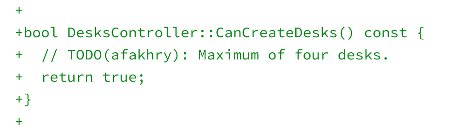

This is essentially a visual look only since the [underlying functionality to add or remove apps to a Virtual Desk hasn't been coded yet](https://bugs.chromium.org/p/chromium/issues/detail?id=866622). For the moment all we can see is a "New Desk" button which adds a desktop and buttons to remove existing desktop spaces.

Back in a [November interview with Android Police](https://www.androidpolice.com/2018/11/27/chrome-os-will-get-virtual-desktop-workspace-support-eventually/), Google's [Kan Liu said that virtual workspaces for Chromebooks was in the works](https://www.aboutchromebooks.com/news/virtual-desktop-workspaces-and-mobile-website-views-coming-to-chromebooks-and-chrome-tablets/). This would provide a way to organize apps and browser tabs into different "virtual desktops". Thanks to 9to5 Google, we now know the feature is called Virtual Desks and even have an early look at the functionality.

At the moment, the developers are planning to support a total of four additional desktops, based on both the demo video as well as the code comments:

While I love the idea of this feature addition, I am concerned about one aspect. Virtual Desks are managed through the Chrome OS Overview mode. That's the mode that displays all of your running apps when you swipe up on a Chromebook trackpad with four fingers or when you tap an icon at the bottom left of the screen when in tablet mode.

That's the mode that most reviewers pointed out had a significant issue on the Pixel Slate. I presume it's a bit of an issue on other Chrome OS tablets as well, but I don't have any to test with at the moment. Overview mode on the Slate -- particularly on the base, Intel Celeron model showed significant lag and frame drops.

[We've seen some code commits to address that](https://www.aboutchromebooks.com/news/pixel-slate-tablet-animation-lag-fix/) and to be honest, I don't really see any major Overview mode issues [on my Intel Core i5 Pixel Slate](https://www.aboutchromebooks.com/reviews/google-pixel-slate-review/). But my hope is that any Overview rendering issues are fully resolved before Virtual Desks arrive.

There's likely plenty of time to ensure a better performing Overview mode in time, since work on Virtual Desks only began earlier this month. The feature has clearly missed the Chrome OS 73 feature-freeze date, since that was yesterday. So at the very earliest, Virtual Desks are a Chrome OS 74 delivery.

I'm going to guess that even that release may be too aggressive, given that this is a Priority 3 feature request and there are several higher priority functions to address. We'll have to see how the code progresses in the coming weeks.
