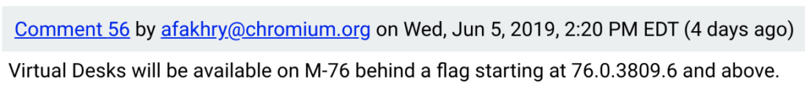

The Chromium team faked me out but that's a good thing. Last week I noted that the [Virtual Desks function appeared behind a setting in Chrome OS 77](https://www.aboutchromebooks.com/news/chrome-os-77-first-look-at-virtual-desks-video-chromebook/), which is where I first saw it. But the feature is actually closer to completion and has made the cut for Chrome OS 76.

Since I starred [the bug report](https://bugs.chromium.org/p/chromium/issues/detail?id=866622), I got a notification a few days ago saying that Chrome OS version "76.0.3809.6 and above" would add the ability to have up to four virtual desks. [That release landed on the Dev Channel](https://chromereleases.googleblog.com/2019/06/dev-channel-update-for-chrome-os.html) Thursday of last week.

Unfortunately, I didn't have time to write it up until now - thank some moderate illness and the start of a new summer class: Data Structures and Algorithms FTW! I noticed [Keith Myers wrote it up right away to share the news](https://kmyers.me/blog/chromeos/chromeos-76-0-3809-6-brings-virtual-desktops-and-fixes-crostini/), however.

One of my test Chromebooks is on the Canary Channel, so I checked my Dev Channel device to verify. Sure enough, it's on the right version for virtual desks so it was a small effort to enable the flag, which is at _chrome://flags/enable-virtual-desks_. Note that even if you are on Chrome OS 76, this flag is disabled by default.

If you're not familiar with virtual desks, here's a look at what this feature adds:

https://www.youtube.com/watch?v=6EoXhfruZL4

With a 2-in-1 or clamshell Chromebook that has a keyboard, it's fairly easy to get into overview mode, which is how you navigate though or use virtual desks. You can use the dedicated keyboard button on a Chromebook or swipe up with four fingers on the trackpad. When using a tablet, such as the Pixel Slate, without a keyboard, overview mode is available through an on-screen button at the bottom right of the display.

Note that I haven't yet found any keyboard shortcuts to move quickly through virtual desks. You can hit Alt + Tab to move through your apps and when you find the one you want, it opens on the virtual desktop it lives on.

But you're really not moving through the desks with this method. I've already seen some feedback to the Chromium team asking for some trackpad or keyboard shortcuts for that functionality; so far, no news on this front.

Given that Virtual Desks made the cut for Chrome OS 76 and it's working well on the Dev Channel, it should arrive on the Stable Channel in early August for everyone.
