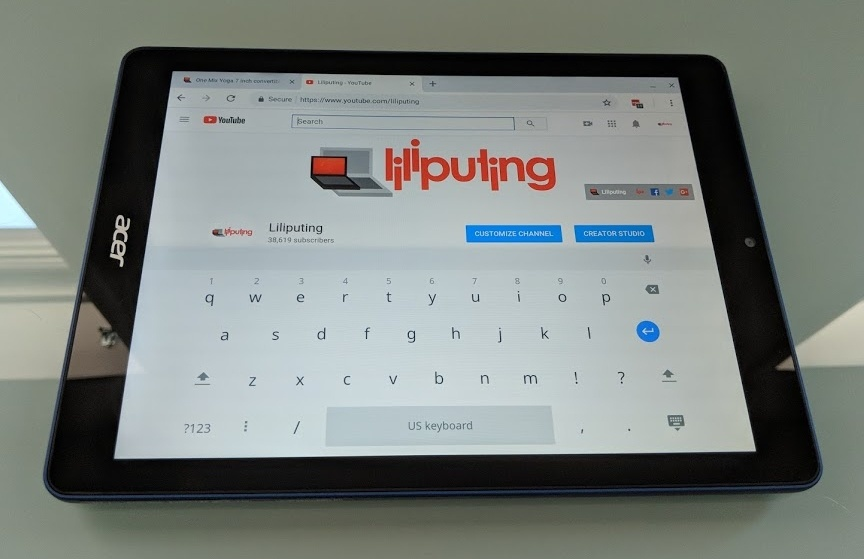

While this week saw the long-awaited [first reviews of the Google Pixel Slate](https://www.aboutchromebooks.com/reviews/google-pixel-slate-review/), it also shed a little light on the future of the software platform. David Ruddock over at Android Police got a little time from Kan Liu, Google's senior product manager for Chrome OS, and Liu shared details on two features in the works: [virtual workspaces](https://www.androidpolice.com/2018/11/27/chrome-os-will-get-virtual-desktop-workspace-support-eventually/) and a [mobile website viewing mode](https://www.androidpolice.com/2018/11/27/chromebooks-and-chrome-tablets-will-get-an-option-to-show-the-mobile-version-of-a-website/) for Chromebooks and Chrome tablets.

I wholeheartedly agree with Liu's observation that a full desktop site on a mobile device doesn't always make sense. Part of that has to do with the touch controls but I think an even bigger part has to do with screen size. In fact, although many people like or want small Chrome OS tablets, I'm actually not a fan, which may be surprising.

Why? Because my observable theory is that _the smaller the display size, the less value from a user experience standpoint is provided from a full desktop browser_.

\[caption id="attachment\_2333" align="aligncenter" width="864"\] Credit: [Liliputing](https://liliputing.com/2018/07/acer-chromebook-tab-10-review.html)\[/caption\]

Using the 9.7-inch Acer Chromebook Tab 10 is when this hit me. Yes, it's great to have the full desktop web, true Google Docs, etc.... but it becomes harder to use that full web on a small screen. Conversely, the desktop web experience on a larger device -- the [HP Chromebook X2](https://www.aboutchromebooks.com/news/hp-chromebook-x2-arrives-as-the-first-detachable-chromebook-tablet/) or the Google Pixel Slate, for example -- is very efficient. And yes, you can dock or connect a smaller tablet to a larger external monitor to get around this. In fact, that setup works well. But you can't take that monitor with you when leaving the desk behind. You just have a small screened tablet with a web experience best suited for a larger display.

This is why the upcoming ability to request a mobile website in Chrome OS is a big deal to me. I think the ability to switch to a "small screened version" of a site on small screened Chrome OS device will do a world of good for those devices. I'll probably test the feature on my Pixel Slate, but honestly, I doubt I'll use it for any length of time. There's just no point.

There is a point to getting virtual desktop workspaces in Chrome OS though. For the moment we're constrained to a single "one screen" environment where we can show a few apps on the display while minimizing or covering others. There's just no way today to have a desktop screen filled with work apps or browser tabs and a separate second screen space for consumer or content activities, for example.

Virtual workspaces have long been a staple on other software platforms for years, whether we're talking about Windows, macOS or Linux. They offer the feel of having a second display and more room to work and organize apps. For now, Chrome OS only has a way to zoom the desktop out and show all running apps; you can't move them to another virtual workspace. Here's how it looks in Windows 10 with multiple desktop spaces, for example.

 

When reporting on these types of new features I often hear from folks who just want Chrome OS to remain simple. Keep in mind that you don't have to use every feature included in Chrome OS. If you just want to browse the web and don't need or want Android or Linux apps, virtual desktops, and mobile website views, you don't have to. I haven't yet seen Chrome OS slowed down by feature bloat, although I don't have older Chromebooks to test that observation. Chime in if you do have an older device and have seen speed degradation that might be caused by Chrome OS updates.

There's no official timeline when both of these new features will arrive, but I'll be digging around the code commits watching for them, so stay tuned!
