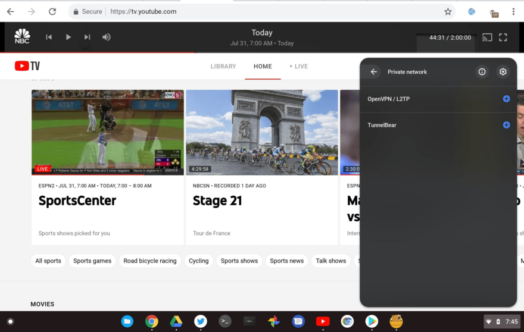

Subscribers to the 2 TB Google One plan are getting a new VPN service option at no extra cost, Google announced on Thursday. The VPN option is controlled directly in the Google One mobile app and is launching on Android phones. While you _might_ be able to use the Google One Android app on a Chromebook for private web browsing, a tidbit buried in Google's support documentation tells us you won't have to in the future. [VPN by Google One](https://blog.google/products/google-one/new-vpn-by-google-one/) is coming to Chromebooks natively.

I am a Google One subscriber, but I use the 200 GB plan these days, which is $2.99 a month. [The](https://one.google.com/about) [2](https://one.google.com/about) [TB plan is $9.99 a month, or $99 if you pay annually](https://one.google.com/about). So under my current plan, I won't get the VPN offer.

Regardless, I was interested in the details, so I started digging around to get more information on the VPN service.

Google published this PDF file to explain what VPN by Google One is and how it works. And there at the bottom, I spied with my four eyes, this passage:

> We believe an easy to use, highly private, and performant VPN will significantly help improve user privacy and security online. So it should come as no surprise that we want to make VPN technology available to as many users as possible.  
>   
> For starters, we will provide the service on Android. Over time, we plan to scale it across more platforms like iOS, ChromeOS, Windows, and Mac.

Unfortunately, Google hasn't clarified exactly when the other platforms will gain this privacy feature. I'll be watching the Chromium code commits for anything VPN-related, which will give me a heads up on the timeline for Chrome OS support.

Knowing how data-driven Google is as a company, I would imagine it will focus first on platforms that have the most Google One subscriber usage.

Before I even publish this post, I'm anticipating comments about "why would you trust Google with your private browsing activities"? And that's a fair point, particularly because of Google's ad-centric business model and the fact that some VPN providers really aren't to be trusted; [some have been caught keeping user data on their servers](https://www.welivesecurity.com/2020/07/20/seven-vpn-services-leaked-data-20million-users-report/), which is a big no-no in VPN-land.

I have two rebuttals, or pre-rebuttals if you will, to consider.

First, Google says that none of your VPN data will be used for advertising. Additionally, it plans to have an independent third-party audit the service for privacy:

> With VPN by Google One, users’ online activity is not identifiable to the VPN and not logged by the VPN. We believe a VPN must be transparent, and robust. That’s why we have open-sourced our client and will provide a third-party audit of the end-to-end solution to make them externally verifiable.

Second, if you're using a Chromebook, Google is _already_ logging your browsing activity through device and web apps you use. Sure, you can use Incognito Mode to keep some web activities from becoming part of your profile. Other than that, or by using a different trusted, or a self-hosted\*, VPN with your Chromebook, Google's getting most of your online activity anyway.

In that case, why not consider VPN by Google One on a Chromebook, especially if you're already paying $9.99 a month for two terabytes of Google One storage?

_\* I [recently reviewed a home network security product called Firewalla Gold](https://staceyoniot.com/firewalla-gold-vs-blue-review-device-network-protection-router/). Aside from protecting my network and smart home devices from external threats, it also functions as a no-fee, localized VPN server at my house._
