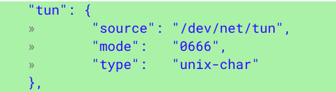

One of the benefits to running Linux desktop apps on a Chromebook via [Project Crostini](https://www.aboutchromebooks.com/tag/project-crostini) is having access to more apps that work in a business environment. But one of the fairly standard requirements in many businesses is using a VPN, or Virtual Private Network, for security reasons. Chrome OS network traffic can be securely routed through an Android VPN client but that security doesn't extend to Linux apps in a Crostini container.

That's about to change due to a code commit made today to address this feature request that's bee[n in the Chrome OS bug repository since November](https://bugs.chromium.org/p/chromium/issues/detail?id=905500&q=component%3AOS%3ESystems%3EContainers&sort=-modified&colspec=ID%20Pri%20M%20Stars%20ReleaseBlock%20Component%20Status%20Owner%20Summary%20OS%20Modified), although the issue was first reported last April.

The code is fairly simple, adding these few lines to Tremplin, which according to its readme file is "the “springboard” daemon that runs in the Termina VM and exposes a gRPC interface for managing LXD containers."

Essentially, this code change natively implements what has been a [workaround to get VPN functionality within Crostini as noted here,](https://bugs.chromium.org/p/chromium/issues/detail?id=834585#c25) which has been to run these commands in crosh (ctrl + alt + t):

- vmc start termina
- lxc config device add penguin tun unix-char path=/dev/net/tun

Tun, by the way, is a virtual network layer device on Level 3 of the OSI model for networking, although you may not care about that. What you might care about is that after the code change was made, OpenVPN was successfully run by the Chromium developer, suggesting that this should bring VPN access to the Linux container.

Given the small scope of this change and the positive test results, I'd expect this function to appear in the Canary channel within the next few days; I'm running the Dev Channel, so I won't be able to test it until it arrives there, however. Just to be clear: This code change enables VPN support but doesn't actually add a VPN. For that, you'll need to find a VPN provider such as OpenVPN, NordVPN, TorGuard VPN or one of several other options available on the market.
