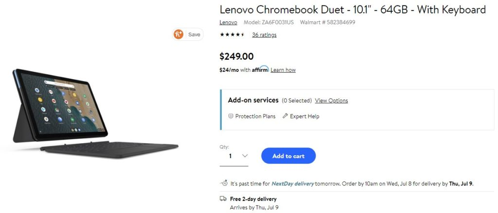

I haven't yet heard anyone say the Lenovo Duet Chromebook was overpriced at a starting cost of $279, which includes the detachable keyboard and kickstand. Still, if you were waiting for a sale on the base 64 GB capacity model, [Walmart has this new Chrome OS tablet available for $249](https://www.walmart.com/ip/Lenovo-Chromebook-Duet-10-1-64GB-With-Keyboard/639904019), saving you just over 10 percent.

I'm specifically mentioning, or re-mentioning, that this is the base Lenovo Duet Chromebook model for two reasons.

First, I wouldn't want to see any potential buyers have confusion over what they're getting, which is the same hardware as the $299 model, save for half the local storage capacity. And second, even at this price, if you know you can fill up that 64 GB rather quickly with Android apps, media content, or other files, you're still likely better off with the 128 GB version. Remember, there's no memory card slot for storage expansion on the Lenovo Duet Chromebook.

The kickstand can fold back from around 95 to about 135 degrees

Having said that, this Chrome OS tablet bundle was already a good value at its full price in my opinion. Snagging one on sale only increases the bang for buck.

Although the Lenovo Duet Chromebook isn't for me personally, since I tend to do [high-performance tasks that require a strong processor and gobs of memory](https://www.aboutchromebooks.com/news/acer-chromebook-spin-13-with-16-gb-ram-should-you-buy-one/), this is a really nice package.

[In my review](https://www.aboutchromebooks.com/news/lenovo-ideapad-duet-chromebook-review-2020/), I noted that the 10.1-inch, 1920 x 1200 resolution touchscreen was great to look at all day, for example. Even with just 4 GB of memory, this tablet handles half-a-dozen browser tabs with ease. Most of the Android apps I've tried generally run just like they do on a mid-range smartphone, save for a few lags here and there.

Although the MediaTek processor won't set any speed-records compared to higher-priced Intel-power Chromebooks, it's no slouch either. And while the keyboard is a bit small -- it has to be since the display is only 10.1-inches diagonally -- it's functional and convenient, especially if you like a detachable keyboard.

If you're looking for a secondary Chrome OS device, the Lenovo Duet Chromebook is among the best options for the price right now, in my opinion. Using it as a primary Chromebook can be done but that's not ideal for most people, save for a younger student. In fact, I'd think elementary and even middle school kids could use this for fun and for schoolwork: Smaller hands would appreciate the smaller keyboard.

Still on the fence? Read [my full review of the Lenovo Duet Chromebook](https://www.aboutchromebooks.com/news/lenovo-ideapad-duet-chromebook-review-2020/) to see if this is the right device for you, on sale or not.
