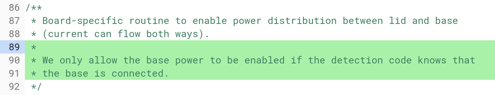
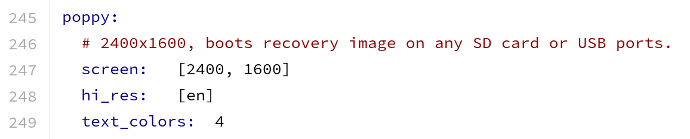

I was digging around to see if there was a Chrome OS code issue related to the HP Chromebook X2's lack of backlit keyboard when I found something else very interesting: A [detachable Chromebook device board, code-named Wand](https://chromium-review.googlesource.com/c/chromiumos/third_party/kernel/+/1095978/1/drivers/hid/hid-google-hammer.c), that will have power in both the screen (like the X2, shown above) and in the keyboard base, which the X2 does not have.

That type of hardware setup helps in two ways. First, it will allow for a potentially longer run-time on a single charge, since there are two batteries. I found code that detects if power is flowing from the screen to the keyboard and vice versa, for example, which is evidence of a pair of power packs likely managed by USB OTG, or USB On-The-Go.

Google has also tested that [Wand will properly hibernate when the display battery drops to, or below, 3 percent capacity](https://chromium-review.googlesource.com/c/chromiumos/platform/ec/+/956659).

Additionally, one code commit description specifically [calls out the battery in the base](https://chromium-review.googlesource.com/c/chromiumos/platform/ec/+/956661) and says that the Lux board inside the base can:

> "provide enough power to charge wand battery a little (44mA), even when backlight is fully on, and touchpad is in use."

Second, such a configuration can help add more centered weight to the base which can help the Chromebook be less "top heavy" when used in laptop mode.

I'm going to take an educated guess and say that the manufacturer for any Chromebooks made with the Wand board will actually be Google.

Why? There's [one last code commit](https://chromium-review.googlesource.com/c/chromiumos/overlays/board-overlays/+/849912/2/overlay-poppy/chromeos-base/chromeos-bsp-poppy/files/61-hammer-keyboard.hwdb) I noticed that includes this: _"Special mapping for "Hammer"/"Wand" keyboard that has a special "Assistant" key."_ It's possible that another Google hardware partner is getting a dedicated Assistant key, of course, but Google's Pixelbook has one, making it a bit of a differentiation that I'd keep if I were Google.

[Wand appears to be built off a base board code-named "Poppy"](https://chromium-review.googlesource.com/c/chromiumos/overlays/board-overlays/+/849912), which supports up to a 2400 x 1600 resolution (so a 3:2 aspect ratio) based on this screen shot from a configuration file.

Note that Poppy is the base board used in both the HP Chromebook X2 and the [Samsung Chromebook Plus v.2](https://www.aboutchromebooks.com/news/samsung-chromebook-plus-v2-release-date-price/); the latter has a lower resolution display, so Wand may not use the full screen resolution that it could.

Based on additional code, there's mention of pins, which I take to mean the pogo pins that are used for data between the keyboard base and the display, just like the [HP Chromebook X2](https://www.aboutchromebooks.com/tag/hp-chromebook-x2/).

Exciting times for detachable Chromebooks!
