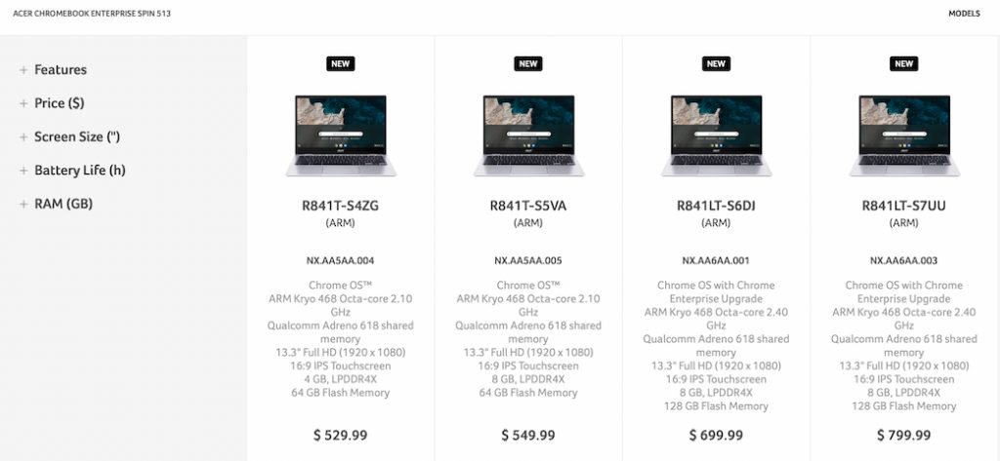
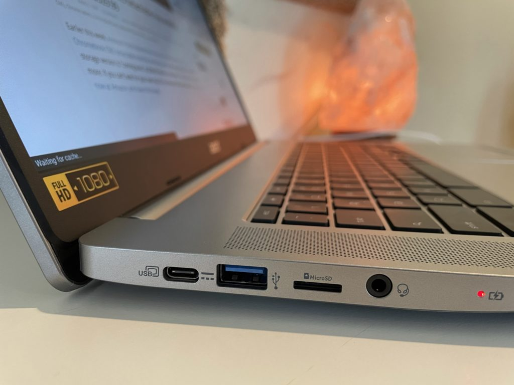

This morning I received a review unit of the Acer Chromebook Spin 513 with LTE, which I'll be checking out over the next week or so. Most, if not all, of [the reviews so far that I've read](https://www.aboutchromebooks.com/news/acer-chromebook-spin-513-review-roundup-a-relatively-solid-entry-level-laptop/), don't have the LTE functionality and are for the $399.99 model. So I'm looking forward to what convenience the integrated broadband brings and how it affects battery life. But this model isn't $399.99. It's currently the least expensive configuration with LTE and it costs $699.99.

I'm a bit confused by the price difference as I'm sure some of you are too. I've received a number of emails from readers asking if the base model includes LTE; it doesn't. And as far as the price increase to add LTE? Well, that's a little odd as well.

See, there are currently [four Acer Chromebook Spin 513 for enterprise configurations](https://www.acer.com/ac/en/US/content/professional-models/laptops/acerchromebookenterprisespin513) on Acer's website. And only two of those, priced at $699.99 and $799.99 include LTE support.

You can't tell by looking at the high-level description of these. You have to dig into the specific configuration specs to see if LTE is there or not. I've provided feedback to Acer suggesting that it highlight LTE support in the description.

But the Acer Chromebook Spin 513 also has configurations available for consumer-focused buyers as well. That's the page where you'll see the entry-level $399.99 configuration as well a similar model for $429.99. But there's no LTE support on those.

That's a shame. I get that device makers have to pay a licensing fee to use Qualcomm's modem technology and it's a Qualcomm Snapdragon 7c SOC inside all of these Chromebooks. There's clearly a cost there. And, assuming there are two different Snapdragon modules -- one with the integrated LTE modem and one without -- there's a hardware cost there as well.

Yet, there aren't any "base" configurations with LTE, and those added costs, which I'd equate to be around $120 or so, based on other LTE devices.

Instead, you have to pay $300 more than the base model for that LTE modem, although it does get you double the RAM (8 GB vs 4 GB) and local storage capacity of 128 GB vs 64 GB. And that feels like a huge missed opportunity. There are plenty of folks who are fine with a basic entry-level Chromebook but want integrated LTE. I'm sure they're willing to pay for that mobile broadband, but will they spend $699 to get it?

I'm skeptical, mainly because [Samsung recently introduced](https://www.aboutchromebooks.com/news/samsung-galaxy-chromebook-go-with-5g-lte-lands-at-att/) the entry-level Galaxy Chromebook Go with LTE that costs just $50 more than the WiFi model. It's priced at $349.99.

No, you don't get 8 GB of memory or 128 GB of storage. Heck, you don't even get the nicer 1080p touch display that the Acer model offers. However, you get the [key feature that's lacking among many Chromebook devices: LTE support](https://www.aboutchromebooks.com/news/want-an-lte-chromebook-here-are-your-current-options/).

Obviously, my review of this Acer Chromebook Spin 513 with LTE will be to judge how the device performs in a variety of use cases, the build quality, and the usefulness of that LTE radio. But I'll also have to share thoughts on the value proposition. That's going to be a tougher task, given that, for now at least, you can't get an LTE model for under $699.

I hope that changes in the near future. These days, integrated LTE isn't, or shouldn't be, reserved for enterprise users.
