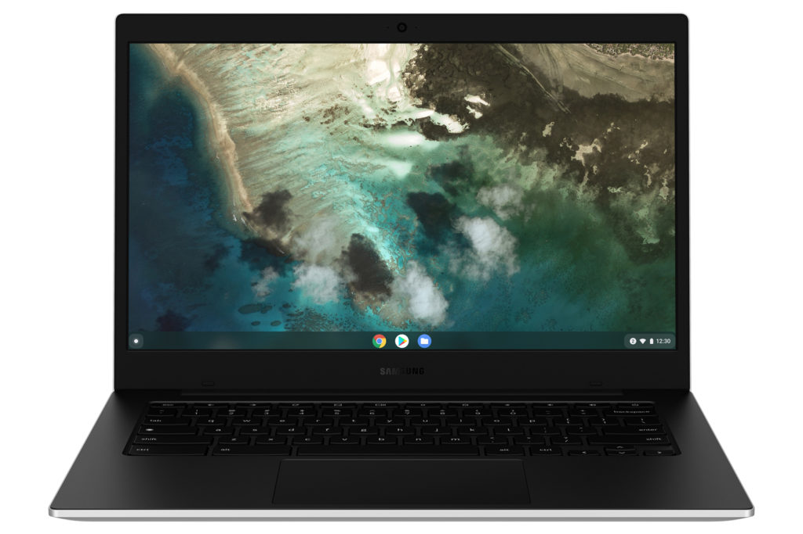
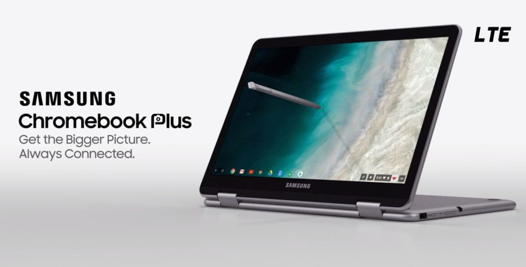
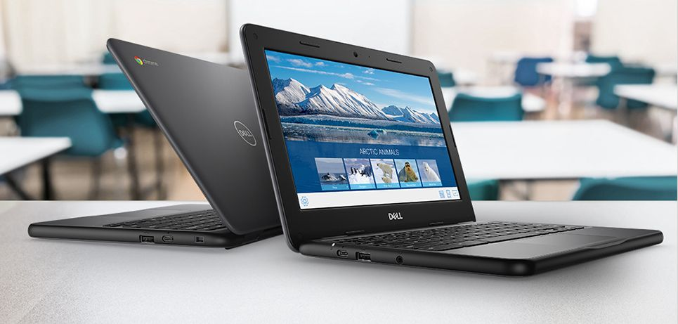
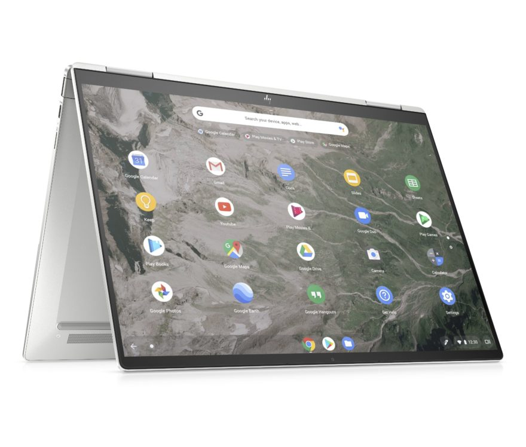
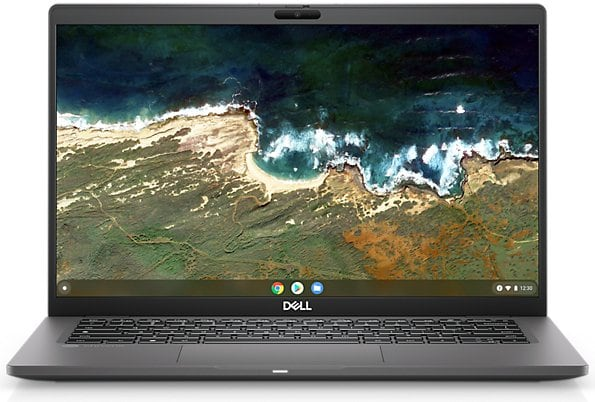
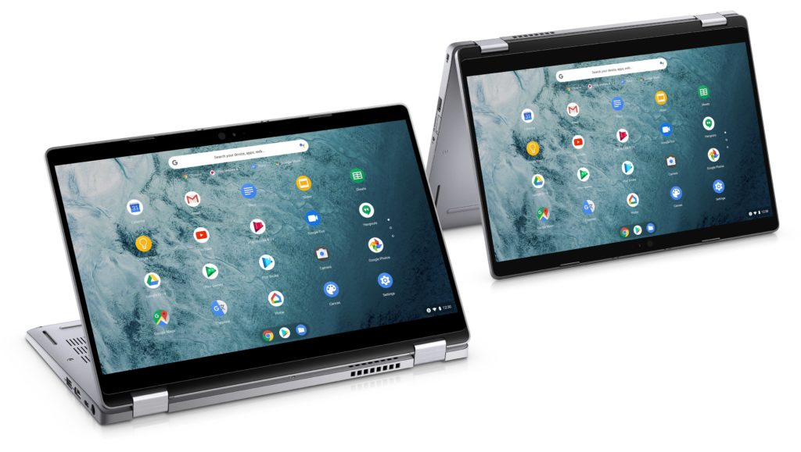

I regularly hear from readers wanting an LTE Chromebook. Google's first Chromebook Pixel had an integrated LTE radio and I admit, it was handy to have. But truth be told, Chromebook makers haven't seen much demand for these devices. So there are very few current options if you want a Chromebook with LTE. Here are the ones I found if you're dead set on having one.

## Samsung Galaxy Chromebook Go

This is a new addition to the list [as of August 5, 2021](https://www.aboutchromebooks.com/news/samsung-galaxy-chromebook-go-with-5g-lte-lands-at-att/), as AT&T is now [directly taking pre-orders for the Samsung Galaxy Chromebook Go with 5G / LTE](https://go.skimresources.com/?id=140330X1604442&isjs=1&jv=15.1.0-stackpath&sref=https%3A%2F%2Fwww.aboutchromebooks.com%2Fnews%2Fsamsung-galaxy-chromebook-go-with-5g-lte-lands-at-att%2F&url=https%3A%2F%2Fwww.att.com%2Fbuy%2Ftablets%2Fsamsung-galaxy-chromebook-go-32gb-silver.html&xguid=01F86Q9Z7HWAEC2QC2S3353TDD&xs=1&xtz=240&xuuid=bfc1d612ad0c1e6561a75df5e3b54bfc&xjsf=other_click__auxclick%20%5B2%5D). The carrier says 5G, but in the past, it has rebadged 4G LTE as 5Ge. Regardless of the mobile broadband standard used, you can get this entry-level Chromebook in the U.S. with always-on connectivity.

The premium for 5G with LTE failover is only $50 more than the WiFi model at $349.

Of course, that doesn’t include a data plan, which you’ll need, or at least want, with this 14-inch Chromebook. And for that, AT&T is touting its $20 a month unlimited data plan.

That means a year of always-on connectivity will set you back $240, which is nearly two-thirds the cost of the Samsung Galaxy Chromebook Go.

However, in typical U.S. carrier fashion, [AT&T will cut you a break on the $349 device cost](https://about.att.com/story/2021/samsung_connected_devices.html). This LTE Chromebook is 50% off with the addition of a data plan.

If you missed the details of the Samsung Galaxy Chromebook Go, it’s essentially a 14-inch Chromebook that has a 180-degree hinge.

You’re only getting a 1366 x 768 screen resolution, Intel Celeron N4500, 4 GB of memory, and 32 GB of storage inside. Again, think entry-level pricing for basic online browsing.

## Samsung Chromebook Plus

This is probably the oldest of the bunch and as such, I personally wouldn't recommend [dropping $599.99 on it](https://www.samsung.com/us/computing/chromebooks/12-14/samsung-chromebook-plus-lte-xe525qbb-k01us). If you do, you're getting an LTE laptop with just three years of Chrome OS software updates left as the expiration date for this model is June 2024.

You do get a nice 12.2-inch 1080p display and integrated stylus for pen support as well as a pair of USB Type-C ports and a single USB Type-A.

But that Intel Celeron 3965Y from 2017 paired with 4 GB of memory isn't going to offer the best performance. Essentially, you're paying for the convenience of an LTE radio in the [Samsung Chromebook Plus](https://www.aboutchromebooks.com/news/samsung-chromebook-plus-lte/) and giving up a lot of money and performance for it.

## Dell Chromebook 3100 Education with LTE

At the Consumer Electronics Show this past January, [Dell announced that it would add an LTE option to its Chromebook 3100 Education line](https://www.aboutchromebooks.com/news/dell-updates-its-chromebook-3100-to-include-an-lte-option/). And it made good on its promise. [Models start at $409, which includes the LTE radio](https://www.dell.com/en-us/work/shop/dell-laptops-and-notebooks/chromebook-3100-education/spd/chromebook-11-3100-laptop/bto015c310011us?view=configurations) inside this student-focused Chromebook.

Again, you're paying a premium for that "always-on" connectivity because like the Samsung Chromebook Plus, this is more of an entry-level device.

It has an 11.6-inch display with 1366 x 768 resolution, an Intel Celeron N4020, and 4 GB of memory. Thanks to that newer Celeron though you do get Chrome OS software updates through June 2026, which is two years longer than the Samsung option.

## HP Elite c1030 Chromebook Enterprise

If entry-level Chromebooks with LTE aren't your thing, the HP Elite C1030 Chromebook Enterprise will fit the bill. But you'll pay dearly for it with [models starting at just over $1,000](https://www.hp.com/us-en/shop/ConfigureView?langId=-1&storeId=10151&catalogId=10051&catEntryId=3074457345619656326&urlLangId=&quantity=1).

That gets you an 11th-gen Core i3, 8 GB of RAM, and a solid 128 GB of fast NVMe SSD storage. What it doesn't get you is that elusive 4G radio. And you can't even get that as an option until you bump up other specifications such as a Core i5 processor. Once you do that and throw in the LTE radio, you're looking at $1,700 or more, depending on your configuration.

For about half the cost, but without LTE, you can get a [comparable high-end Chromebook](https://www.aboutchromebooks.com/news/acer-chromebook-spin-713-sale-discount-deal/) so make sure you're going to use that extra connectivity.

## Acer Chromebook Spin 513

This one is a bit of an enigma because so far, I haven't seen availability for the model with LTE. [I took a non-LTE version of this Qualcomm Snapdragon 7c-powered Chromebook for a spin](https://www.aboutchromebooks.com/news/hello-acer-chromebook-spin-513-the-first-with-a-qualcomm-snapdragon-7c/) and I'd say it's an entry-level experience with some mid-range build quality.

[It starts at $399.99 without LTE](https://store.acer.com/en-us/acer-chromebook-spin-513-cp513-1h-s60f?internal_source=us.acer.com&internal_medium=referral&internal_campaign=CLM&internal_content=NX.HWYAA.001) and although there are models from third-party sellers around $500, they don't mention LTE support. I'm flummoxed. But, the situation could change at any time, so I'd at least keep this on your radar in case LTE models do appear.

## Dell Latitude 7410 Chromebook Enterprise

Enterprise users like, or need, always-on connectivity. So any Chromebook with the word Enterprise attached to it has a shot at having an LTE option. And the [Dell Latitude 7140 Chromebook Enterprise](https://www.dell.com/en-us/work/shop/2-in-1-laptops-tablets/latitude-7410-chromebook-enterprise/spd/latitude-14-7410-2-in-1-chrome-laptop/cto2lc741014us?configurationid=283c2767-fd2b-41fb-b82f-c8b54690264a) does offer that option.

It's not the newest Chromebook but it's quite capable, depending on your requirements. The least expensive option with LTE that I configured is currently $1,272. That gets you a 14-inch, 1080p display, along with a 10th-gen Intel Core i3 processor, 8 GB of memory, and 128 GB of speedy NVMe storage. Oh, and the integrated LTE radio as well. You can bump up many of these specs, but the price gets bumped as well. Still, it is an option if you have the budget.

## Dell Latitude 5300 2-in-1 Chromebook Enterprise

In addition to the 7140, Dell also still sells the older [5300 Chromebook Enterprise model with an LTE option](https://www.dell.com/en-us/work/shop/2-in-1-laptops-tablets/latitude-5300-2-in-1-chromebook-enterprise/spd/latitude-13-5300-2-in-1-chrome-laptop/xctolc53002n113us2?view=configurations&configurationid=7c29990b-2bf1-4b2b-ad49-655d79a5f754). I wouldn't suggest it over the 7140 as it uses an older processor and costs even more. That's partially because Dell only includes LTE with the 8th-gen Core i5 option. You can drop down to a Celeron or Core i3, but no LTE for you if you do!

The least expensive I could get is the LTE model with 8 GB of memory and 128 GB of the same, fast NVMe storage is $1,344. At that price, I'd save money by nabbing the 7140 with LTE and get a newer Core i3 processor. Or you could bump up to a newer Core i5 for about the same price.

## There just aren't many good options

If you've read this far, you're likely disappointed in the choices for an LTE Chromebook. I don't blame you. It's not as if Chrome OS itself won't support LTE; the operating system does.

The issue is that Google's hardware partners, if not Google itself, don't see enough of a benefit to offer integrated LTE in Chrome OS devices. I know some of you wish that were otherwise. Unfortunately, that's not the case.

Although it may not sound appealing you do have other options; neither of which is a fully seamless solution. You can always consider using your current phone as a hotspot and connect your Chromebook to it over WiFi.

Or if you'd prefer, you could invest in a mobile hotspot device and use its connection for your Chromebook. The added benefit here is that others in your family could use the LTE connection with their devices, regardless of the operating system they run.

_**Update**: This post was originally published on July 13, 2021 and has been updated with additional LTE Chromebook options._
