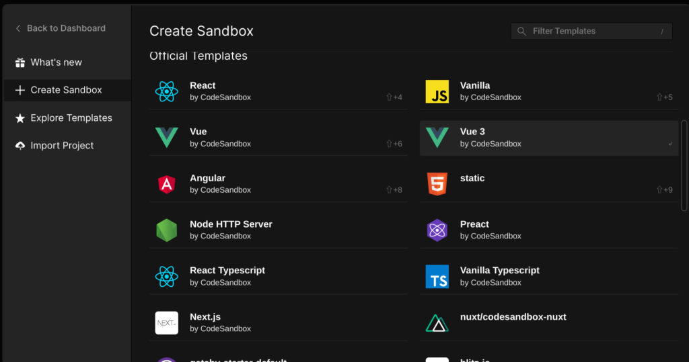
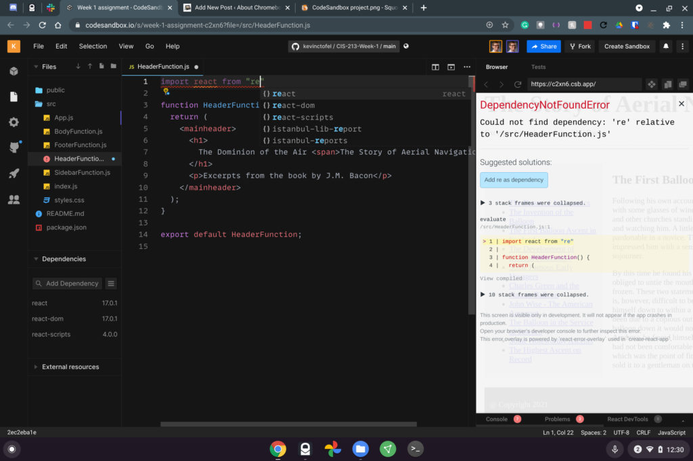
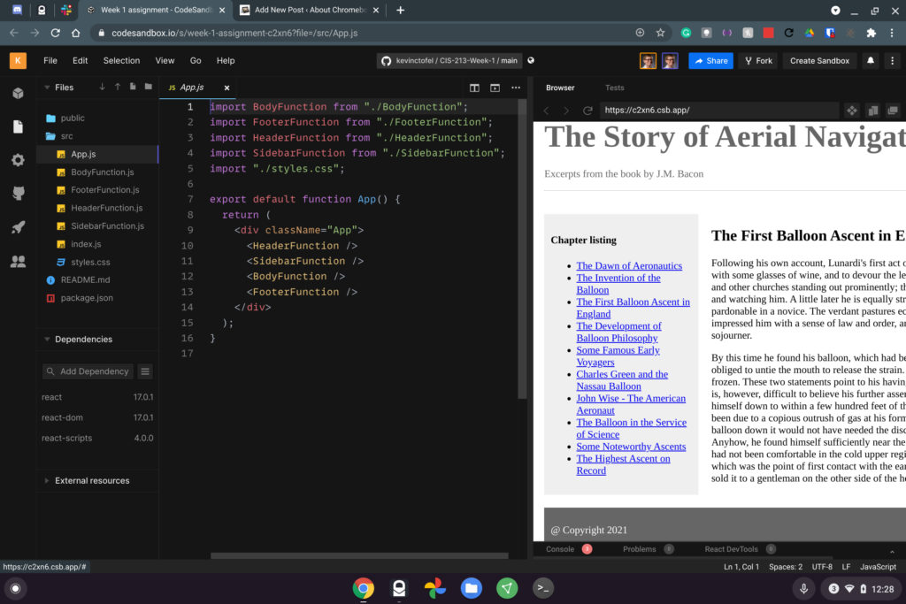

I just started my next college semester as a guest student taking Computer Science classes and like previous semesters, I'm [using a Chromebook for coding](https://www.aboutchromebooks.com/news/can-you-learn-to-code-in-a-college-computer-science-program-with-a-chromebook/). My current class is Advanced JavaScript, where we're learning [React](https://reactjs.org/).

While I can (and have) [used Linux for my web dev classes](https://www.aboutchromebooks.com/news/5-reasons-you-might-want-to-run-linux-on-your-chromebook/), our prof introduced us to a cloud-based coding environment. It's called [CodeSandbox](https://codesandbox.io/). It offers a web-based environment both to write and run your code in a wide range of web dev libraries and frameworks.

It's free to use CodeSandbox although there are a few minor limitations.

If I tie my CodeSandbox account to GitHub, for example, all of my code will be public. To get private GitHub repos and a few other nice features, it costs $12 a month. You can also pay $108 for a yearly plan. That gets you a discounted monthly rate of $9.

I'm fine with the free account for class and so far, I'm very impressed with the service. It's simple to use but powerful.

In a browser, I can create a sandbox to code my React apps, basic standard web pages with native HTML, CSS, and JavaScript, or use Angular, Vue, or a number of other options.

And the interface is very much like Microsoft Visual Code. That's my preferred code editor when using Linux on a Chromebook. In fact, CodeSandbox is built on Visual Code and includes code auto-complete suggestions:

Additionally, you can share your code with other people.

This lets you collaborate with everyone running CodeSandbox in their own browser. We don't yet have any team projects for class yet, but I could see that feature being very helpful if we're assigned to work as a group.

My first homework assignment was to take a static web page built with HTML, CSS, and JavaScript.

Using CodeSandbox it was easy to complete the assignment right in my Chromebook browser. Plus I was able to share a link to my CodeSandbox with the prof so he could review and grade it.

While you're limited to web development with this service, I can't recommend it enough for Chromebook users who like to tinker with web pages or want to learn new web development skills.

It doesn't matter how much memory your Chromebook has or how fast the processor is because all the heavy lifting is done in the cloud!
