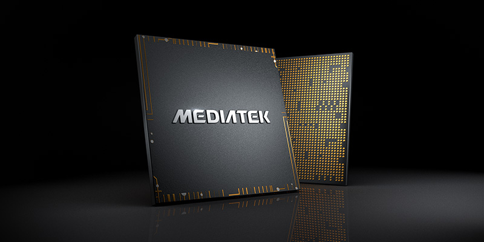
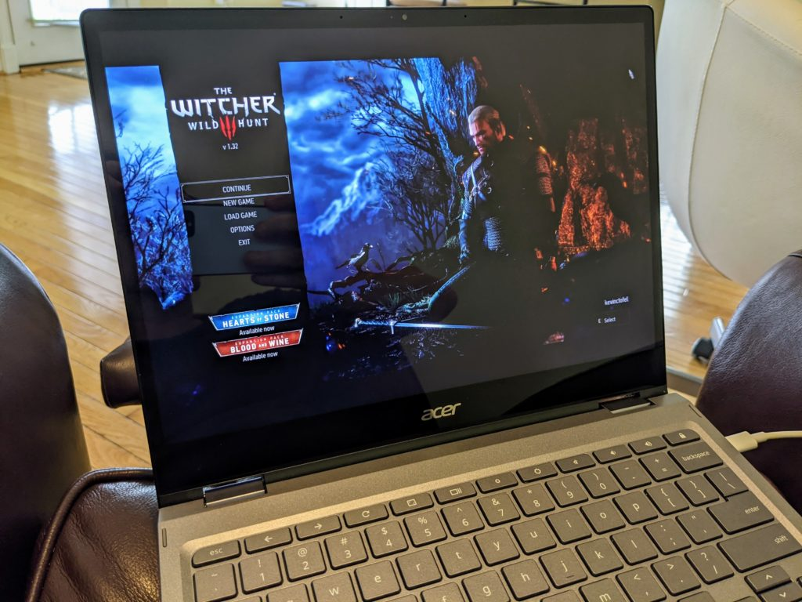

On Monday at its annual GPU Technology Conference, Nvidia shared details of its upcoming efforts in the graphics space. That was expected. What wasn't, however, is the following quote from Nvidia's press event news release, suggesting it's likely we'll see Nvidia and MediaTek chips in Chromebooks.

> In PCs, NVIDIA is working with MediaTek, the world’s largest supplier of smartphone chips, to create a new class of notebooks powered by an Arm-based CPU alongside an NVIDIA RTX GPU. The notebooks will use Arm cores and NVIDIA graphics to give consumers energy-efficient portables with no-compromise media capabilities based on a reference platform that supports Chromium, Linux and NVIDIA SDKs.

To be clear, it doesn't sound like an Nvidia CPU is in the works here. I only mention that because the company has designed ARM-based CPUs in the past for phones, tablets and its Nvidia Shield line of products.

You might recall the Tegra-line of chips I'm referencing here but I wouldn't be surprised if you didn't. Relatively few consumer devices were built on the Tegra processors.

The other obvious bit here is that if Nvidia was going to make its own CPU again, it wouldn't really have to partner with MediaTek.

Neither company produces their respective chips; they're both considered "fabless" silicon companies. In contrast, Intel, Samsung, and TSMC do have chip fabrication plants. So don't think that Nvidia is having MediaTek produce the chips; it can't. I _**could**_ see MediaTek assist in the CPU design if Nvidia wants the help.

The more interesting things here to me are the mention of the notebooks having "an Nvidia RTX GPU" and a reference design built to run Chromium or Linux. Those platforms certainly allude to these chips in Chromebooks, but it isn't limited to them.

I'm all for ARM-based processors in Chromebooks, particularly if they can be optimized for the software platform. And as much as I like the idea of Nvidia RTX GPUs (I have an RTX 3080 in my custom gaming rig), I'm not sure that Chromebooks need what such a GPU would offer. Remember that adding discrete graphics to any device is going to raise the selling price.

Yes, there has been talk of [native gaming on Chromebooks with Steam integration](https://9to5google.com/2020/07/01/chrome-os-preparing-steam-gaming-ubuntu/).

In that case, the RTX GPU would surely benefit the Chromebook. But out of the millions of Chromebook users, how many are Steam gamers now? And of those, how many would rather keep using their PC for Steam gaming? I don't think it's a big number in the overall Chromebook market.

As it is now, I [play my Steam games on Nvidia's GeForce Now streaming service with my Chromebook](https://www.aboutchromebooks.com/news/steam-game-sync-on-geforce-now-for-chromebooks-may-make-it-a-better-option-than-stadia/ "Steam game sync on GeForce Now for Chromebooks may make it a better option than Stadia"). Of course, that requires a solid broadband connection, which wouldn't be required for local Chromebook gaming.

Don't get me wrong: I'm all for more power, performance, and overall hardware improvements. But I'm leery that Nvidia GPUs in Chromebooks will have a large effect on the market overall. I guess we'll see over time!
