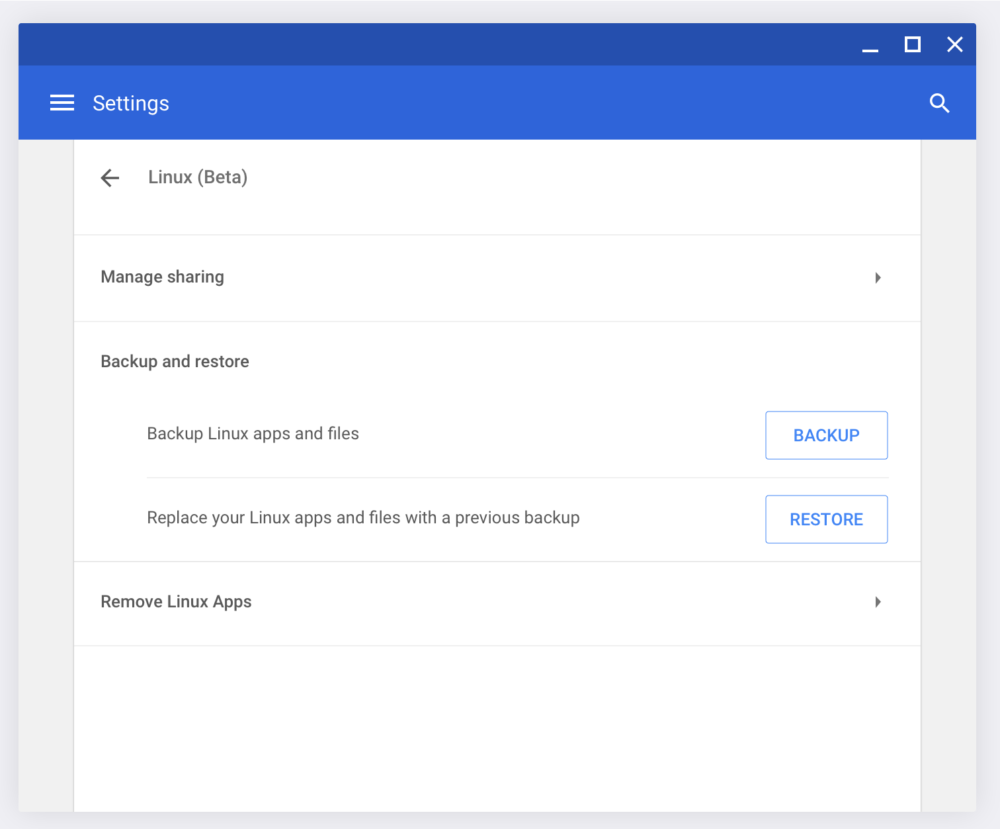
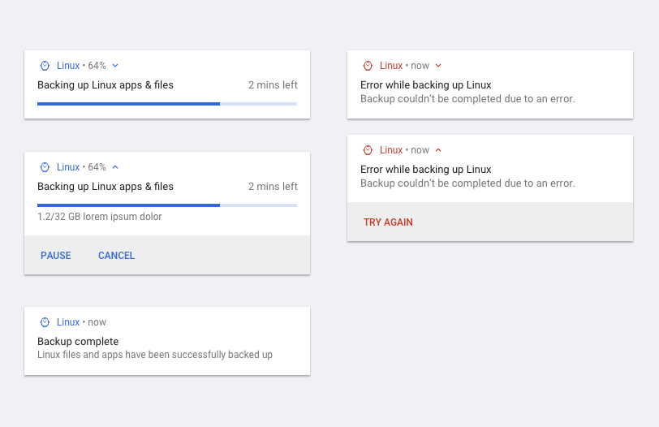
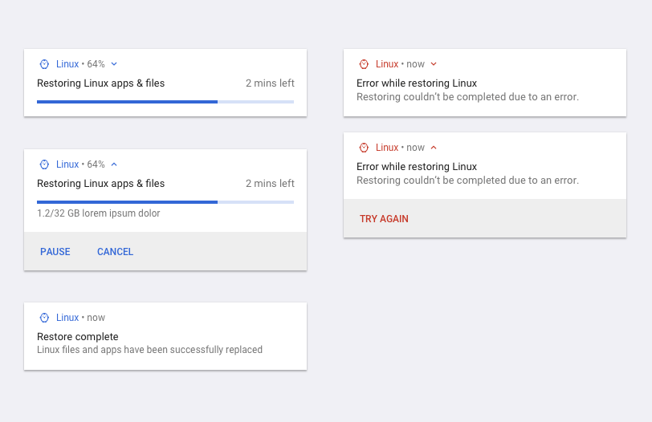

A few weeks ago I pointed out a new feature targeted for Chrome OS 74: A [native way to backup and restore Linux apps and data on Chromebooks](https://www.aboutchromebooks.com/news/crostini-linux-backup-restore-import-export-tremplin-chrome-os-74/) that support Project Crostini. Since then, the Chromium team has made a big push to nail down the functionality in advance of the [Chrome OS 74 feature freeze date](https://chromiumdash.appspot.com/schedule), which is February 22: Aside from the code to support backups and restores, there was [a slew of interface work done this week](https://chromium.googlesource.com/chromium/src.git/+/ae2a611d776397d93373e8cca99353a4e987ea1a).

Here's what it looks like in mockups, which of course, could always change before the final implementation.

\[caption id="attachment\_2946" align="aligncenter" width="1000"\] Linux backup and restore in Chrome OS\[/caption\]

\[caption id="attachment\_2947" align="aligncenter" width="812"\] Linux backup messaging in Chrome OS\[/caption\]

\[caption id="attachment\_2948" align="aligncenter" width="812"\] Linux restore in Chrome OS\[/caption\]

Note that you _can_ currently back up and restore a Linux container in Crostini today, but it's a manual process using LXD commands, [which you can find in this excellent guide](https://www.reddit.com/r/Crostini/wiki/howto/backup). The process captures the entire container, meaning your Linux apps, settings, and data.

Although Linux support on Chrome OS was originally aimed for the developer audience, there are certainly everyday, mainstream users of the feature. And why not? Even if there's a single Linux desktop app that can extend your Chromebook experience, that's a win all around. Making it a more user-friendly experience is a smart strategy on Google's part.

Once the backup and restore function rolls out, it's expected to be managed through _chrome://flags/#crostini-backup,_ but I anticipate that the feature will be enabled by default if you have the Linux (beta) feature on. My understanding of the native feature is that you'll be able to save your backup to external storage, which you can now do thanks to [memory card and USB drive support added to Chrome OS 72](https://www.aboutchromebooks.com/news/stable-version-chrome-os-72-what-you-need-to-know/).
