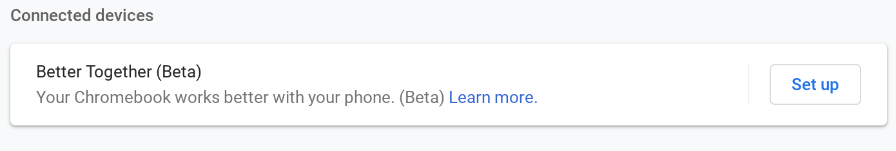
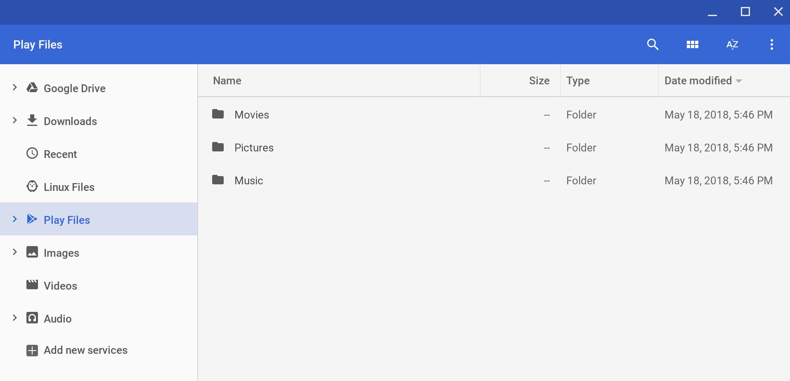

I was busy tinkering with the [Acer Chromebook Tab 10 review unit](https://www.aboutchromebooks.com/news/acer-chromebook-tab-10-review-unit-is-here-got-questions/) last night, so I didn't get a chance to write up the latest Chrome OS news: [The Dev Channel 69 update is out](https://chromereleases.googleblog.com/2018/06/dev-channel-update-for-chrome-os_19.html) and there appears to be quite a few new features.

I'm still nosing around, but for starters, the system tray that brings an Android-like look is a little cleaner and smoother. And the notifications above it are working better as well, although they don't reflect the ["dark mode" theme](https://www.aboutchromebooks.com/news/dark-themed-android-p-like-system-tray-settings-menu-available-for-chromebooks/) that I'm using for the tray. Here's a quick peek at the tray, minus any notifications.

https://twitter.com/KevinCTofel/status/1009250353978793984

Also new to Chrome 69 is the beginnings of the ["Better Together" setup process](https://www.aboutchromebooks.com/news/chromebook-android-messages-better-together/) that will bring multidevice functionality between Chrome OS and connected devices, such as your Android phone.

Unfortunately, the Set up button doesn't do anything yet. And the Learn more link takes you to a page that's not yet written, so we'll have to wait on another update to actually use this.

The Files app gets an update too, but its not quite where we're expecting to be. We know that [Google plans to move Google Drive down the list and lump Play, Linux and Downloads under "My Files.](https://www.aboutchromebooks.com/news/chrome-os-files-app-changing-again-to-better-integrate-local-android-and-linux-files/) That hasn't happened yet. And you only have access to the Movies, Pictures and Music folders from the Android container now.

Folks running [Project Crostini for Linux apps](https://www.aboutchromebooks.com/tag/project-crostini/) get a small, but needed, bonus in Chrome OS 69. Until now, when you opened a Linux app from the App Menu, you didn't see any indicator showing that something was actually happening. You'd just wait for five or so seconds and then you'd see your Linux app. That's because the Linux container has to start up if it wasn't already running. Now a spinner icon appears in the shelf to indicate that something is happening. And once the app opens, its icon appears on the shelf in place of the spinner.

Picture-in-picture mode is enabled by default but not yet working (at least not for me). However, that new [Wallpaper picker](https://www.aboutchromebooks.com/news/chrome-os-wallpaper-picker-updated-and-getting-chromecast-like-backdrop-feature/) that I like still works.

Note that [many people who have upgraded to Dev Channel 69 are experiencing a multitude of issues](https://www.reddit.com/r/Crostini/comments/8sdta2/19june_dev_update_69034640/), including browser stability and other problems. For some reason, I'm in the minority here because I'm not seeing any major issues save for one: A touchpad firmware driver update appears upon every boot up. I suspect Google will quickly get an update out for the Dev Channel to address some of the reported problems.
