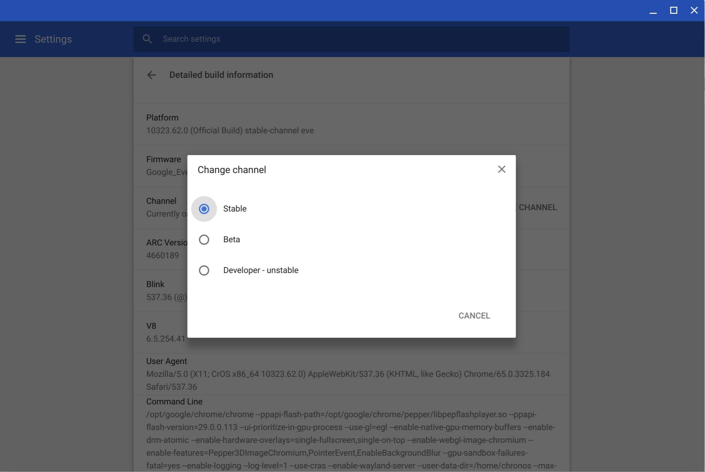

New Chromebook owners eventually hear about both Developer Mode and the Dev Channel of Chrome OS, wondering if they're the same thing. They're not.

### What's Developer Mode?

Developer Mode basically waters down one of the Chrome OS security features called "Verified Boot" so you can run alternative software, such as Linux. It also provides more access to the system files on your device. Unless you really want to tinker around -- and know what you're doing -- Developer Mode isn't for most people.

I have used Developer Mode in the past to allow my Chromebook to run both Chrome OS and Ubuntu Linux at the same time.

The main reason? I wanted to install apps so I could code on my Chromebook. These days, I can do that without using the less secure Developer Mode through Android apps, remotely accessing a Raspberry Pi I set up for coding or using a cloud development environment, such as AWS Cloud 9.

### What's the Dev Channel?

For starters, the Chrome OS platform has several versions, which are called "channels". Chromebooks ship with the software from the Stable Channel, which is the latest generally available of the software. Typically, Chromebooks see an updated version of the Stable Channel every six weeks for major changes, while minor updates can appear more often.

New features and fixes don't magically appear in the Stable Channel though. Instead, they first get added to and tested in three other channels: Canary, Dev, and Beta. Canary is where changes begin and it's considered to be fairly unstable.

You wouldn't want to run on the Canary Channel every day; in fact, you need to enable Developer Mode to use it. Plus, it can be updated or modified several times per day.

The Dev Channel is where tested changes from Canary end up, so this channel changes often as well: Often once or twice per week. As these changes are tested to ensure they're working well, they make their way into the Beta Channel every week or so.

Eventually, over the course of several weeks, Beta features end up in the next Stable Channel release. The [Chrome Releases Blog](https://chromereleases.googleblog.com/) announces updates for all of the channels if you ever want to see what the latest channel versions are.

### **Switching channels**

Switching between Dev, Beta and the Stable Channel is easy to do and gives you a glimpse at new features coming to your Chromebook.

There's one caveat though: Changing channels from an older version to a newer one will wipe the data from your device so you'll need to set it up like a brand new Chromebook.

You can go, for example from Chrome OS 88 Stable to Chrome OS 90 Dev without losing data. But if you move from Chrome OS 90 Dev to Chrome OS 88 Stable, your device will be powerwashed. In that type of downgrade situation, you'll lose all locally stored data, Android apps, and Linux containers.

If you do want to make the switch, go into the Settings menu of your Chromebook and scroll down to and click the About Chrome OS option. Then click on the Detailed Build Information and look for the Change Channel option.

Just remember that your data could be erased before you make the switch, depending on if you're upgrading or downgrading your version of Chrome OS!

_Updated on February 22, 2021 to point out powerwash scenarios._
