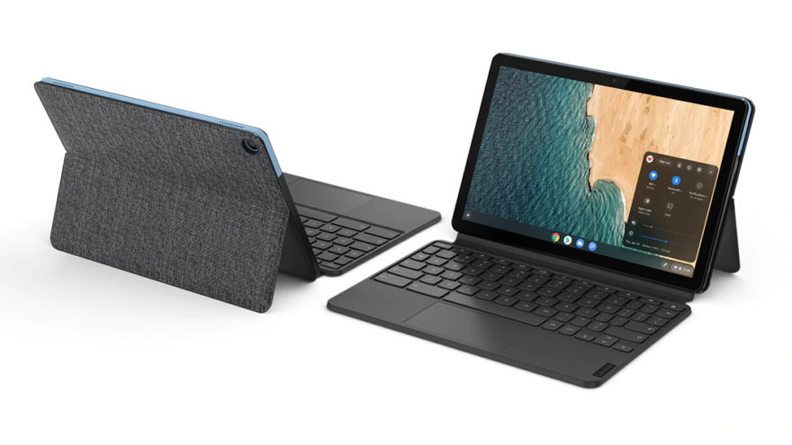
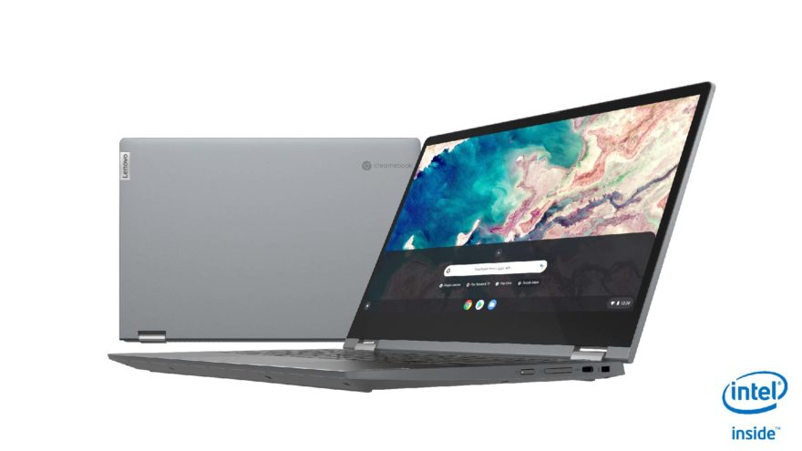
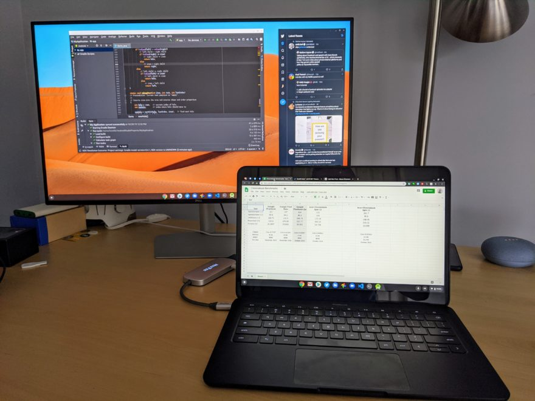

Although most things pretty much sucked in 2020, I have to say it was a good year for Chromebooks and Chrome OS users. I know, in the grand scheme of things, that's not much, but I'm trying to find the silver lining.

We've seen a huge boost in demand for Chromebooks, which is both good and bad: Good because it keeps hardware makers interested in creating new devices and bad because of inventory shortfalls when schools needed hardware the most. This year also [debuted the first Project Athena Chromebooks](https://www.aboutchromebooks.com/tag/project-athena/). I'm not truly enamored by most of them, mainly from a price to value perspective, but it's a good development overall.

2020 also gave rise to an unexpected, [low-cost delight in the Lenovo Duet Chromebook](https://www.aboutchromebooks.com/news/lenovo-ideapad-duet-chromebook-review-2020/) tablet.

For under $300, it's a great little portable package that I recommend mainly as a secondary device. You can connect it to an external monitor for primary work but depending on that work, the MediaTek chip and 4 GB of memory might be a big ask. Still, it's a highlight for the year in my book.

Even in the mid-range market, this year saw hardware specs rise up while prices were mainly flat or even down. [The Lenovo Flex 5 at $409 (or less when on sale) is a perfect example](https://www.aboutchromebooks.com/news/lenovo-flex-5-chromebook-hands-on-and-first-impressions/). Yes, you're limited by the 4 GB of memory but you're getting a 10th-generation Intel Core processor, convertible form factor, and solid 1080p touchscreen for the price.

These and other related hardware developments since January are going to make my "Chromebook of the year" pick rather difficult this year. Or at least more difficult than last year. I'll be making that pick and sharing it between Christmas and the New Year's Day that we all can't wait for. Won't it be nice to put an end to 2020?

Having said that, I know that many "under the radar" Chromebooks are often fan favorites.

For example, Matthew tweeted out to me that I shouldn't be overlooking the $170 Lenovo Chromebook 3:

<blockquote class="twitter-tweet">
this might also be Chromebook of the Year?  The Lenovo Chromebook 3 is awesome!  As an experiment I went to Walmart and got a $170 Chromebook. Considering the price and everything you get for it, this is a definite winner in my book! Nov 12, 2020<a href="https://t.co/aUlMfKD7kX">https://t.co/aUlMfKD7kX</a>
— matthew (@mathewinvisitec) <a href="https://twitter.com/mathewinvisitec/status/1336264381970210818?ref_src=twsrc%5Etfw">December 8, 2020</a></blockquote>

Others have told me that even with the mediocre battery life, they're big fans of the fanless [Samsung Galaxy Chromebook](https://www.aboutchromebooks.com/news/samsung-galaxy-chromebook-hands-on-yes-its-as-nice-as-it-looks/). (See what I did there?) And still, others think that the [HP Chromebook 14c](https://store.hp.com/us/en/SearchDisplay?client=&charset=utf-8&searchTerm=chromebook+14c&storeId=10151&catalogId=10051&langId=-1&beginIndex=0&pageSize=12), with options ranging from a Pentium to various 10th-gen Intel Core processors, offers customized buying options for a "just the right size" Chromebook. The choices go on and on.

**So I'm asking you**: What would be your pick for Chromebook of the year and why?

My criteria could be different from yours, and that's perfectly fine. There is no one size fits all Chromebook because we all have different requirement priorities and use our devices in different ways. I doubt many are [using a Chromebook to complete a Computer Science college program](https://www.aboutchromebooks.com/news/how-my-chromebook-is-getting-me-through-computer-science-college-classes/) like I do, for example.

Oh, and for anyone who bought the [Google Pixelbook Go, that was my pick for last year](https://www.aboutchromebooks.com/news/my-pick-for-2019-chromebook-of-the-year/). Whether you knew that or not, I'd be very curious as to how you feel about that purchase.

